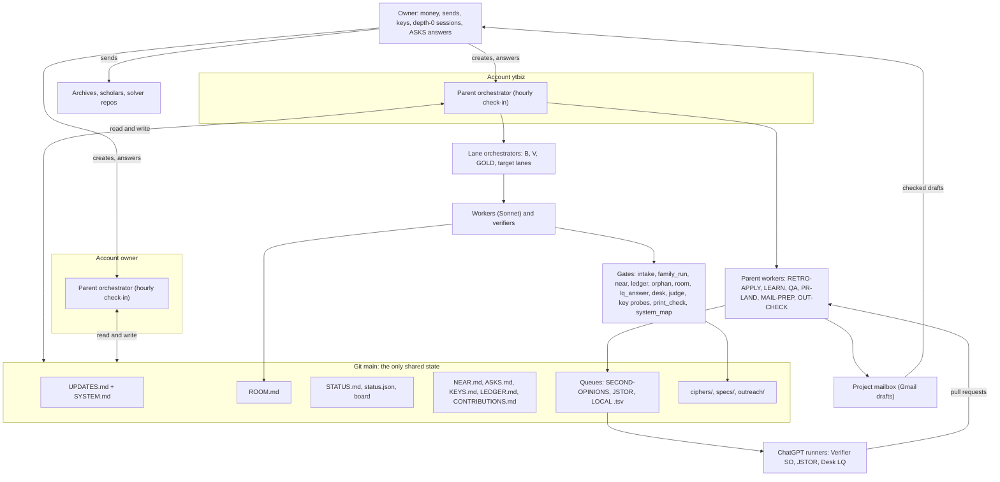

# SYSTEM.md: how the work is done (current-state map)

Written 26 Sept 2026 17:01 UTC (clock read) by parent worker SYSTEM-MAP for parent 7h, at the owner's ask of 16:58 UTC:
"a clear diagram of how our work is done and the different levers ... sometimes we add something and then it's lost in
the ether and our other agent account can't see it". This is the one map of roles, outside loops, gates, registers,
cadences and levers. It describes; the binding text stays in CLAUDE.md and `.claude/briefs/`, and each row says where.
Read it first; then CLAUDE.md, the tail of UPDATES.md and STATUS.md.

**The rule that keeps it true (section 7):** any new tool, gate, loop, register or runner gets its row here in the same
commit that adds it. `python3 tools/system_map_check.py` fails, naming what is missing, when a `tools/*.py`, a runner
prompt, a root queue `.tsv`, a register or a CLAUDE.md Usage 8a gate is not mentioned on this page. Both parents run it
at every check-in (parent.md duty 3a); a RETRO-APPLY that adds a tool runs it before pushing.

Column key for every table: **name**, **what it does**, **defined in**, **enforced or run by**, **who may change it**.

---

## 1. Roles

| Name | What it does | Defined in | Enforced or run by | Who may change it |
|---|---|---|---|---|
| Owner | Sets the goal, money, sends every email, adds keys to both environments, creates depth-0 sessions, answers ASKS.md; never named in the repo (rule 9) | CLAUDE.md Operating model, Outreach | the owner | the owner |
| Parent orchestrator (one per account: `ytbiz` and `owner`) | Opens lanes, routes outside loops, keeps the owner's desk and the board current, tells the owner only what parent.md duty 7 lists; does not solve, transcribe or verify | `.claude/briefs/parent.md` | hourly self-bound `send_later` check-in; the successor parent | the owner; a parent through UPDATES.md |
| Two parents, one per account | Invisible to each other: no account sees the other's sessions or triggers. They coordinate only through git: UPDATES.md, ROOM.md lines addressed "for the owner-account parent", STATUS.md handoffs, hub-seed/ASSIGNMENTS.md rows, LEARN passes | CLAUDE.md Operating model "Accounts"; parent.md "On start" | each parent's reading list at start and at each check-in | the owner |
| Successor parent | Takes over the trigger, renames the predecessor `ARCHIVED ...` and archives it, verifies the archive took, runs orphan_check first | parent.md "Handing over"; hub-seed/SUCCESSOR-PROMPT.md | the outgoing parent writes the prompt; since 26 Sept only the owner can create it at depth 0 (below) | the owner |
| Lineage depth constraint (26 Sept 2026) | Each hand-over nests the new parent one level deeper; at depth 8 a session cannot `create_session` or `send_later` (LANE V10 closed itself). A parent at depth 7 runs workers directly; lanes and the next parent need a depth-0 session the owner creates from the claude.ai UI (ASKS 69). A `create_trigger` fresh-session routine is not a substitute (LANE B12 test, 15:25 UTC, X) | parent.md "Lineage depth" | the parent records its depth in every hand-over line | the owner (creates the next parent) |
| Lane orchestrator (Opus) | Writes job briefs to `.claude/briefs/runs/`, runs Sonnet workers, ledgers each report, keeps "LANE X handoff" in STATUS.md current after every worker, self-ledgers from `get_session` at close; cannot archive itself | parent.md "Opening a lane"; lane brief + COMMON under `.claude/briefs/runs/` | the parent (duty 3: status, context self-report, successor) | the parent |
| LANE B (breadth) | First cheap test on each spec at a $3 cap with its matched control (Pipeline 3a) | CLAUDE.md Pipeline 3a; `.claude/briefs/breadth.md` | the lane; `family_run.py` | the parent |
| LANE V (verification) | Verifiers, second audits, AUDIT.md N-classes, outreach drafts, second-opinion routing | CLAUDE.md Workers "Verifier brief"; `.claude/briefs/verifier.md` | the lane | the parent |
| LANE GOLD (standing, famous items) | The only route for Voynich-class items; may sit idle-standing on named ASKS rows | CLAUDE.md Pipeline 3, "Lane state: idle-standing" | the lane; the parent's ASKS read is the exit trigger | the parent |
| Target lanes (R, AX, ARM, NX, ZX ...) | A campaign on one target or pool after its first test moved it | CLAUDE.md Pipeline 3a; lane briefs | the parent | the parent |
| Worker (Sonnet by default) | One job, one brief, pushes, reports a short paragraph, stops at its cap or box; at most four subagents | CLAUDE.md Workers, Usage 1, 6, 7 | its orchestrator (reads `get_session`) | the orchestrator writing the brief |
| Solver hat | Produces readings graded per token (rule 4) and a search log; never classifies novelty | CLAUDE.md Workers "Two hats"; `.claude/briefs/solver.md` | the orchestrator | the parent |
| Verifier hat | A separate session: tries to disprove novelty, writes AUDIT.md with an N0-N5 class and key source | CLAUDE.md rule 10, Verifier brief template | the verification lane | the parent |
| Scout / check-solved | Scout fills QUEUE.md, never promotes; check-solved sets stage 2 | CLAUDE.md Pipeline 1-2; `.claude/workflows/scout.js`, `.claude/workflows/check-solved.js`; `.claude/briefs/scout.md`, `check-solved.md` | the orchestrator; intake_gate_check.py | the parent |
| Access workers (lookup, image capture, transcription) | Move a target from stage 2 to 7 without the owner where the playbook allows; write REQUEST.md where not | CLAUDE.md Pipeline 4, Access playbook; `.claude/briefs/archive-lookup.md`, `transcription.md` | the orchestrator | the parent |
| Retrospective | After 12 ledger rows or USD 60 of worker usage, or any X/F: proposes at most five diffs in RETRO-<date>.md | CLAUDE.md Improvement loop; `.claude/briefs/retrospective.md` | the parent spawns it | the owner approved the loop (ASKS 23) |
| RETRO-APPLY | Applies a retrospective's brief/tool/workflow diffs, logs each in UPDATES.md; adds a SYSTEM.md row for any new tool and runs system_map_check | `.claude/briefs/README.md` common tail; `runs/*retro-apply-*.md` | the parent | the parent |
| LEARN (cross-account learning pass) | Every third check-in: reads what the other account pushed, writes LEARN-<date>-<hhmm>.md with diffs to port, notes what the other side has not picked up | parent.md duty 10; `.claude/briefs/learn-cross-account.md` | the parent | the parent |
| Rolling QA | Every two hours while lanes run: a fresh Sonnet audit of the window, QA/<date>-<hhmm>.md | parent.md duty 9; `runs/2026-09-25-parent-quality-audit.md` | the parent | the parent |
| PR-LAND | Short-lived Sonnet worker that lands `[LQ-]`, `[JSTOR-]` and `[SO-]` pull requests into the named files and closes them unmerged (a parent's GitHub token goes stale) | parent.md duties 4, 7; `runs/*pr-land-*.md` | the parent | the parent |
| MAIL-PREP | Prepares `outreach/mailbox/<slug>.json` from ready drafts, recipient address verified on the institution's own page | `runs/2026-09-26-parent-mail-prep.md`; outreach/README.md "Project mailbox" | the parent | the parent |
| OUT-CHECK (gate 7 checker) | A session other than the drafter reads each outward draft against every source it cites and writes the `checked:` header line | CLAUDE.md Outreach gate 7; `runs/2026-09-26-parent-out-check.md` | the parent | the owner (gate 7 is the owner's rule) |
| Tool builders (ORPHAN-TOOL, DESK-CHECK, LADDER-TOOL, SYSTEM-MAP ...) | Turn a rule broken twice into a tool with an offline test (Usage 8a), log it in UPDATES.md, add its row here | CLAUDE.md Usage 8, 8a | the parent | the parent |
| Collaborators | Other people with full access and their own agents; claim in ROOM.md, rebase before writing shared files | CLAUDE.md Collaborators; ONBOARDING.md | ROOM.md claims; room.py | the owner |

---

## 2. Loops outside the repository

| Name | What it does | Defined in | Enforced or run by | Who may change it |
|---|---|---|---|---|
| Verifier runner (second opinions; ChatGPT scheduled task) | Reads `SECOND-OPINIONS-QUEUE.tsv`, answers one `queued` prompt per run as a pull request titled `[SO-<label>]` on branch `second-opinion/<label>`. Landed by the parent check-in (row -> `posted` with PR number) and handed to LANE V; a verifier checks every citation. Gate: a row is queued only after a verifier gives N3 or better | `tools/second_opinion_runner_prompt.md` (fetched live from main each run) | the owner's ChatGPT task; parent duty 4 | the owner (task); a parent (prompt file) |
| JSTOR runner (ChatGPT, browser on the owner's JPASS) | Answers `JSTOR-QUEUE.tsv` rows as one file in a `[JSTOR-<stamp>]` pull request. A PR-LAND worker copies hits into the `hits` column and the target's AUDIT.md "JSTOR" section, sets `done <date>`, closes unmerged, posts "for LANE V<n>" on a candidate hit. Gate: Outreach gate 2 (rows answered or waived); never blocks N3/N4 on its own | `tools/jstor_runner_chatgpt_prompt.md`; Claude Desktop variant `tools/jstor_runner_brief.md` | the owner's runner; parent duty 7 | the owner; a parent (prompt file) |
| Desk runner (LOCAL-QUEUE, ChatGPT on the owner's browser) | Answers `LOCAL-QUEUE.tsv` rows (Cloudflare hosts, HathiTrust, catalogue records) as `[LQ-<id>]` pull requests on branch `local-queue/<id>`. Landing gate: `lq_answer_check.py` bounces an unbacked "not digitised"; after landing, `desk_check.py` | `tools/local_queue_runner_prompt.md`; older Claude Desktop brief `tools/local_runner_brief.md` | the owner's runner; PR-LAND worker | the owner; a parent (prompt file) |
| Project mailbox (cipherlab.research@gmail.com, Gmail connector on both accounts) | The parent places each ready draft as a Gmail draft (from `outreach/mailbox/<slug>.json`); gate 7 `checked:` line before the owner is told it is ready; the owner sends; replies are logged in the draft's status line and CONTRIBUTIONS.md; nothing is sent by a model until the owner's directive line is in CLAUDE.md Outreach | outreach/README.md "Project mailbox"; CLAUDE.md Outreach | the parent; OUT-CHECK; the owner sends | the owner |
| Solver-repository issues (Bourdeau, Aymeloglu) | Issue text drafted in `outreach/bourdeau-issues.md`; the owner posts it from their account | CLAUDE.md Outreach | the owner | the owner |
| Breakthrough alert routine | "Cipher Lab: breakthrough alert (email)": the parent fires it for a real result with a plain graded description | CLAUDE.md Operating model; parent.md duty 7 | the parent | the owner |
| Weekly retrospective routine | Scheduled retrospective on top of the 12-row / USD 60 trigger | CLAUDE.md Operating model "Routines" | the routine; the parent | the owner |
| Published board | GitHub Pages at noautopilot.github.io/cipher-lab, rebuilt from status.json | ONBOARDING.md; `tools/build_dashboard.py` | the parent after any class change | the parent |

---

## 3. Gates (mechanical checks) and instruments

### 3a. Gates: a rule made into a tool

| Name | What it does | Defined in | Enforced or run by | Who may change it |
|---|---|---|---|---|
| `tools/intake_gate_check.py` | Blocks deep work when a target's check-solved verdict does not name the standard edition and what was read (nonzero blocks the brief) | CLAUDE.md Pipeline 2 intake gate | lane orchestrator before briefing any deep-work worker | a parent via RETRO-APPLY |
| `tools/family_run.py` (control first) | Rule 3: runs a family's matched control first; target only if the control meets `--gate` (else exit 3); both numbers to HYPOTHESES.md | CLAUDE.md rule 3, Usage 8, 8a | every cryptanalytic worker | a parent via RETRO-APPLY |
| `tools/leaf_pool_gate.py` | Per-leaf gate before a leaf's signs enter a shared pool or key (rule 3 per-unit merge paragraph) | CLAUDE.md rule 3 | pooling workers (LANE B9 pattern) | a parent via RETRO-APPLY |
| `tools/near_check.py` | Rule 5: NEAR.md and status.json `near` agree; no near target reads `closed-negative`; rows stale past 48 h flagged | CLAUDE.md rule 5, Usage 8a | parent duty 0; rolling QA | a parent |
| `tools/ledger_check.py` | LEDGER.md duplicate session ids and non-standard outcome codes | CLAUDE.md Improvement loop, Usage 8a | orchestrator before its self-ledger row; rolling QA | a parent |
| `tools/orphan_check.py` | Orphan sessions, triggers, stale ROOM claims, unledgered ASSIGNMENTS rows, LIVE/ARCHIVED title mismatches | parent.md duty 3a, "Handing over"; Usage 8a | parent at every check-in and both sides of a hand-over | a parent |
| `tools/room.py` warnings and refusals | Appends ROOM lines safely; warns on a test/negative without "control", a dollar figure, an over-long line, a mistyped clock time or session id; refuses a shrunk ROOM.md or a lost STATUS.md/QUEUE.md section; `--start` prints UPDATES tail, NEAR targets and key summaries | CLAUDE.md Collaborators; rule 6; Usage 8a | every session's first command and every ROOM line | a parent via RETRO-APPLY |
| `tools/lq_answer_check.py` | Bounces a desk-runner "no items" that lacks the holding-catalogue record and quoted availability flag (`tools/data/catalogue_ladders.tsv`); skips that requirement for a page/text-read `kind` (`ia-reader`, `edition-read`, `hathitrust-page`, `jstor`), which answers a content read, not a digitisation lookup | CLAUDE.md Access playbook, Usage 8a | PR-LAND worker before landing an `[LQ-]` row | a parent |
| `tools/desk_check.py` | Flags outreach drafts left at `ready`/`drafted` telling the owner to do something a runner already did | parent.md duty 6; Usage 8a | parent at every check-in; after landing any runner row | a parent |
| `tools/judge_plaintext.py` + rule-7 re-derivation | Scores a reading against its spec (PASS/FAIL pasted into NOTES.md); a fresh session re-derives with the decode script and `--check` before stage 9 | CLAUDE.md rule 7 | solver; a fresh verifier session | a parent via RETRO-APPLY |
| `tools/decode_key.py --check` | Regenerates the graded reading from transcription + key; nonzero when the committed reading is stale | CLAUDE.md rule 7, Usage 8 | solver; re-derivation session | a parent |
| `tools/key_probe.py` / `tools/key_livecheck.py` | Names-only presence against KEYS.md with `--sync` to ROOM.md; live test call per credential into KEYS-STATUS.md. No ASKS/LOCAL-QUEUE access row without the probe line | CLAUDE.md Access playbook "Key livecheck", "Keys are a register" | `room.py --start`; parent duties 0a and 1; any worker naming an external host | a parent |
| `tools/print_check.py` before "reading ready" | 2-4 decoded phrases against IA, Google Books, OpenAlex; result cited in the done line; "no hits" is a search result, never novelty | `.claude/briefs/README.md` common tail; CLAUDE.md Usage 8 | solver before the reading-ready ROOM line; verifier | a parent |
| `tools/system_map_check.py` | Fails, naming the missing names, when a tool, runner prompt, root queue, register or 8a gate is absent from this page | this file, section 7; CLAUDE.md Usage 8a | parent duty 3a; RETRO-APPLY and tool builders before pushing | a parent |
| `tools/file_shrink_guard.py` | Refuses a path that collapsed below 20% of its prior committed line count and below 5 lines absolute (a HEAD commit message naming shrink/regen/restore/AX2-SHRINK exempts it); also run inside `tools/room.py --push` on every pushed path | CLAUDE.md Usage 8a; RETRO-2026-09-26i item 1 | any landing/PR/RETRO-APPLY worker before its final push; `room.py --push` | a parent via RETRO-APPLY |
| `tools/next_steps.py --check` | Every open/partial/blocked target's own written next step into `NEXT-STEPS.tsv` (folder, blocker, cost band, near_row, last_touched); `--check` fails when the file is stale | CLAUDE.md Usage 8a; `.claude/briefs/parent.md` "Opening a lane" | lane orchestrator before opening a lane (job 1); `build_dashboard.py`'s "Next steps" strip | a parent via RETRO-APPLY |
| Outreach gates 1-7 | AUDIT.md class; second adversarial audit and JSTOR rows for above N1; safe sentence; rule 10 wording; CONTRIBUTIONS.md row before sending; verifiable links; gate 7 `checked:` line by a non-drafter | CLAUDE.md Outreach | verification lane; OUT-CHECK; `desk_check.py` | the owner |
| Stage 2 / novelty stage | Stage 2 only from a check-solved verdict; "Novelty verified" only from AUDIT.md | CLAUDE.md Pipeline 2, rule 10 | the parent when updating status.json | the owner |

### 3b. Instruments (tools that do work, not gates)

| Name | What it does | Defined in | Enforced or run by | Who may change it |
|---|---|---|---|---|
| Solvers: `homophonic_anneal.py`, `nomenclator_anneal.py`, `seg_homophonic.py`, `subst_hillclimb.py`, `running_key.py`, `key_repair.py`, `crib_rounds.py` | Cryptanalytic searches, each run through `family_run.py` with a matched control | docstrings; CLAUDE.md rule 3 | solver workers | tool builders; RETRO-APPLY |
| `tools/families/wordcode.py` (test `tools/tests/test_wordcode.py`) | family_run.py family: letter-or-word nomenclator inside sign runs (each sign type = one letter or one whole word / `<NAME>` code), control on the target's run lengths with its code token share and code-type count, per-class token accuracy | module docstring; CLAUDE.md rule 3 | solver workers via `family_run.py --family wordcode` | tool builders; RETRO-APPLY |
| Language models and scorers: `french16_ngram.py`, `german_ngram.py`, `italian_ngram.py`, `italian16_corpus.py`, `latin_ngram.py`, `english_score.py`, `translit_ru.py`, `freq.py` | n-gram models, corpora filters and scorers for solvers and the judge (era-matched corpora, rule 3) | docstrings; `tools/data/` | solver workers | tool builders |
| Key work: `key_crossmatch.py`, `interlinear_align.py`, `thurloe_extract.py` | Try every key on every ciphertext (KEY-CROSSMATCH.tsv, KEY-OFFICES.tsv; gate fitted by `--calibrate` on the verified readings, KEY-CROSSMATCH-CAL.tsv + tools/data/key_crossmatch_gate.json; nightly `--since-hours 25 --post-room`); known-plaintext alignment; printed-cipher extraction | docstrings; CLAUDE.md Usage 8 | lane workers | tool builders |
| Transcription: `iiif_lines.py`, `gallica_folio.py`, `glyph_atlas.py`, `reconcile_passes.py`, `cipher_page_detector.py` | Mandatory line crops, folio-canvas map, sign atlas, two-pass reconciliation, cipher-page detection | CLAUDE.md Usage 6, 8 | transcription workers | tool builders |
| Access: `digitarq_fetch.py`, `discovery_items.py`, `ia_borrow.py`, `ia_djvu_headwords.py`, `ia_numeral_runs.py`, `htrc_ef_headwords.py`, `htrc_numeral_pages.py`, `htrc_series_harvest.py`, `gbooks_search_within.py`, `html2text.py`, `browser_fetch.js`, `decode_browser_login.js` | Host-specific fetch and search routes (see CLAUDE.md host table) | CLAUDE.md Access playbook | access workers | tool builders |
| DECODE and solver repos: `decode_list.py`, `decode_neighbours.py`, `decode_neighbours_exclude.py`, `solver_repo_diff.py` | Login-free DECODE census, neighbour pairs, diff against Bourdeau/Aymeloglu clones | docstrings; breadth.md | scouts, breadth | tool builders |
| Registers by tool: `key_request.py`, `build_dashboard.py` | File a key request (KEYS.md + ASKS.md + ROOM flag); rebuild the board from status.json | CLAUDE.md Access playbook; ONBOARDING.md | any agent needing a key; the parent | a parent |
| Retired or broken | `decode_fetch.sh` (curl login never evaluated; use `decode_browser_login.js`), `purge_history.sh` and `finish_history_swap.sh` (history purge dropped 25 Sept 2026) | CLAUDE.md Access playbook, Git | nobody | a parent |

---

## 4. Registers and state files

| Name | What it does | Defined in | Enforced or run by | Who may change it |
|---|---|---|---|---|
| `status.json` + the board | Source of truth for target stages, classes, `near`, results; the board and STATUS.md must agree with it | ONBOARDING.md; parent.md duty 6 | parent (only the parent edits it); `build_dashboard.py` | the parent |
| `NEAR.md` | Near-solve register: never `closed-negative`, named next step, read at every check-in | CLAUDE.md rule 5 | `near_check.py`; parent duty 0 | any lane, keeping both registers in step |
| `NEXT-STEPS.tsv` | Every open/partial/blocked folder's own named next step, blocker type and cost band, so the backlog is visible instead of living only in each NOTES.md | OPTIMIZATION-2026-09-26.md section (c); `.claude/briefs/parent.md` "Opening a lane" | `tools/next_steps.py`; a lane's job 1 | `next_steps.py`, regenerated, never edited by hand |
| `ASKS.md` | Everything blocked on a human, from either account | CLAUDE.md Collaborators | parent's desk; `desk_check.py`; idle-standing exits | anyone appends; the owner answers |
| `KEYS.md` / `KEYS-STATUS.md` | Credential register (names only, purpose, reader, which account has seen it) / last live probe | CLAUDE.md Access playbook | `key_request.py`, `key_probe.py --sync`, `key_livecheck.py` | tools write; the owner sets keys |
| `CONTRIBUTIONS.md` | One row per item offered outside, written before it is sent | CLAUDE.md Outreach gate 5 | verification lane; parent | parent / verification lane |
| `NOTIFY.md` | Routing register: per N3+ board target, its class, gate 2, second audit, who has been told (from CONTRIBUTIONS.md), who has not but should be (holding archive, editors, specialist; public contact page read on the day), the one blocker; ordered by readiness | .claude/briefs/runs/2026-09-26-parent-v-gate2.md (V-GATE2) | parent at check-in, with CONTRIBUTIONS.md and desk_check.py | verification lane; parent |
| `CITATIONS.md` | Public citations of this work by others | its own header | parent | parent |
| `LEDGER.md` | One row per archived worker: role, model, cost, outcome code, lesson | CLAUDE.md Improvement loop | orchestrators; `ledger_check.py`; retrospective trigger | orchestrators |
| `ROOM.md` | Shared channel: claim, flag, done; six-hour stale claim rule | CLAUDE.md Collaborators, Workers | `room.py` | everyone, append only |
| `STATUS.md` | Human board text: Parent handoff per account, Lane structure table, one LANE handoff per lane | CLAUDE.md Operating model | parents and lane orchestrators; `room.py` section guard | parents, lanes |
| `hub-seed/ASSIGNMENTS.md` | Cross-account work rows: one account writes, the named account pulls on its next wake | its header | `orphan_check.py` (unledgered rows) | parents |
| `hub-seed/SUCCESSOR-PROMPT.md` | The next parent's starting prompt and state note | parent.md "Handing over" | the outgoing parent | the outgoing parent |
| `UPDATES.md` | Cross-account changelog: every instituted change, dated, with evidence; the channel that stops a change being "lost in the ether" | parent.md "On start"; README common tail | `room.py --start` prints the tail; both parents read it | any parent or RETRO-APPLY, append only |
| `SYSTEM.md` (this file) | The current map | section 7 | `system_map_check.py` | anyone adding a tool, gate, loop, register or runner |
| `SECOND-OPINIONS-QUEUE.tsv` | Verifier-runner queue (`queued`, `posted`, outcome) | second_opinion_runner_prompt.md | lanes append at N3; parent marks posted | lanes, parent |
| `JSTOR-QUEUE.tsv` | JSTOR runner queue, two query families per target | CLAUDE.md Verifier brief 2(g) | verifiers append; PR-LAND lands | verifiers, PR-LAND |
| `LOCAL-QUEUE.tsv` | Desk-runner queue for hosts the cloud cannot reach | local_queue_runner_prompt.md | any worker after the key probe; PR-LAND lands | workers, PR-LAND |
| Other root TSVs: `KEY-CROSSMATCH.tsv`, `KEY-CROSSMATCH-CAL.tsv`, `KEY-OFFICES.tsv`, `OPEN-INDEX-RESULTS.tsv`, `POOLS.tsv`, `QUEUE-github-held.tsv` | Key-by-ciphertext sweep results; the sweep's gate calibration on the verified readings; key office register; open-index scholarship results; sign pools (Pipeline 3 selection rule); solver-repo-held queue rows | their tools and headers | key_crossmatch.py; verifiers; scouts | the lane that owns them |
| `QUEUE.md` / `QUEUE-scores.json` | Ranked candidate queue with kind per row | CLAUDE.md Pipeline 1, 3 | scouts write; the parent promotes | scouts, parent |
| `specs/<slug>.json` | Breadth spec: ciphertext, alphabet, constraints, cheap tests in order, judge block, `cheap_test_done` | CLAUDE.md Pipeline 3a | breadth workers; `judge_plaintext.py`; `family_run.py` | breadth lane |
| `ciphers/<t>/` | NOTES.md (status word first), ciphertext.txt, key.tsv, HYPOTHESES.md, AUDIT.md, REQUEST.md, decode script | CLAUDE.md Layout, rules 4-7, 10 | lane workers; verifiers | the lane holding the target |
| `outreach/` | Drafts with status/to/subject header, `checked:` line, `mailbox/` JSON | CLAUDE.md Outreach; outreach/README.md | verification lane, MAIL-PREP, OUT-CHECK, `desk_check.py` | drafters; the owner sends |
| `BUDGETS.md` | Plan limits per person; the scaling rule | CLAUDE.md Operating model | parent duty 2 | each person for their own row |
| `CLAUDE.md` / `.claude/briefs/` | The binding rules / the role templates and dated job briefs | itself | every session | the owner; parents for brief/tool changes, logged in UPDATES.md |
| RETRO-*.md, LEARN-*.md, QA/*.md | Retrospective proposals, cross-account learning passes, rolling quality audits | Improvement loop; parent.md duties 9-10 | retrospective, LEARN, QA workers | those workers |

---

## 5. Cadences and levers

| Name | What it does | Defined in | Enforced or run by | Who may change it |
|---|---|---|---|---|
| Parent check-in | Hourly self-bound `send_later`, re-armed each firing, duties 0-11 | parent.md | the parent | the owner |
| Lane check-ins | Each lane schedules its own; nothing polls; the parent asks each lane its context estimate | CLAUDE.md Operating model; parent.md duty 3 | lane orchestrators | the parent |
| Rolling QA | Every two hours while lanes run | parent.md duty 9 | the parent | the parent |
| LEARN pass | Every third check-in while both accounts are live | parent.md duty 10 | the parent | the parent |
| Retrospective trigger | Every 12 ledger rows or USD 60 of worker usage, whichever first; and after any X/F | CLAUDE.md Improvement loop | the parent after each worker report | the owner |
| Caps and boxes | Every brief states a dollar cap and a wall-clock box, sized per unit (per pass) with one unit of margin; stop before a unit crosses 80% | CLAUDE.md Usage 6; README common tail | the worker; orchestrator reads `get_session` | the orchestrator writing the brief |
| Rate-limit rule | `allowed` spawn; `allowed_warning` anywhere: no new workers anywhere; `rejected`: every lane writes its handoff and stops | BUDGETS.md; parent.md duty 2 | the parent | the owner |
| Context lines | A lane past 80% of its brief's context line writes its handoff this check-in | parent.md duty 3 | the parent | the parent |
| Stale claim | Six hours without a done line or activity: anyone may take the target after a ROOM line | CLAUDE.md Collaborators | everyone | the owner |
| Hand-over points | Parent to successor (orphan_check clean, trigger taken over, ARCHIVED verified); lane close (handoff, self-ledger, parent archives); idle-standing entry and exit | parent.md "Handing over"; CLAUDE.md "Lane state" | parents, lanes | the parent |
| Only the owner can move | Money and payments; every email send; keys in both environments; creating the next parent and any depth-0 session; answering ASKS rows; the goal and spend; CLAUDE.md Outreach directive lines | CLAUDE.md Outreach, Access playbook item 4, parent.md "Lineage depth" | the owner | the owner |

---

## 6. Diagram



Terminal version:

```
                 +---------------------------------------------+
                 | OWNER: money, sends, keys, depth-0 sessions |
                 +------+----------------------------+---------+
                        | creates/answers            | creates/answers
              +---------v---------+        +---------v---------+
              | PARENT (ytbiz)    |        | PARENT (owner)    |   invisible to each other
              | hourly check-in   |        | hourly check-in   |
              +----+---------+----+        +----+---------+----+
                   |         |   read/write     |         |
                   |    +----v------------------v----+    |
                   |    | GIT main (only shared)     |    |
                   |    | UPDATES.md  SYSTEM.md      |    |
                   |    | ROOM.md  STATUS.md  status |    |
                   |    | NEAR ASKS KEYS LEDGER CONTR|    |
                   |    | queues: SO / JSTOR / LOCAL |<---+-----+
                   |    | ciphers/ specs/ outreach/  |          |
                   |    +----^----------------^------+          |
            +------v------+  |                |          +------+--------+
            | LANES       |  | ROOM lines     | PR-LAND  | CHATGPT       |
            | B V GOLD R..|  |                +----------+ RUNNERS       |
            +------+------+  |                   PRs     | SO JSTOR LQ   |
                   |         |                           +---------------+
            +------v------+  |
            | WORKERS     +--+     parent workers: RETRO-APPLY, LEARN,
            | verifiers   |        QA, PR-LAND, MAIL-PREP, OUT-CHECK
            +------+------+
                   |
            +------v-----------------------------+      +-----------------+
            | GATES: intake family_run near      |      | MAILBOX drafts  |
            | ledger orphan room lq_answer desk  |      | gate 7 checked  +--> OWNER sends
            | judge key_probe print system_map   |      +-----------------+
            +------------------------------------+
```

---

## 7. How to add something

| Name | What it does | Defined in | Enforced or run by | Who may change it |
|---|---|---|---|---|
| Same-commit rule | A new tool, gate, loop, register or runner gets its row on this page in the same commit that adds it, plus its UPDATES.md row | this section; CLAUDE.md Usage 8a | the author; `system_map_check.py` | a parent |
| `python3 tools/system_map_check.py` | Checks every `tools/*.py` (tests excepted), every `tools/*_runner*_prompt.md` and `*_runner_brief.md`, every root `*.tsv`, the register list and every tool named in CLAUDE.md Usage 8a is mentioned here; nonzero with the missing names | `tools/system_map_check.py --help`; test `tools/tests/test_system_map_check.py` | parent duty 3a; RETRO-APPLY; tool builders | a parent via RETRO-APPLY |
| Retiring something | Move its row to "Retired or broken" (3b) with the date and reason rather than deleting it | this section | the author | a parent |
| The other account | A change lands in shared files and UPDATES.md; the other parent learns it from `room.py --start` and its UPDATES.md read, and from a ROOM line addressed to it | parent.md "On start", duty 10 | both parents | the owner |
