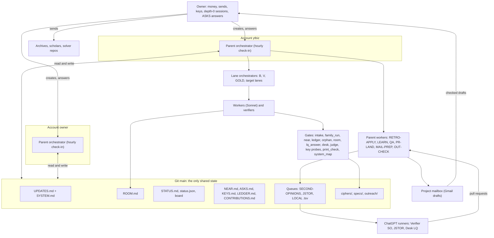

# SYSTEM.md: how the work is done (current-state map)

Written 26 Sept 2026 17:01 UTC (clock read) by parent worker SYSTEM-MAP for parent 7h, at the owner's ask of 16:58 UTC:
"a clear diagram of how our work is done and the different levers ... sometimes we add something and then it's lost in
the ether and our other agent account can't see it". This is the one map of roles, outside loops, gates, registers,
cadences and levers. It describes; the binding text stays in CLAUDE.md and `.claude/briefs/`, and each row says where.
Read it first; then CLAUDE.md, the tail of UPDATES.md and STATUS.md.

**The rule that keeps it true (section 7):** any new tool, gate, loop, register or runner gets its row here in the same
commit that adds it. `python3 tools/system_map_check.py` fails, naming what is missing, when a `tools/*.py`, a runner
prompt, a root queue `.tsv`, a register or a CLAUDE.md Usage 8a gate is not mentioned on this page. Both parents run it
at every check-in (parent.md duty 3a); a RETRO-APPLY that adds a tool runs it before pushing.

Column key for every table: **name**, **what it does**, **defined in**, **enforced or run by**, **who may change it**.

---

## 1. Roles

| Name | What it does | Defined in | Enforced or run by | Who may change it |
|---|---|---|---|---|
| Owner | Sets the goal, money, sends every email, adds keys to both environments, creates depth-0 sessions, answers ASKS.md; never named in the repo (rule 9) | CLAUDE.md Operating model, Outreach | the owner | the owner |
| Parent orchestrator (one per account: `ytbiz` and `owner`) | Opens lanes, routes outside loops, keeps the owner's desk and the board current, tells the owner only what parent.md duty 7 lists; does not solve, transcribe or verify | `.claude/briefs/parent.md` | hourly self-bound `send_later` check-in; the successor parent | the owner; a parent through UPDATES.md |
| Two parents, one per account | Invisible to each other: no account sees the other's sessions or triggers. They coordinate only through git: UPDATES.md, ROOM.md lines addressed "for the owner-account parent", STATUS.md handoffs, hub-seed/ASSIGNMENTS.md rows, LEARN passes | CLAUDE.md Operating model "Accounts"; parent.md "On start" | each parent's reading list at start and at each check-in | the owner |
| Successor parent | Takes over the trigger, renames the predecessor `ARCHIVED ...` and archives it, verifies the archive took, runs orphan_check first | parent.md "Handing over"; hub-seed/SUCCESSOR-PROMPT.md | the outgoing parent writes the prompt; since 26 Sept only the owner can create it at depth 0 (below) | the owner |
| Lineage depth constraint (26 Sept 2026) | Each hand-over nests the new parent one level deeper; at depth 8 a session cannot `create_session` or `send_later` (LANE V10 closed itself). A parent at depth 7 runs workers directly; lanes and the next parent need a depth-0 session the owner creates from the claude.ai UI (ASKS 69). A `create_trigger` fresh-session routine is not a substitute (LANE B12 test, 15:25 UTC, X) | parent.md "Lineage depth" | the parent records its depth in every hand-over line | the owner (creates the next parent) |
| Lane orchestrator (Opus) | Writes job briefs to `.claude/briefs/runs/`, runs Sonnet workers, ledgers each report, keeps "LANE X handoff" in STATUS.md current after every worker, self-ledgers from `get_session` at close; cannot archive itself | parent.md "Opening a lane"; lane brief + COMMON under `.claude/briefs/runs/` | the parent (duty 3: status, context self-report, successor) | the parent |
| LANE B (breadth) | First cheap test on each spec at a $3 cap with its matched control (Pipeline 3a) | CLAUDE.md Pipeline 3a; `.claude/briefs/breadth.md` | the lane; `family_run.py` | the parent |
| LANE V (verification) | Verifiers, second audits, AUDIT.md N-classes, outreach drafts, second-opinion routing | CLAUDE.md Workers "Verifier brief"; `.claude/briefs/verifier.md` | the lane | the parent |
| LANE GOLD (standing, famous items) | The only route for Voynich-class items; may sit idle-standing on named ASKS rows | CLAUDE.md Pipeline 3, "Lane state: idle-standing" | the lane; the parent's ASKS read is the exit trigger | the parent |
| Target lanes (R, AX, ARM, NX, ZX ...) | A campaign on one target or pool after its first test moved it | CLAUDE.md Pipeline 3a; lane briefs | the parent | the parent |
| Worker (Sonnet by default) | One job, one brief, pushes, reports a short paragraph, stops at its cap or box; at most four subagents | CLAUDE.md Workers, Usage 1, 6, 7 | its orchestrator (reads `get_session`) | the orchestrator writing the brief |
| Solver hat | Produces readings graded per token (rule 4) and a search log; never classifies novelty | CLAUDE.md Workers "Two hats"; `.claude/briefs/solver.md` | the orchestrator | the parent |
| Verifier hat | A separate session: tries to disprove novelty, writes AUDIT.md with an N0-N5 class and key source | CLAUDE.md rule 10, Verifier brief template | the verification lane | the parent |
| Scout / check-solved | Scout fills QUEUE.md, never promotes; check-solved sets stage 2 | CLAUDE.md Pipeline 1-2; `.claude/workflows/scout.js`, `.claude/workflows/check-solved.js`; `.claude/briefs/scout.md`, `check-solved.md` | the orchestrator; intake_gate_check.py | the parent |
| Access workers (lookup, image capture, transcription) | Move a target from stage 2 to 7 without the owner where the playbook allows; write REQUEST.md where not | CLAUDE.md Pipeline 4, Access playbook; `.claude/briefs/archive-lookup.md`, `transcription.md` | the orchestrator | the parent |
| Retrospective | After 12 ledger rows or USD 60 of worker usage, or any X/F: proposes at most five diffs in RETRO-<date>.md | CLAUDE.md Improvement loop; `.claude/briefs/retrospective.md` | the parent spawns it | the owner approved the loop (ASKS 23) |
| RETRO-APPLY | Applies a retrospective's brief/tool/workflow diffs, logs each in UPDATES.md; adds a SYSTEM.md row for any new tool and runs system_map_check | `.claude/briefs/README.md` common tail; `runs/*retro-apply-*.md` | the parent | the parent |
| LEARN (cross-account learning pass) | Every third check-in: reads what the other account pushed, writes LEARN-<date>-<hhmm>.md with diffs to port, notes what the other side has not picked up | parent.md duty 10; `.claude/briefs/learn-cross-account.md` | the parent | the parent |
| Rolling QA | Every two hours while lanes run: a fresh Sonnet audit of the window, QA/<date>-<hhmm>.md | parent.md duty 9; `runs/2026-09-25-parent-quality-audit.md` | the parent | the parent |
| PR-LAND | Short-lived Sonnet worker that lands `[LQ-]`, `[JSTOR-]` and `[SO-]` pull requests into the named files and closes them unmerged (a parent's GitHub token goes stale) | parent.md duties 4, 7; `runs/*pr-land-*.md` | the parent | the parent |
| MAIL-PREP | Prepares `outreach/mailbox/<slug>.json` from ready drafts, recipient address verified on the institution's own page | `runs/2026-09-26-parent-mail-prep.md`; outreach/README.md "Project mailbox" | the parent | the parent |
| OUT-CHECK (gate 7 checker) | A session other than the drafter reads each outward draft against every source it cites and writes the `checked:` header line | CLAUDE.md Outreach gate 7; `runs/2026-09-26-parent-out-check.md` | the parent | the owner (gate 7 is the owner's rule) |
| Tool builders (ORPHAN-TOOL, DESK-CHECK, LADDER-TOOL, SYSTEM-MAP ...) | Turn a rule broken twice into a tool with an offline test (Usage 8a), log it in UPDATES.md, add its row here | CLAUDE.md Usage 8, 8a | the parent | the parent |
| Collaborators | Other people with full access and their own agents; claim in ROOM.md, rebase before writing shared files | CLAUDE.md Collaborators; ONBOARDING.md | ROOM.md claims; room.py | the owner |

---

## 2. Loops outside the repository

| Name | What it does | Defined in | Enforced or run by | Who may change it |
|---|---|---|---|---|
| Verifier runner (second opinions; ChatGPT scheduled task) | Reads `SECOND-OPINIONS-QUEUE.tsv`, answers one `queued` prompt per run as a pull request titled `[SO-<label>]` on branch `second-opinion/<label>`. Landed by the parent check-in (row -> `posted` with PR number) and handed to LANE V; a verifier checks every citation. Gate: a row is queued only after a verifier gives N3 or better | `tools/second_opinion_runner_prompt.md (one-off sibling: tools/chatgpt_resume_prompt.md; tools/chatgpt_browser_probe_prompt.md (5 Oct 2026, which blocked hosts the ChatGPT browser agent can reach), 5 Oct 2026, ChatGPT reports unfinished work then takes the SO queue)` (fetched live from main each run) | the owner's ChatGPT task; parent duty 4 | the owner (task); a parent (prompt file) |
| JSTOR runner (ChatGPT, browser on the owner's JPASS) | Answers `JSTOR-QUEUE.tsv` rows as one file in a `[JSTOR-<stamp>]` pull request. A PR-LAND worker copies hits into the `hits` column and the target's AUDIT.md "JSTOR" section, sets `done <date>`, closes unmerged, posts "for LANE V<n>" on a candidate hit. Gate: Outreach gate 2 (rows answered or waived); never blocks N3/N4 on its own | `tools/jstor_runner_chatgpt_prompt.md`; Claude Desktop variant `tools/jstor_runner_brief.md` | the owner's runner; parent duty 7 | the owner; a parent (prompt file) |
| Desk runner (LOCAL-QUEUE, ChatGPT on the owner's browser) | Answers `LOCAL-QUEUE.tsv` rows (Cloudflare hosts, HathiTrust, catalogue records) as `[LQ-<id>]` pull requests on branch `local-queue/<id>`. Landing gate: `lq_answer_check.py` bounces an unbacked "not digitised"; after landing, `desk_check.py` | `tools/local_queue_runner_prompt.md`; older Claude Desktop brief `tools/local_runner_brief.md` | the owner's runner; PR-LAND worker | the owner; a parent (prompt file) |
| Project mailbox (cipherlab.research@gmail.com, Gmail connector on both accounts) | The parent places each ready draft as a Gmail draft (from `outreach/mailbox/<slug>.json`); gate 7 `checked:` line before the owner is told it is ready; the owner sends; replies are logged in the draft's status line and CONTRIBUTIONS.md; nothing is sent by a model until the owner's directive line is in CLAUDE.md Outreach | outreach/README.md "Project mailbox"; CLAUDE.md Outreach | the parent; OUT-CHECK; the owner sends | the owner |
| Send runner (SEND-QUEUE, ChatGPT on the owner's browser) | Answers `SEND-QUEUE.tsv` rows (checked outreach drafts and reproduction-quote requests) as `[SENT-<id>]` pull requests on branch `send-queue/<id>`, sending from the project mailbox for `email` rows or submitting the institution's own web form for `form` rows. Landing gate: `send_queue_check.py` bounces a row whose gate-7 chain is missing a rung; after landing, the Send log shape (outreach/README.md) and `desk_check.py` (f) | `tools/send_queue_runner_prompt.md` | the owner's runner; PR-LAND worker | the owner; a parent (prompt file) |
| Solver-repository issues (Bourdeau, Aymeloglu) | Issue text drafted in `outreach/bourdeau-issues.md`; the owner posts it from their account | CLAUDE.md Outreach | the owner | the owner |
| Breakthrough alert routine | "Cipher Lab: breakthrough alert (email)": the parent fires it for a real result with a plain graded description | CLAUDE.md Operating model; parent.md duty 7 | the parent | the owner |
| Weekly retrospective routine | Scheduled retrospective on top of the 12-row / USD 60 trigger | CLAUDE.md Operating model "Routines" | the routine; the parent | the owner |
| Published board | GitHub Pages at noautopilot.github.io/cipher-lab, rebuilt from status.json; counts from per-row fields (document_id, claim_scope, plaintext_novelty, mapping_novelty, completeness, audit_status, depth), counted in documents; the two reading counts need depth D2+ (rule 4a), D1 rows show as a separate "fragments read" figure never summed, rows without depth are held out and named (BOARD-DEPTH, 5 Oct 2026; test tools/tests/test_build_dashboard_depth.py) | ONBOARDING.md; `tools/build_dashboard.py` | the parent after any class change | the parent |
| `tools/build_catalogue.py` (mock-up only) | Reader-facing catalogue of the audited readings, generated from status.json (the board's own counting rules, lifted from build_dashboard.py's source), each AUDIT.md's safe sentence, N4-READINGS.md links and NOTES.md heads; writes to research/mockups/catalogue/ (refuses docs/) plus an optional single-file mock-up (`--mockup`); strips internal job names and session ids, skips restricted folders, shows open/blocked targets only as a count (CATALOGUE-SITE-1, 9 Oct 2026; test tools/tests/test_build_catalogue.py) | CLAUDE.md rules 4a, 9, 10 and Outreach gates 3, 4, 6; owner 9 Oct 2026: nothing public, mock-up for review | the orchestrator, on the owner's request | a parent |

---

## 3. Gates (mechanical checks) and instruments

### 3a. Gates: a rule made into a tool

| Name | What it does | Defined in | Enforced or run by | Who may change it |
|---|---|---|---|---|
| `tools/intake_gate_check.py` | Blocks deep work when a target's check-solved verdict does not name the standard edition and what was read (nonzero blocks the brief; open/partial also need real '## Web and blog check' and '## Premise check' headings, pasted gate output and fenced blocks ignored (2 Oct 2026)); anonymous piles (`- **Pile:** anonymous` in the head) pass on a holder-based check-solved with the edition step deferred until a sender is named, ASKS 158, 9 Oct 2026) | CLAUDE.md Pipeline 2 intake gate | lane orchestrator before briefing any deep-work worker | a parent via RETRO-APPLY |
| `tools/premise_check.py` (2 Oct 2026) | The parent's pre-spawn check of a SHORTLIST row's premise cells against the folder before any LIKELY/SPLIT session: folder and non-empty ciphertext.txt when the step decodes, every path and sibling-key the `head_start` cell names on disk, the named leaf in images/manifest.json with `--needs-images`, the slug (or its leaf) not already in NEAR.md's "Why it left" table; nonzero means no session, the row goes back to SHORTLIST with the failure named. `--new` passes a `new` row with no folder. The worker-side counterpart is check-solved.md's "## Premise check" section (account 3, 12:47 UTC 2 Oct) | RETRO-2026-10-02-account4 proposal 5; CLAUDE.md Usage 8a | the parent before `create_session` for a LIKELY/SPLIT row; SHORTLIST on every row it ranks | a parent via RETRO-APPLY |
| `tools/brief_price_check.py` (3 Oct 2026; advisory since 3 Oct, owner) | A brief that names an image step (blind pass, crops, tiles, readers, gloss read, transcribe, iiif_lines) must carry "vision calls: N x USD r [+ k reconciliation] = X" with correct arithmetic and X <= its Cap, or the "Opus rate unmeasured" wording; no-image and "disk only" briefs pass; `--summary` counts; FLOOR line per `## JOB` section whose named Fable/Opus model is capped under its floor (Fable 5, Opus 2.5; RETRO-2026-10-04-acct1 P2) | RETRO-2026-10-03-acct3 proposal 2, RETRO-2026-10-04-acct1 proposal 2; `.claude/briefs/README.md` "Vision calls are a counted unit", "Fable floor"; CLAUDE.md Usage 6, 8a; `tools/tests/test_brief_price_check.py` | the orchestrator on every brief before `create_session` | a parent via RETRO-APPLY |
| `tools/family_run.py` (control first) | Rule 3: runs a family's matched control first; target only if the control meets `--gate` (else exit 3); both numbers to HYPOTHESES.md; `--param lock=FILE` (MQS-LOCK, 9 Oct 2026; test `tools/tests/test_family_run_lock.py`, controls `tools/tests/PREREG-MQS-LOCK.md`, shelf weak) holds confirmed sign values fixed through every restart and sweep (homophonic, nomenclator, wordcode, syllabary; seeded_code as `pins`; any other family exit 2), the control locked at the target's token share, recovery on unlocked positions only; `--langs L1,L2,...` (MQS-LANGS, 9 Oct 2026; test `tools/tests/test_family_run_langs.py`, controls `tools/tests/MQS-LANGS-controls.tsv`, shelf controlled-only) runs the family once per LANG_CORPORA key with that language's own matched control and ranks the decodes by judge score - real_p05 in their own language; judge key `fr16` = all three tools/data/fr16 files (fold spread 1.5-71.5%) | CLAUDE.md rule 3, Usage 8, 8a | every cryptanalytic worker | a parent via RETRO-APPLY |
| `tools/leaf_pool_gate.py` | Per-leaf gate before a leaf's signs enter a shared pool or key (rule 3 per-unit merge paragraph) | CLAUDE.md rule 3 | pooling workers (LANE B9 pattern) | a parent via RETRO-APPLY |
| `tools/depth_check.py` | Rule 4a: a unique solve is N3+ AND depth D2+; checks status.json `depth`/`depth_pct`/`depth_sentence`/`depth_check`/`decode_status`, fails a counted result dated 4 Oct 2026 or later with no depth, lists legacy ungraded ones (`--strict` fails them), prints the headline by depth | CLAUDE.md rule 4a; research/DECIPHERMENT-STANDARDS-2026-10-04.md (owner, 4 Oct 2026) | every verifier writing AUDIT.md + status.json; parent at every board update | a parent via RETRO-APPLY |
| `tools/tx_taxonomy.py` (LANE TX-ENGINEER round 1, 9 Oct 2026) | Error taxonomy of transcription passes against a BENCHMARK-TX item: one row per scored truth position with each pass's aligned read (tx_bench.py's own alignment), position in line, line index within the reader call, segment-crop edge/overlap, line-band cut, box<->token glue (atlas no87_box_token.tsv), stroke weight (erosion-survival terciles on the page image) and cross-pass error correlation; markdown summary of error mass per class and the top (truth <- read) pairs with their feature profile; `--label-map` as tx_bench. Sorts, does not explain: the mechanism per class is written in research/TX-TAXONOMY-<date>.md. Outputs in benchmark-tx/taxonomy/. TXP-AGREE (9 Oct 2026): appended columns n_pass_wrong, n_same_wrong, agree_class (all-same-wrong / all-wrong-split / majority / minority / baseline-only, first --pass the baseline) and err_class (crop / look-alike / thin / other), and an --md agreement section; earlier columns and sections byte-identical; error map in benchmark-tx/txeng2/errormap/ and ERRORMAP-2026-10-09.md. Test `tools/tests/test_tx_taxonomy.py` | TRANSCRIPTION.md; .claude/briefs/runs/2026-10-09-account4-lane-tx-engineer.md | transcription tool builders (which error class an instrument targets, before it is briefed) | a parent |
| `tools/tx_pair_reread.py` (LANE TX-ENGINEER round 2, TXE-C, 9 Oct 2026) | Thin-stroke targeted pair re-read: `select --unit U` maps the unit's atlas boxes to line-read positions label-blind (no87_map.py DP costs) and picks boxes in the page's thin erosion tercile (tx_taxonomy.erosion_share) whose line-read sign is in a listed look-alike pair with secure exemplars on both sides; `build` shows each as the boxed sign in context beside exemplar rows A and B (seeded order; key TSV never given to the reader), sheets of <= 16 rows; `resolve` turns A/B/neither picks into a pass (neither/? keeps the line read). Outputs in benchmark-tx/txeng/pair/. Test `tools/tests/test_tx_pair_reread.py` | benchmark-tx/PREREG-txeng-2.md Instrument C; research/TX-TAXONOMY-2026-10-09.md class 3 | transcription workers (a pair-choice re-read of thin signs) | a parent |
| `tools/tx_same_strip.py` (LANE TX-ENGINEER-2, TXE2-SAME, PREREG-txeng2-3 X7, 9 Oct 2026) | Same-sign retrieval strips: `build` shows each doubt position as the framed tile (4x, +-1 neighbour) beside lettered strips of up to 6 other occurrences of each candidate sign (L's, the lattice runner-up, the taxonomy pair partner) cut from the SAME page as the line read reads it, names hidden, key kept apart; `--swap-seed` builds the registered swapped-strip control; `resolve` maps picks back (neither -> L). Test tools/tests/test_tx_same_strip.py. Result benchmark-tx/txeng2/same/RESULTS.md: dev FAIL 5/4 p 1.0, control 3/28 wrong way. |
| `tools/tx_pair_clf.py` (LANE TX-ENGINEER-2 round 1, TXE2-PAIR, 9 Oct 2026) | Read-free pair classifiers: `train` fits one logistic regression (zones + raw 32x32 + HOG) per listed look-alike pair on the family's S-grade secure tiles from non-no.87 leaves, threshold by leave-one-leaf-out; `apply --unit U` changes a unit position only where L's sign is in a usable pair and the margin beats the threshold (box map: no87_box_token.tsv columns sid/fol/line/pos/sign/op only, truth refused in code); `control` = labels permuted, seeds 1-5. Outputs benchmark-tx/outputs/birago1572-no87/passX2_pair_*.tsv, reports benchmark-tx/txeng2/pair/. Test `tools/tests/test_tx_pair_clf.py` X2b (TXE2-PAIR2, round 3): `--train-domain dev_tune --loo-lines` trains on no.87's own dev_tune boxes, leave-one-line-out (the applied line's truth never read for its fold; read_truth_lines is the only truth reader, training lines only), threshold by inner leave-one-line-out net fixed-minus-broken; without --loo-lines trains on all dev_tune lines and applies to another unit. | benchmark-tx/PREREG-txeng2-1.md X2 | transcription workers (a measured classifier at pair positions) | a parent |
| `tools/tx_pair_hints.py` (LANE TX-ENGINEER, TXE-H, idea M17, 9 Oct 2026) | Pair hints for a blind reader's brief: `derive` measures descender depth, loop count and long-bar count on the secure tiles (non-no.87 leaves) of each code of a look-alike pair, keeps the statistic with the largest d' as one plain sentence (drops a pair with < 3 tiles a side or d' < 1) and draws a hints sheet; `assemble` appends the hints to the unchanged blind brief; `norm` normalises the raw read. Birago no.87 dev: FAIL (vs pass A 11/3, p 0.057; benchmark-tx/txeng/hints/RESULTS.md); test tools/tests/test_tx_pair_hints.py |
| `tools/tx_recovery.py` (LANE TX-ENGINEER round 2, TXE-G, 9 Oct 2026) | Document-recovery renderings from the DIA literature (research/TX-RECOVERY-PRACTICE-2026-10-09.md): `render --setting plain|sauvola|clahe|swn` writes a reader-facing image; `proxy` re-derives every atlas box bitmap under a setting from its page (same boxes, paired) and runs `glyph_atlas.py classify --topk 3` with holdouts, writing topk/bench TSVs to score with `tx_bench.py --paired`. Birago no.87 dev_tune: all three FAIL the p<0.01 gate (clahe harmful). Colour methods are not flags: the Birago sources on disk are greyscale. Outputs in benchmark-tx/txeng/recovery/. Test `tools/tests/test_tx_recovery.py` | research/TX-RECOVERY-PRACTICE-2026-10-09.md; .claude/briefs/runs/2026-10-09-account4-txe-g.md | transcription tool builders (which rendering, if any, earns a read) | a parent |
| `tools/tx_compare.py` (LANE TX-ENGINEER round 2, TXE-A, 9 Oct 2026) | Compare, don't recall: `build --unit U` shows each doubtful line-read position (atlas held-out top-1 != line read, top-1 share < 0.6, or merged conf M/L) as the sign in context beside 2 exemplar tiles per numbered candidate (line-read sign + atlas top-3, code names hidden, seeded order), sheets of <= 16 rows with a key TSV the reader never gets; `resolve` turns the reader's picks into a pass (pick, else the line read) and a weighted top-k lattice for `key_decode_lattice.py decode`; `map` is the label-blind box<->position DP of atlas/no87_map.py; `lattice-out` converts a lattice decode to a pass. Outputs in benchmark-tx/txeng/compare/. Test `tools/tests/test_tx_compare.py` | benchmark-tx/PREREG-txeng-2.md Instrument A; research/TX-TAXONOMY-2026-10-09.md class 1 | transcription workers (a re-read of doubtful signs against shown candidates) | a parent |
| `tools/tx_compare.py tiles` / `tiles-resolve` (LANE TX-ENGINEER, TXE-L, idea M7, 9 Oct 2026) | Per-sign tile sheets of the mapped positions of named lines (box + marks grown 25%, neighbour boxes blanked, autocontrast, sign about 90 px), `--order ordered` (line order, labelled line/pos) or `--order shuffled` (seeded, labelled #n only; key TSV never given to the reader); `tiles-resolve` maps reads (tile, sign_id, conf) back to line, pos, sign, falling back to the line read on ?/X_NEW/unmapped. First use: benchmark-tx/txeng/shuffle/RESULTS.md (non-test, shuffled vs ordered 5/2 p 0.45). Test: tools/tests/test_tx_compare_tiles.py. |
| `tools/tx_compare.py library` / `build --library` / `resolve --agree` (LANE TX-ENGINEER, TXE-S, ideas O7 + O8, 9 Oct 2026) | Cross-target exemplar library: per key code, the printed key cell (`--print-image` + `--key-map` cell boxes) plus up to 3 secure tiles from non-target pages chosen by farthest-point sampling on glyph_atlas classify features (`--extra` adds another family target's tiles, credited); `build --library DIR --per-cand 4 --split 12 --max-sheets N` shows them per candidate; `resolve --agree R1 R2` changes the line read only where two independent readers pick the same non-L candidate, `--reads-dir` resolves one reader by the TXE-A rule. Results benchmark-tx/txeng/library/RESULTS.md; test tools/tests/test_tx_compare.py. |
| `tools/tx_shift_look.py` + `tools/iiif_lines.py --shift-bands/--shift-segments` (LANE TX-ENGINEER, TXE-N, idea M20, 9 Oct 2026) | A second crop set shifted half a pitch and half a segment step (marked line in a white margin, own and next line kept whole by the mask); `build` aligns the two blind reads (reconcile_passes NW) and puts only the disagreements on a third-look sheet (S0 and S1 windows at 4x, seeded option order, key never given to the reader); `resolve` writes the merged read. First use: benchmark-tx/txeng/shift/RESULTS.md (Birago no.87 dev_tune FAIL, 13/7 p 0.26 vs pass A). Tests: tools/tests/test_tx_shift_look.py, tools/tests/test_iiif_lines.py item 9. |
| `tools/tx_adjudicate.py` (LANE TX-ENGINEER, TXE-K / M19, 9 Oct 2026) | Adjudicator of two blind readers' splits: `items` turns a reconcile_passes-style agreement file into items (runs of non-agree rows; split+gap and order swaps merged), `packet` draws a bracket over each stretch on a native line strip (box<->position map, no value or code shown) with the A/B options in seeded order and a key the reader never gets, `resolve` applies answers (1, 2, a third cell sequence, ?) to a base pass, `score` gives item accuracy per adjudicator through tx_bench's scorer. Test `tools/tests/test_tx_adjudicate.py` | benchmark-tx/txeng/adjud/PREREG.md, RESULTS.md (FAIL: Fable 32/36, Opus 34/36 vs Sonnet 35/36) | transcription workers (settling A/B splits) | a parent |
| `tools/tx_tile_gate.py` (LANE TX-ENGINEER round 2, TXE-F, 9 Oct 2026) | Per-cut quality gate: `score --page P` labels every atlas box good / bad-crop / joined / blot from the page image only (ink mass, aspect, components, edge contact, tx_taxonomy band-cut rule and erosion share, neighbour touch, column valleys); `gate --unit U` (after tiles.tsv is committed) tables each label against the positions the line read and pass A get wrong via tx_bench.position_errors; `recut` splits joined boxes at the deepest valley and grows cut boxes to their own ink (iiif_lines.mask_neighbours), drops blots to a log, sheets of <= 24 rows with a key TSV never given to the reader; `resolve` writes the pass file. Test tools/tests/test_tx_tile_gate.py. Result: benchmark-tx/txeng/gate/RESULTS.md (read-free gate FAIL on Birago no.87 dev). |
| `tools/tx_prep.py` (LANE TX-ENGINEER round 2, TXE-D, 9 Oct 2026) | Tile and line-crop rendering settings as named flags with a manifest: `render` (plain = box +50% native; tight = ink-measured margin +10% then 2x LANCZOS; gamma=G, stretch, thicken=N; channel=R|G|B, sep, invert, false; sr2, sr4; combo), `proxy` (the read-free reader: re-binarise each rendered tile, replace its atlas bitmap, glyph_atlas classify --topk 3 with holdouts, label-blind box->position map via tx_compare.box_map -> bench TSV for tx_bench), `lines` (the setting on whole line crops; tight re-cuts the band to the ink extent, splits a crop over 2500 px with 100 px overlap and writes crops_note.md). Outputs in benchmark-tx/txeng/prep/. Test `tools/tests/test_tx_prep.py` | benchmark-tx/PREREG-txeng-2.md; research/TX-IDEAS-2026-10-09.md O1 O2 O4 M4 | transcription workers (choosing how tiles or crops are rendered for a reader) | a parent |
| `tools/tx_split_groups.py` (LANE TX-ENGINEER, TXE-P, idea M8, 9 Oct 2026) | Read-free count check for glued or over-split signs: stitches a line's segment crops by their manifest boxes, sweeps iiif_lines.py group_pieces() over gaps 2-12 (sweep.tsv: the gap at which the piece count equals each pass's count), assigns each pass's signs to the pieces by a width DP and flags positions where the pass reads more or fewer signs than the ink holds between agreed anchors (flags.tsv); `--score TRUTH` after the commit (events.tsv). FAIL on dint-f128-print: recall 1/11 at 4.2% flagged (benchmark-tx/txeng/split/RESULTS.md). Test `tools/tests/test_tx_split_groups.py` | benchmark-tx/PREREG-txeng-2.md; research/TX-IDEAS-2026-10-09.md M8 | transcription workers (digit hands whose passes disagree on sign count) | a parent |
| `tools/tx_contrast_sweep.py` (LANE TX-ENGINEER round 2, TXE-I, 9 Oct 2026) | Contrast sweep before cutting (owner's item 6): `sweep --page P` renders each atlas box (grown 50%) at five contrasts (Otsu +- 2 steps of 0.03 x (p95-p5)) as one strip + manifest; `stable --page P` tracks 8-connected ink components (>= 20 px) across levels by IoU >= 0.5 and writes per box n_stable / n_appearing / n_vanishing, an `uncertain` flag and the stable-ink box; `gate --unit U` (after the tables are committed) scores the flag against L's and pass A's wrong positions via tx_bench.position_errors; `sheet` / `resolve` for a read of flagged tiles only if the gate is met. Result: read-free dev gate not met (5 of 14 at 21%), benchmark-tx/txeng/sweep/RESULTS.md; test tools/tests/test_tx_contrast_sweep.py |
| `tools/tx_features.py` (LANE TX-ENGINEER, TXE-M, idea M24, 9 Oct 2026) | Feature-first reading: `cells` derives seven features (desc, asc, bars, loops, dots, lean, tail) for each cell of the printed sign sheet by script; `assemble` appends the rule (write features before the cell) and the cell table to the unchanged blind brief; `norm` normalises the read; `consist` counts the written features that contradict the chosen cell and scores that flag against wrong positions. Birago no.87 dev: FAIL (vs pass A 9/6, p 0.61), readers did not write features first (benchmark-tx/txeng/feature/RESULTS.md). TXE-M2 adds `tiles` (unlabelled sheet cells as a seeded control montage), `task1` (features-only task, no sheet or names), `comply` (compliance gate a/b/c before any cell call) and `task2` (cell naming from the reader's own features): control 19/51 within one feature, non-test (RESULTS-M2.md); test tools/tests/test_tx_features.py |
| `tools/tx_doubt.py` (LANE TX-ENGINEER, TXE-O, ideas M22 + M14, 9 Oct 2026) | Doubt detector for the sign sorter: `signals --unit U` writes nine truth-blind 0/1 signals per line-read position (show rule via `tx_compare.show_decision`, A/B disagree via `tx_compare.merged_conf(field='status')`, band cut, thin tercile, contrast flag, jitter stability, frequency over-read, plain-lattice disagreement, look-alike pair) to `benchmark-tx/txeng/doubt/<unit>_signals.tsv`; `measure` opens truth only through `tx_bench.position_errors` and reports recall / flagged share per signal, n_signals >= n and the best OR-combination of k <= 3 at share caps; `list --combo` gives the flagged positions and sorter sessions. Shelf weak: dev gate FAIL (disagree+latt 0.429 at 10.5%), eval read-free 0.600 at 6.1% (benchmark-tx/txeng/doubt/RESULTS.md). Test tools/tests/test_tx_doubt.py. `extend --unit U` (TXE2-DOUBT, X9 + X17, 9 Oct 2026) adds 0/1 columns from other reads aligned to L per line (`--differ` pairclf / vote, `--differ-ref` selfcons vs pass A or H vs H2, `--below` X4 conf p1 < 0.7, `--line-flag` X19 countchk) -> `<unit>_signals2.tsv`; `measure --table` searches every column (benchmark-tx/txeng2/doubt/RESULTS.md: dev 0.833 at 14.0%, eval as registered 0.400). |
| `tools/tx_sorter_curve.py` (LANE TX-ENGINEER-2, TXE2-SORT, X6, 9 Oct 2026) | Sorter value curve: with the benchmark truth as the owner oracle, err_true after k = 0..200 decisions per ordering (tx_doubt feed, atlas cluster size, random seeds, greedy oracle upper bound), each decision propagating per `--propagate cluster` (PREREG: the whole atlas cluster), `pile` (cluster x current sign) or `none` (per tile); re-scored with `tx_bench.position_errors`; decisions-to-2% and errors removed by the first 10/20. Measurement, no gate: whole-cluster propagation is destructive on the Birago 1572 atlas (77% majority share; every non-oracle ordering ends worse than L), pile x cluster about neutral (benchmark-tx/txeng2/sorter/RESULTS.md). Test tools/tests/test_tx_sorter_curve.py. |
| `tools/tx_feed.py` (LANE TX-ENGINEER-2, TXE2-FEED, S4, 9 Oct 2026) | Sorter feed as a product, read-free: aligns other reads to a unit's line read (`--differ`, `--lowconf`, committed signal `--table`s), orders tiles combo-tier first (the X9 rule; absent columns reported, an absent combo falls back to the any-signal tier) then n_signals, and writes `<unit>_feed.tsv`, `<unit>_feed_signals.tsv` and a sorter `focus.tsv` with one question per tile (candidate piles sorted, taxonomy pair feature, band-cut / hairline hints; never a value, a colour or a resolution; per tile, no cluster propagation). Test `tools/tests/test_tx_feed.py`; first use `benchmark-tx/txeng2/feed/` (eval_heldout, f152r, spinelli). |
| `tools/overlap_audit.py` (LANE TX-ENGINEER-2, TXE2-OVERLAP, PREREG-txeng2-7 O1, 9 Oct 2026) | Read-free audit of where a pass's deletions and insertions sit relative to the segment-crop overlap zones: measures each neighbouring pair's overlap from the crop manifest boxes and by pixel-matching the shared strip (NCC), places truth positions at the line's ink-mass quantiles (`--model uniform` for sensitivity), and classifies every tx_bench-aligned indel inside / at the seam (one sign width) / outside, with the chance share; `--label-map` as tx_bench, `--no-positions` keeps counts only (eval items). Never prints a sign value. Offline test tools/tests/test_overlap_audit.py; results benchmark-tx/txeng2/overlap/RESULTS.md. |
| `tools/gloss_cut.py` (LANE TX-ENGINEER-2, TXE2-RECUT2, PREREG-txeng2-6 R3b, 9 Oct 2026) | Stroke-level (below the component) interlinear-gloss removal on line crops: fits the cipher row's core band per column window from the crop's ink profile, keeps an envelope (core +- `--up/--down`), replaces ink outside it with the local paper shade (iiif_lines.local_paper), optional `--stem-width` keeps thin strokes touching the envelope; `--debug` overlay (blue envelope, removed ink orange). Read-free; never labels. First use: benchmark-tx/txeng2/recut2/RESULTS.md (fr.3623 f.23r: gloss letters 0 at every margin tried, but cipher descenders/base bars cut in every cipher crop; family retired for this leaf). Test `tools/tests/test_gloss_cut.py`. |
| `tools/tx_offsheet.py` (LANE TX-ENGINEER-2, TXE2-SHEET, X1, 9 Oct 2026) | Sheet inventory as the instrument, read-free: `detect` segments line crops into blobs (Otsu, band by row profile or `band`, x-overlap merge, s1/s2 stitched), aligns them to a skeleton read with CLEAR rows (width DP), maps to reference positions with `tx_bench.align`, and scores each tile's off-sheet distance to the nearest cell of both-reader consensus tiles; flags reader NEW/X_/? first, then top scores, q% in all; `grow` clusters flagged tiles into value-blind NEW_k cells and draws a grown sheet; `census` (TXE2-SHEET2, X1b) counts a sibling page's glyph-size components near a flagged tile / a consensus cell, value-blind; `recall` (`--exclude-flagged`, reader-flag vs score split) (after detect is committed) gives recall of the baseline's errors. Shelf weak: dev gate FAIL, 0/21 baseline errors caught at 15% flagged on dint-f128-print + dint-f89-gloss (benchmark-tx/txeng2/txe2-sheet/RESULTS.md). Test tools/tests/test_tx_offsheet.py. |
| `tools/tx_weighted_vote.py` (LANE TX-ENGINEER-2, TXE2-WEIGHT, X5, 9 Oct 2026) | Learned per-reader-per-sign weighting of passes on disk: `learn` counts (read, truth) per reader on training lines (tx_taxonomy alignment, add-0.5 over the key's signs), `vote` aligns readers to a base read (truth-free) and takes argmax_t sum_r w(r,s,t), `--loo` leave-one-line-out, `--uniform` plain majority; `control` writes uniform + 5 permuted-truth outputs. Dev gate FAIL on no.87 (fixed 3 broken 7); benchmark-tx/txeng2/weight/RESULTS.md |
| `tools/tx_count_check.py` (LANE TX-ENGINEER-2, TXE2-WEIGHT, X19, 9 Oct 2026) | Read-free expected sign count per line from the segment crops' ink column runs (gap_frac tuned on no.87 dev); `count` flags abs(expected - read) >= 1, `tune`, `recall` vs tx_bench indels. Weak: flags 83-100% of lines; benchmark-tx/txeng2/weight/RESULTS.md |
| `tools/tx_power.py` (LANE TX-ENGINEER-2 round 0a, 9 Oct 2026) | Power audit for the paired sign-test gate on BENCHMARK-TX units and pools: `--unit NAME=ITEM:OUTPUT[:LABELMAP]`, `--pool NAME=u1,u2`, or `--errors E,...`; simulates planted instruments (clean fixer at a fix rate, noisy fixer breaking correct signs at base_err x K, a 30%-worse one, no-op, random 3%) over 1,000 draws and prints the share that pass fixed > broken at p < alpha, plus the smallest baseline-error count at which a clean fixer passes >= 80% (32 at p 0.01, 24 at p 0.05 for a 30% fixer). The gate of a campaign is chosen from this table before any instrument result (benchmark-tx/PREREG-txeng2-0.md); CLAUDE.md rule 3's near-ceiling control made mechanical. Test tools/tests/test_tx_power.py. |
| `tools/tx_register.py` (TX-REGISTER, account 4, 9 Oct 2026) | The transcription programme's memory: compiles `research/TX-REGISTER.tsv` (one row per experiment of both campaigns: id, campaign, family, mechanism_attacked, unit_or_pool, dev_result, eval_result, eval_looks, verdict, reason, source_file, date) best-effort from research/TX-IDEAS*.md (ideas table + Results log), TRANSCRIPTION.md's TX-VIEWS/AGREEAUDIT/ALTS/SHEET/FABLE rows and any benchmark-tx PREREG/RESULTS file no row cites; an unreadable status is written `unparsed` with its source line, never dropped. `--check PREREG.md` exits 1 unless the PREREG's Nearest prior / differs from section names a register id in a sentence and every named `retired` id carries "different instrument" or "new material". Reads only, scores nothing. Test tools/tests/test_tx_register.py | research/TX-PROGRAM.md "Memory"; .claude/briefs/runs/2026-10-09-account4-tx-register.md | every TX session (read the register first); lane at each check-in (regenerate); anyone freezing a PREREG (--check) | a parent |
| `tools/depth_stats.py` | Rule-4a depth statistics for one item: longest H/C/S grade run vs the authentication distance (H(K) with liberties, R from an era corpus), recurring code values with deduplicated contexts, and two key-dependent controls (fr18-segmentable stretch; per-context window score) against value-shuffled keys; `--clear-aware STREAM.tsv` (DEPTH-STATS-CLEAR, 9 Oct 2026, off by default) cuts the per-context windows from the leaf's mixed clear+cipher stream (rows clear/run/gap) for leaves where cipher runs are islands in clear text, and contexts.tsv's `shuffle_varies` flags a window the shuffle cannot move | .claude/briefs/runs/2026-10-08-acct3-depth-bar.md (DEPTH-MH, 8 Oct 2026); .claude/briefs/runs/2026-10-09-account4-orch-jobs.md (DEPTH-STATS-CLEAR) | depth verifiers before setting `depth` | any session (offline test tools/tests/test_depth_stats.py) |
| `tools/gaps_check.py` | Rule 5 "Finish or name the blocker": a `partial` target's NOTES.md ends in "## Remaining gaps" (blocker per gap from a fixed vocabulary) and "## Escalation" (seven steps, each [x]/[n/a]/[retired]/[ ]) with a Verdict; "parked" only when every gap has an outside blocker and no step is untried; `--all` scans every partial, nonzero on any FAIL; since 8 Oct 2026 (SUCCESS-SIBS) a target with an N3+ status.json result row must also carry a "## Siblings" section, whatever its status, and `--all` includes those targets | CLAUDE.md rule 5, Usage 8a; from Bourdeau's writeup skill 0a (sources/cyphersolver/2026-10-01/) | every solver worker stopping at `partial`, before its done line (`.claude/briefs/README.md` common tail) | a parent via RETRO-APPLY |
| `tools/progress_block.py [--check] [--on-it] [--unassigned]` | Renders the owner's progress block (bar, firm/total, F K R 1 2 C S under a header, `*` if the finding was already sent, legend) from PROGRESS.tsv; `--on-it` adds the lane on each row now (WORK-QUEUE + 12 h of ROOM), `--unassigned` lists open rows nobody is on that have a runnable NEXT-STEPS row, so no recap row is typed from memory | owner, 2 Oct 2026; hub-seed/CHECKIN-PROMPT.md | the orchestrator, every recap | a parent |
| `tools/progress_metrics.py [--tsv]` | Per ISO week from LEDGER.md + status.json: worker spend, share D of D/D-/X/F, new D2+ results, USD per D2+ result, median cost by role; skips and counts unparsable rows | owner, 5 Oct 2026 (METRICS, account 3) | the retrospective, week-on-week trend before proposals | a parent |
| `tools/near_check.py` | Rule 5: NEAR.md and status.json `near` agree; no near target reads `closed-negative`; rows stale past 48 h flagged | CLAUDE.md rule 5, Usage 8a | parent duty 0; rolling QA | a parent |
| `tools/rules_sync_check.py` | Rule R0: CLAUDE.md (slim agent copy) and RULEBOOK-FULL.md (full human rulebook) carry the same rule ids; exit 1 on an id in one file only or tagged twice; never blocks wording edits inside an id; `--slim CLAUDE-SLIM.md` before the swap | RULES-SLIM, 5 Oct 2026 (pending owner approval of the swap) | any commit that edits a rule | a parent |
| `tools/ledger_check.py` | LEDGER.md duplicate session ids, non-standard outcome codes and shifted-outcome rows (always); `--split FROM_ROW` prints the S/A/V/C effort table (`tools/data/effort_roles.tsv`) and parent-vs-worker spend per tenure | CLAUDE.md Improvement loop, Usage 8a; RETRO-2026-09-27x P5 | orchestrator before its self-ledger row; rolling QA; the daily effort-split check-in | a parent |
| `tools/orphan_check.py` | Orphan sessions, triggers, stale ROOM claims, unledgered ASSIGNMENTS rows, LIVE/ARCHIVED title mismatches | parent.md duty 3a, "Handing over"; Usage 8a | parent at every check-in and both sides of a hand-over | a parent |
| `SPRINT.md` | The proof sprint: the fixed campaign list, rules, daily budgets and the scoreboard the orchestrator updates hourly | parent.md "Campaigns" | `tools/campaign.py` | orchestrator |
| `tools/campaign.py` | CAMPAIGN.md checks: every sprint campaign has a runnable hypothesis and is within budget; --next gives a runner its step; --spend records cost | parent.md "Campaigns", campaign.md | -- | campaign runners, orchestrator |
| `.claude/briefs/campaign.md` | The campaign runner: a fresh session per firing that takes the top runnable hypothesis of one target, runs it, records, re-ranks, never parks | parent.md "Campaigns" | `tools/campaign.py` | per-target triggers |
| `WORK-QUEUE.tsv` | The single orchestrator's job list, one row per worker job with account, brief, model, cap, box and status; the only assignment channel from 27 Sept 2026 | parent.md "Single orchestrator", dispatcher.md | `tools/work_queue.py` | orchestrator adds, dispatcher and orchestrator claim/done |
| `tools/work_queue.py` | Validate, list, add, claim, done and bounce rows of WORK-QUEUE.tsv; whole-file read-modify-write via temp file + rename (never truncates), stray trailing tabs folded into note (3 Oct 2026), rows never deleted; `--next --account A` auto-fills one DEFAULT-<A> lane row on an empty, idle, unpaused queue (5 Oct 2026, LANE-SYS1; `--no-autofill`, `--pause/--resume ACCOUNT`, aliases owner=account-1, other=account-2, third=account-3); test tools/tests/test_work_queue.py | parent.md "Single orchestrator" | -- | orchestrator, dispatcher |
| `.claude/briefs/dispatcher.md` | The other account's hourly routine: pull WORK-QUEUE.tsv, spawn the `other` rows as workers, claim them, exit; no parent duties | parent.md "Single orchestrator" | `tools/work_queue.py` | the dispatcher trigger |
| `.claude/briefs/default-lane.md` | Standing lane-orchestrator brief for an auto-filled DEFAULT-<account>-<stamp> WORK-QUEUE row: verifier backlog (VERIFY-BACKLOG.tsv) first, then `next_steps.py --hot-only` runnable rows; cap 60, box 600 | dispatcher.md "Empty-queue auto-fill" | `tools/work_queue.py` | a dispatcher-spawned DEFAULT lane |
| `tools/open_asks.py` | ROOM.md lines addressed to a role with no later line from that role; the first command of every parent check-in, answered with a decision in the same check-in | parent.md "No parking" | both parents at every check-in; lanes at theirs | a parent |
| `tools/room.py` warnings and refusals | Appends ROOM lines safely; warns on a test/negative without "control", a dollar figure, an over-long line, a mistyped clock time or session id; refuses a shrunk ROOM.md or a lost STATUS.md/QUEUE.md section; `--start` prints UPDATES tail, NEAR targets and key summaries; self-heals a stub ROOM.md from git history (`heal_stub_content()`) rather than stopping and waiting for a person, falling back to refuse-and-flag only if no commit in the last 50 touching ROOM.md is large enough or the restore's own push conflicts twice; never moves branch `main` when another worktree has it checked out (WT-MAIN, 11 Oct 2026: `--start`/`--push` from a linked worktree stay detached; test tools/tests/test_room_worktree.py) | CLAUDE.md Collaborators; rule 6; Usage 8a; "Outside agents" | every session's first command and every ROOM line | a parent via RETRO-APPLY |
| `tools/restricted_guard.py` (29 Sept 2026) | Keeps holder-restricted material (the museum's Debosnys scans) out of this public repository: one-way fingerprints in `tools/restricted_fingerprints.txt`, the image allowlist `tools/restricted_allowlist.txt`, the whole-line allowlist `tools/restricted_allowed_lines.txt` (ASKS 156 option (a), 9 Oct 2026: lines the owner leaves in an append-only file; `--line-fingerprint`; test tools/tests/test_restricted_guard.py), any `restricted/` path; `--outgoing` scans what a push would add, full scan otherwise; prints file and line, never the matched text | .claude/briefs/parent.md "Restricted material guard"; ciphers/debosnys-1883/RESTRICTED.md | `tools/room.py push` before every push; `.github/workflows/restricted-guard.yml` on push, PR and daily | the orchestrator |
| `tools/lq_answer_check.py` | Bounces a desk-runner "no items" that lacks the holding-catalogue record and quoted availability flag (`tools/data/catalogue_ladders.tsv`); skips that requirement for a page/text-read `kind` (`ia-reader`, `edition-read`, `hathitrust-page`, `jstor`), which answers a content read, not a digitisation lookup; ignores repository file names (NOTES.md) as ladder hosts; the ladder has an Archives nationales / FranceArchives row (5 Oct 2026) | CLAUDE.md Access playbook, Usage 8a | PR-LAND worker before landing an `[LQ-]` row | a parent |
| `tools/send_queue_check.py` | Bounces a `SEND-QUEUE.tsv` row that is `queued` (or a `[SENT-<id>]` PR about to be landed) whose draft is missing, whose gate-7 `checked:` line is missing or stale, whose body lacks the `[SIGN-OFF]` placeholder or the disclosure sentence's substance, whose slug carries no CONTRIBUTIONS.md row, or whose `form` kind carries no `form_fields` | CLAUDE.md Usage 8a, Outreach gates 5+7 | the parent before queueing a row; PR-LAND worker before landing a `[SENT-]` row | a parent |
| `tools/desk_check.py` | Flags outreach drafts left at `ready`/`drafted` telling the owner to do something a runner already did | parent.md duty 6; Usage 8a | parent at every check-in; after landing any runner row | a parent |
| `tools/judge_plaintext.py` + rule-7 re-derivation | Scores a reading against its spec (PASS/FAIL pasted into NOTES.md); a fresh session re-derives with the decode script and `--check` before stage 9 | CLAUDE.md rule 7 | solver; a fresh verifier session | a parent via RETRO-APPLY |
| `tools/decode_key.py --check` | Regenerates the graded reading from transcription + key; nonzero when the committed reading is stale (9 Oct 2026, TOOL-CHK: `--check` combined with a report mode (--consistency, --split-check, --try, --avalanche, --special-scan, --lookalike, --error-matrix, --aliases, --alias-scan) used to return before the staleness test and exit 0 whatever the committed reading said (V-MANTC flag, Manteuffel key.tsv 54 C->M, C 202 vs 199); it now runs the staleness test only, with a stderr note; tools/tests/test_decode_key_check_drift.py (must catch grade-only drift; must not block an unchanged regeneration); 8 Oct 2026, TT-CONS: `--consistency [--lexicon L] [--segment F]` reports per code the unrelated words it reads in, Tomokiyo practice 16, breaking.htm; shelf grade weak, tools/tests/PREREG-TT-CONS.md; 9 Oct 2026, MQS-CROSSWORD: `--try CODE=VALUE` tests a guessed value at every occurrence against a shuffled-position and a value-class null, `--avalanche` queues values for blanks, `--try-log` logs non-blind tries; in memory, never writes key.tsv; shelf grade controlled-only for letters (K3 19/23), word values weak (K2 58/116), tools/tests/PREREG-MQS-CROSSWORD.md; 9 Oct 2026, MQS-SHEETS: `--style case` shows the grade by letter case, H/C/S capitals, M lower case, I [bracketed], U <code>, NULL _, clear words {word}; tools/tests/test_decode_key_case.py; 9 Oct 2026, MQS-SPECIAL-SIGNS: decode.json `repeat_values`/`delete_values` apply repeat-previous and delete-previous signs, `--special-scan` flags codes reading best as NULL, REPEAT or DELETE (REPEAT/DELETE against a shuffled-position null); shelf grade controlled-only for REPEAT (8/10) and DELETE (10/10), weak for NULL (6/10), tools/tests/PREREG-MQS-SPECIAL-SIGNS.md, tools/tests/test_decode_key_special.py; 9 Oct 2026, MQS-ALIAS: `--aliases ALIAS.tsv` renders 'alias [= meaning, G]' beside each codename (shared alias.tsv schema: alias meaning grade first_use last_use evidence source; `feigned_name` read as alias), `--alias-scan LANG` flags announcement phrases from `tools/data/alias_cues_{fr,en,it,es}.tsv`, `--alias-text FILE` on any plain text; writes only --alias-out/--alias-tsv, never the reading; shelf --aliases controlled-only, --alias-scan weak, tools/tests/PREREG-MQS-ALIAS.md, tools/tests/test_decode_key_alias.py; 9 Oct 2026, MQS-LOOKALIKE-SLIPS: `--lookalike A~B` reads each occurrence of a declared look-alike pair as its twin, one position at a time, and flags gains >= `--lookalike-min` bits (3); a report, never a key edit; shelf weak (planted recall 0.75 vs shuffled-pair null 0.40, false flags 0.108 over the 0.10 gate), tools/tests/PREREG-MQS-LOOKALIKE-SLIPS.md, tools/tests/test_decode_key_lookalike.py; 9 Oct 2026, MQS-CCE-MATRIX: `--error-matrix SIBLING_KEY[,KEY2...]` reads each token as a sibling key of the same office would, one position at a time, and reports the flag rate against a permuted-sibling null with a per-code error matrix, several keys ranked by p (`--cce-rule best|gain`, `--cce-min`, `--error-tsv`); a report, never a key edit; shelf weak (3% planted 6/10 and 5/10 vs gate 8/10, unrelated sibling 2-3/10), tools/tests/PREREG-MQS-CCE-MATRIX.md, tools/tests/test_decode_key_cce.py; 9 Oct 2026, MQS-STRUCK: transcribed corrections `X{struck}` / `{over=OLD>NEW}` or a tsv `state` column, decode.json `corrections` / `--corrections final|original` (final skips struck signs and reads NEW; original reads as first written, contamination evidence); shelf controlled-only (plumbing: 1.000 on 10/10 vs null 0.078-0.657), tools/tests/PREREG-MQS-STRUCK.md, tools/tests/test_decode_key_struck.py) | CLAUDE.md rule 7, Usage 8 | solver; re-derivation session | a parent |
| `tools/decipher_sheet.py key|reading ciphers/<t>` | Renders a key sheet (A-Z homophone header, exemplar glyph tiles picked by `glyph_atlas.py`'s `pick_spread`, code, n, grade) and a reading sheet (line crop, token row, value row, edited text) from the folder's own graded data through `decode_key.py`'s loaders; layout after Lasry, Biermann and Tomokiyo 2023, no figure reproduced; a reading described outside the repository goes with them, and a sheet in a key family with an open blind sort is held; `--check` regenerates (rule 7), `--tile-report` is K3's programmatic count; refuses RESTRICTED.md folders (9 Oct 2026, MQS-SHEETS; KM, R-K1, R-K2 in tools/tests/PREREG-MQS-SHEETS.md) Refuses a key or reading sheet for any key family with an open blind sort in tools/data/sorter_families.tsv (`--key-family`, else its folder table, else the key path; MQS-SHEET-REFUSAL, 9 Oct 2026, tools/tests/test_decipher_sheet_refusal.py). Corrections callouts (MQS-STRUCK-2, 9 Oct 2026): a token in decode_key state `struck` shows as a double-bordered tile, [sign], label STRUCK, "not read" (or as written under `--corrections original`); `over=OLD>NEW` shows OLD>NEW with label OVER; each listed under "Corrections on the page"; no CSS or section on a sheet without states; shelf controlled-only (plumbing 10/10 on 5/5 seeds vs nulls 0/10), tools/tests/PREREG-MQS-STRUCK-2.md, tools/tests/test_struck_roundtrip.py. | CLAUDE.md rules 4, 7; MQS-SHEETS brief | solver; verifier (before a reading is described outside the repo) | a parent |
| `tools/cvd_check.py` | The colour gate for any page or figure a person reads: CIEDE2000 >= 20 (a declared design threshold, not a sourced one) between every pair of marks in normal vision and protan, deutan, tritan simulation; marks 3:1, text 4.5:1, text on a tint 4.5:1; exit 0 PASS / 2 WARN (18-20) / 1 FAIL (9 Oct 2026, MQS-SHEETS; tools/tests/test_cvd_check.py); `--audit FILE...` lists CVD-collapsing (simulated dE2000 < 10) and red-green colour pairs among a tool's or template's colour literals, cv2 tuples read as BGR -- a lead list, not a verdict (MQS-CVD-AUDIT, 9 Oct 2026; tools/tests/mqs_cvd_audit_control.py) | MQS-SHEETS brief; research/MARY-STUART-TALK-2026-10-09.md section f | any worker building a page, sheet or figure | a parent |
| `tools/decode_witness.py` | Scores a symbol/nomenclator key against a witness leaf's clerk decipherment: key_row->value decode, global alignment to the clerk's letters, 20-shuffled-key control (letter rows only, homophones preserved), plus a blind-check-sample control and a per-key-row confirmed/contradicted TSV; `--label-diffs` (9 Oct 2026, MQS-WITNESS-LABELS) labels each decode-vs-printed-witness difference (omission, addition, substitution, name/code, spelling-only after PX-BRODEC normalisation) with a `--plant-control` planted-difference control, shelf weak; `--criteria-scan` flags clear-copy sentences meeting the 'sent in cipher' criteria of `tools/data/sent_in_cipher_criteria.tsv` (Lasry, Biermann and Tomokiyo 2023 p.131 n.70) as a lead, shelf weak | LESSONS.md 27 Sept "Symbol ciphers: known plaintext first, then a reader"; CLAUDE.md rule 3 | a witness-calibration job (NEV-C1) before any target leaf of the same key is read | a parent |
| `tools/key_probe.py` / `tools/key_livecheck.py` | Names-only presence against KEYS.md with `--sync` to ROOM.md; live test call per credential into KEYS-STATUS.md. No ASKS/LOCAL-QUEUE access row without the probe line | CLAUDE.md Access playbook "Key livecheck", "Keys are a register" | `room.py --start`; parent duties 0a and 1; any worker naming an external host | a parent |
| `tools/print_check.py` before "reading ready" | 2-4 decoded phrases against IA, Google Books, OpenAlex; result cited in the done line; "no hits" is a search result, never novelty | `.claude/briefs/README.md` common tail; CLAUDE.md Usage 8 | solver before the reading-ready ROOM line; verifier | a parent |
| `tools/system_map_check.py` | Fails, naming the missing names, when a tool, runner prompt, root queue, register or 8a gate is absent from this page | this file, section 7; CLAUDE.md Usage 8a | parent duty 3a; RETRO-APPLY and tool builders before pushing | a parent |
| `tools/file_shrink_guard.py` | Refuses a path that collapsed below 20% of its prior committed line count and below 5 lines absolute; a binary file (JPEG, PDF; since 3 Oct 2026, TOOL-FSG-JPEG -- it used to crash on one) is compared in bytes and refused below 20% of its prior size and below 1024 bytes, so a stub replacing an image is caught and a re-encoded image is not (a HEAD commit message naming shrink/regen/restore/AX2-SHRINK exempts it); also run inside `tools/room.py --push` on every pushed path | CLAUDE.md Usage 8a; RETRO-2026-09-26i item 1 | any landing/PR/RETRO-APPLY worker before its final push; `room.py --push` | a parent via RETRO-APPLY |
| `tools/sorter_preflight.py` | Fails a sign-sorter page before it is published unless it carries Fix the cut and the current template marker, its "Check these first" tiles are answerable (focus non-empty, >= 2 named piles, every label a reader split offers is a pile), every tile sits on a listed cipher line (and its cipher x-range), and wide / blank-or-black / strip-height boxes stay at or under 5%; writes a 24-tile contact sheet `<page>.preflight.png` to eye; fifth check `--cvd [PAGE_OR_TEMPLATE]` (MQS-SORTER, 9 Oct 2026): the page's `:root` tokens, tints, text on fills and the `const BOX` colours through `tools/cvd_check.py` (CIEDE2000 gate in normal, protan, deutan and tritan vision; 3:1 marks, 4.5:1 text and text on a tint; box colours against each page image's median, `--pages-json` for real colours), and any person-facing string that names a colour (`\bred\b`, `\bgreen\b`, `\borange\b`) fails; tests `tools/tests/test_sign_sorter_cvd.py`; sixth check `--gestures PAGE` (owner rule R05, template 2026-10-09.5, 10 Oct 2026): runs `tools/sign_sorter/browser_tests/test_gestures.js` (iPhone 13, iPhone SE and a mouse; a still and a drifting hold on every kind of tile open its card and move nothing, a tap takes the sign to the tray and never opens the card, no tap switch, mouse drag still moves) -- FAIL prints the failing lines, no node/playwright prints `SKIP gestures`, never a silent pass; the CLI runs it by default (`--no-gestures` says SKIP), a library call such as the build's only with `gestures=True`; wiring and SKIP tests in `tools/tests/test_sorter_preflight.py`; must not block focus tiles that are all one family, nor "ordered"/"required"/"entered" in a hint, nor a machine without node (SKIP) | CLAUDE.md Usage 8a; owner, 6 Oct 2026 (Oldenbarnevelt v1 wrong-line cut, Dinteville one-pile page, MLH old template); owner rule R05 in `tools/data/sorter_owner_requirements.tsv` (9 Oct 2026, said six times) | `tools/sign_sorter.py` after every build; any session before publishing a sorter (`--expect-owner-account` from the owner account) | a parent via RETRO-APPLY |
| `tools/live_sorters_check.py` | Lists every live sorter page published to the owner (`tools/data/live_sorters.tsv`) whose template marker differs from `tools/sign_sorter/template.html`'s as "stale: re-render and republish" (no marker, `unread`, an older one, or one newer than the template; a row without a claude.ai artifact URL, or with a status other than `live` / `retired YYYY-MM-DD: reason`, is a bad row; retired rows are counted, never stale); `--artifacts LIST.txt` (an Artifact list saved to a file) fails on any sorter-titled artifact with no row; `--record URL PAGE.html` writes the marker read from the republished page and the time; exit 1 if any, `--warn` exits 0, `--account` limits to one account's pages; test `tools/tests/test_live_sorters_check.py` | owner rule R06 in `tools/data/sorter_owner_requirements.tsv` (9 Oct 2026, "Why we make same mistakes over and over?"); CLAUDE.md Usage 8a | a parent at every check-in (`.claude/briefs/parent.md` duty 6); the account that owns a stale page re-renders it (`tools/sorter_rerender.py`), preflights it and republishes it to the same URL | a parent |
| `tools/retired.py --check` | Every retired step in one register, `RETIRED.tsv` (folder or `transcription`, step, instrument, date, attempts, why, reopen_when, source file:line), from `[retired]` lines in ciphers/*/NOTES.md, `untested-by-this-tool`/`retired` rows in ciphers/*/HYPOTHESES.md and `retired` verdicts in research/TX-REGISTER.tsv; best-effort parse, an unparsed line kept with `?` cells; `--check` exits 1 listing rows whose reopen_when is `not stated` (reports, never repairs); `tools/data/retired_overrides.tsv` (source, step, instrument, reopen_when, note, set_by, date; RETIRED-REOPEN, 9 Oct 2026) is merged by source file:line so a misparsed or condition-less line gets its cells from the folder's own record without editing a target folder, and a stale override (line moved) is reported | CLAUDE.md rule 5 ([retired] step names instrument and what reopens it), Usage 8a; owner, 9 Oct 2026 ("noting it somewhere, so if we want to return to it later, we can") | a parent before reopening a retired family; the orchestrator queueing reopen-condition repairs; the retrospective | a parent via RETRO-APPLY |
| `tools/next_steps.py --check` / `--wait-only` | Every open/partial/blocked target's own written next step into `NEXT-STEPS.tsv` (folder, blocker, cost band, near_row, last_touched, `parallel`); an empty or truncation-hidden next step reads `needs-triage`/`?`, never `runnable`/`S`; `--check` fails when the file is stale, and (every run) prints "wait-only: N of M blocked targets have no parallel action"; `--wait-only` prints just that list (folder \| blocker) | CLAUDE.md Usage 8a; `.claude/briefs/parent.md` "Opening a lane" and "Duties at every check-in" 0b; CODEX-REVIEW-2026-09-27.md section 2 | lane orchestrator before opening a lane (job 1); `build_dashboard.py`'s "Next steps" strip; every parent check-in (0b); the retrospective | a parent via RETRO-APPLY |
| `tools/bnf_findingaid.py` | Fetch a BnF volume's finding aid (archivesetmanuscrits.bnf.fr: simple-search POST for the exact cote, then the notice) and list its items as TSV with the record's own "chiffre"/"déchiffrement" flags; a notice with no item list prints 0 items and "not a negative"; `--html` parses a saved notice offline; `--pile` scores saved notices for an unread bare-cipher pile (MQS-BNFPILE, 9 Oct 2026; shelf `weak`), `--pile --permute N` an across-volume permutation null (MQS-BNF-S2A), `--census` counts quoted phrases into `sources/bnf-census/` (a register), `--local-search IR TERM` searches inside one finding aid, `--branch-pdf` is an untested route | BNF-FOCUS lane (7 Oct 2026, .claude/briefs/runs/2026-10-07-acct3-standing.md); snapshots in `sources/bnf-findingaids/` | BNF-FOCUS waves (catalogue enrichment, unread-item sweep); any worker checking what the BnF record says about a leaf | any session (shared tool, offline test); `--pile --prior-work` (MQS-BNF-S3, 9 Oct 2026, disk only) adds per item own work across ciphers/ (shelfmark exact; ours/ours? columns) and prior_work.py check 3a contact_first, shelf weak (N1 folio-shift null 0.383 vs gate 0.25, sources/bnf-findingaids/2026-10-09-s3/RESULTS.md); `--attribute` / `--attribute-control` (MQS-BNF-S5, 9 Oct 2026, disk only) list catalogue-side attribution leads per pile item (neighbour senders, papers, KEY-OFFICES names, interceptor key depots M45, language trial set; neighbour language never default), shelf weak (masked cipher letters 0.322 vs within-volume null p95 0.407, tools/tests/PREREG-MQS-BNF-S5.md); `--check-solved` (MQS-BNF-S6b, 9 Oct 2026, disk only) writes the anonymous-pile holder checklist per pile item (DECODE listings by shelfmark, Cryptiana with a section-level 'broken by' rule `section_known`, cyphersolver, unsolved-ciphers, the holder notice) and a draft '## Check-solved' block, shelf weak (tools/tests/PREREG-MQS-BNF-S6.md; tools/tests/mqs_bnf_s6_controls.py) |
| `tools/holder_dataset.py --holder bnf --out/--check` | Per-holder contribution dataset from the repo's own records: one row per verifier-classified reading (status.json results) and one per target folder whose shelfmark is a holder fonds; `--check` fails when the committed TSV is stale | BNF-FOCUS lane (7 Oct 2026) | BNF-FOCUS waves regenerate `BNF-VALUE.tsv` | any session |
| `tools/verify_backlog.py [--check]` | Every reading with Audit 1 done and Audit 2 and/or Counted missing, from PROGRESS.tsv (`1`/`2`/`C`) and status.json results (audit_status, novelty/class, depth), priority high/low/none then oldest first, with the next verifier action and a note when the two registers disagree or a folder is in one only; writes `VERIFY-BACKLOG.tsv`; `--check` fails when it is stale | LANE-SYS1 (5 Oct 2026, parent's review: verifier backlog spread over two undiffed registers) | LANE-VER1 and any verifier lane picking its next audit; parent at check-in | a parent via RETRO-APPLY |
| `tools/next_steps_fresh.py` | Freshness check of every NEXT-STEPS `runnable` row: the step's anchor (git blame of its NOTES.md line) against later ROOM.md done lines (30-min margin) and later NOTES.md paragraphs, by keyword overlap (identifiers + content words); `stale?` rows quote the evidence for a model to judge, never an edit | CLAUDE.md Usage 2 and 8a; FRESH-0914 (7 Oct 2026) after B0709-A1/A4 and BKLOG-0507 found stale rows | lane orchestrator before spawning on a NEXT-STEPS row; parent check-in | a parent via RETRO-APPLY |
| `tools/loose_ends.py` / `--untracked-only` / `--folder F` | Material a folder's own prose (NOTES.md, AUDIT.md, HYPOTHESES.md body sections) says was never fetched, read or decoded -- "not fetched", "never read", "a different correspondence", "carries cipher", "further cipher leaves", "unread sibling", "out of scope for this", a body-section "next:" -- plus images on disk no transcription/ciphertext/script file names, into `LOOSE-ENDS.tsv` (folder, status, file:line, snippet, kind, tracked, material); tracked = yes when the folder's Escalation/Remaining gaps/While waiting/Siblings sections, NEXT-STEPS.tsv, an open WORK-QUEUE.tsv row or a 7-day ROOM.md line names the same material; a finder for triage, exit 0 | CLAUDE.md Usage 8a; owner 8 Oct 2026 (na-oldenbarnevelt-2442 leaves 4/5/7, noted 25 Sept in a body section, never a step); LOOSE-ENDS-2026-10-08.md | parent or lane orchestrator before choosing job 1; the retrospective | a parent via RETRO-APPLY |
| `tools/prior_work.py <slug> --item ID` / `--item-spec` / `--brief F` / `--register F [--columns a,b]` / `--record ROWID ANSWER` / `--derive` / `--reading F` / `--network` | The per-item prior-work gate (PRIOR-WORK v1, 8 Oct 2026; warn-first): before a step transcribes, keys, decodes, crops, looks up or audits an item, and again after decode (G3), it reads the target at origin/main and answers whether the item or the step is already read or done -- (1) own work: typed done markers on the bullet, WORK-QUEUE done rows, AUDIT/status.json/PROGRESS.tsv classes, ROOM claims under 6 h (LEAD live-claim); (2) the leaf and its neighbours: `look.tsv` of crops owed (LOOK until `--record` or a recorded gloss check answers it; a gloss on another letter is CONTEXT); (3) Tomokiyo mirror, DECODE listing caches, solver-repository caches and holder notes, sentence by sentence with a negation lexicon; (4) `tools/data/prior_editions.tsv` editions by date +-1 day (both styles 1582-1752) and both correspondents, each with a positive control (a missed control is UNCHECKED, never CLEAR); (5) the civil-war adapter (entries_mssEC19.py, the Huntington transcription: E78 shape = KNOWN-PART); (6) G3 SUBSTANCE. Appends `ciphers/<slug>/prior-work.tsv`; exit 3 DONE, 2 KNOWN without a consumer, 4 LOOK/LEAD/UNCHECKED owed (that item only), 0 proceed on the residue, 5 (`--brief`) a mix of proceed and stop (per-item table); step types include `second-audit` (never DONE) and `key`/`align` (KNOWN is their input); paths under restricted/ and the private repository are refused; never prints a novelty class (rule 10). Review fixes 8 Oct 2026 (correctness, replay, compliance): clause-level attribution, entry-keyed Eckert DONE, append-only look.tsv, one Net per run; the 45-case replay is `tools/tests/prior_work_replay.py` (reports exit distributions and survivors' KNOWN rows at a ref; never a recall figure) | research/PRIOR-WORK-LEAK-2026-10-08.md; CLAUDE.md Usage 8a; `.claude/briefs/prior-work-step.md` | the worker before its first priced step (README common tail); a lane orchestrator over NEXT-STEPS/SIBLINGS/LOOSE-ENDS with `--register` before choosing job 1 | a parent via RETRO-APPLY; `prior_work.py - --interceptor POWER --year YYYY` (MQS-INTERCEPTOR, 9 Oct 2026, row M45) lists the intercepting power's key and decipherer depots from `tools/data/interceptor_depots.tsv` (a register: power, aliases, period, depot, holds, source) as families to log as searched, prints only, shelf controlled-only (known answer 4/4 vs null 0/16, tools/tests/test_prior_work_interceptor.py) |
| `tools/shelfmark.py` | One normaliser for item identity: volume keys (decode_neighbours_exclude.volume_keys plus bare `fr3040`, file-name hints `c105_`), folios (ranges, sides, `f102r` in file names), canvases, DECODE R-ids, Huntington pointers, WVO numbers (comma lists too), entry labels, HStAM/NLA/NA/Huntington mss/LOC mss/Dresden Loc./abbreviated Cotton shelfmarks; each folio is bound to the volume named nearest it in its clause, so `match()` (exact / fuzzy / ambiguous / none) never matches the same folio in another volume (fr.16104 vs fr.16105), even in one sentence; `mentions()`, `clauses()` and `names_other()` serve the gate's clause-level attribution | PRIOR-WORK v1, 8 Oct 2026 | `tools/prior_work.py`; tests in tools/tests/test_prior_work.py | a parent via RETRO-APPLY |
| `tools/scout_rubric.py --rerank QUEUE-scores.json` | The one scout scoring formula, shared with `.claude/workflows/scout.js` (MQS-SCOUT, 9 Oct 2026): language `pending trial` (2) for an unattributed all-cipher pile with holder/era context, a holder/era weight prior, a `pile` axis from estimated signs in one key (x2), prior-work flags applied before the rank. Weights are a declared prior. Prints only; never writes QUEUE-scores.json or QUEUE.md. Tests: `tools/tests/test_scout_rubric.py`. |
| `tools/calendar_check.py DATE --calendar julian --weekday thursday` | The one Julian/Gregorian routine (MQS-SCOUT, 9 Oct 2026): exact day numbers, weekday test (exit 0 fits, 1 not), `other_style`, year-start easter/march25/jan1; `prior_work.date_variants()` calls it. Tests: `tools/tests/test_calendar_check.py`. |
| `tools/hot_cold.py --check` / `--folder F` | Every target folder HOT (a key source on disk: period/published key, clear copy, period decipherment, gloss, found-solved, or a POOLS.tsv/NOTES.md pool member with one) or COLD into `HOT-COLD.tsv` (folder, hot_cold, kind, evidence = file: phrase, pool); negated/hedged prose and `ours` keys never count; `next_steps.py --hot-only` filters NEXT-STEPS to HOT rows (default output unchanged) | CLAUDE.md Usage 8a; pipeline 3 pools-first; LANE-SYS1 job 2 (5 Oct 2026) | `.claude/briefs/default-lane.md` (HOT rows first); lane orchestrator picking job 1 | a parent via RETRO-APPLY |
| `tools/no_cracks.py` | One row per PROGRESS row and per open/partial/blocked folder into `NO-CRACKS.tsv`: next step, blocker, who acts (agent/owner/outside/none), the desk-board card carrying it; flags MISSING (owner step, owed reply or owner ask with no non-done card) and NO-NEXT (no next step anywhere); `--cards-json` proposes grouped owner cards (one link, one action, one thing back); exit 1 on any flag, `--report-only` exit 0 | owner 5 Oct 2026 ("nothing slipping through the cracks"); CLAUDE.md Usage 8a; `.claude/briefs/parent.md` duty 0c | parent at every check-in (after `next_steps.py`, with the board exported by ArtifactData) | a parent via RETRO-APPLY |
| `POOLS-2026-10-09-A2l.tsv` | LANE FAMILY-A2l's supply (c) pool ranking (POOLS-A2l, 9 Oct 2026 20:32 UTC): KEY-OFFICES pools in the Dutch, German, Iberian, British and Scandinavian families with unread item ids, signs estimate, key-in-hand grade, prior-work check and rank; its top three fed the lane's wave-2 check-solved. Read by the next family lane's job 1; row added by the orchestrator (account-4) at the 22:4x UTC check-in because the lane closed without one. |
| Outreach gates 1-7 | AUDIT.md class; second adversarial audit and JSTOR rows for above N1; safe sentence; rule 10 wording; CONTRIBUTIONS.md row before sending; verifiable links; gate 7 `checked:` line by a non-drafter | CLAUDE.md Outreach | verification lane; OUT-CHECK; `desk_check.py` | the owner |
| Stage 2 / novelty stage | Stage 2 only from a check-solved verdict; "Novelty verified" only from AUDIT.md | CLAUDE.md Pipeline 2, rule 10 | the parent when updating status.json | the owner |

### 3b. Instruments (tools that do work, not gates)

| Name | What it does | Defined in | Enforced or run by | Who may change it |
|---|---|---|---|---|
| Solvers: `homophonic_anneal.py` (MQS-PARTICIPATION 9 Oct 2026: `--participation CLASSFILE` with `--part-lexicon/--part-minlen/--part-shuffles/--part-alpha/--part-min-count/--part-null-shuffle` and `--marked-mode plain`, per-sign lexicon-word share vs a shuffled-position null, weak, `tools/tests/MQS-PARTICIPATION-controls.tsv`, test `tools/tests/test_homophonic_participation.py`; MQS-NGRAM-SWEEP 9 Oct 2026: `--order 3/4/5 [--backoff]` x `--norm none/nc2/nc2paper` swept on the matched control by `tools/tests/mqs_ngram_sweep.py`, results `tools/tests/MQS-NGRAM-SWEEP-controls.tsv`, all weak; `--alphabet NAME|CHARS`, A2P4-KAL4 3 Oct 2026: a plaintext alphabet other than the 24 folded Latin letters, e.g. `ru-s3p-soft` from `tools/data/ru19_soft`; the same as `--param alphabet=` in `families/homophonic.py` and a judge-block `"alphabet"` in `judge_plaintext.py`; `translit_ru.py --soft-letters` builds the corpus; test `tools/tests/test_homophonic_alphabet.py`; `--norm nc2`, SCORE-NC2 4 Oct 2026: n-gram score divided by sum N_c^2 (Lasry et al. 2023 App. A), penalising keys that pile signs on one letter, also `--param norm=nc2` in `families/homophonic.py` via the shared `ngram_term`; test `tools/tests/test_homophonic_nc2.py`; MQS-SOLVER 9 Oct 2026: `--moves reassign|swap|both`, `--max-homophones` (with --moves both), `--min-count`/`--homophone-budget`, `--drop-letters`, `--collapse-doubles`, `--as-unknown CLASSFILE` (marked signs kept as gaps, never deleted), `--norm nc2paper` (the paper's score; nc2 is not), marked-sign control `--control-homs`/`--marked`/`--marked-mode`, the same as `--param` in `families/homophonic.py`; test `tools/tests/test_homophonic_mqs.py`, controls `tools/tests/MQS-SOLVER-controls.tsv`, all weak: no headroom), `nomenclator_anneal.py`, `seg_homophonic.py`, `subst_hillclimb.py`, `running_key.py` (`--drag MINLEN --corpus DICT`, TT-DRAG 8 Oct 2026: Tomokiyo runningkey.htm / Brown's dictionary drag, every word >= MINLEN at every offset as plaintext and as key, quadgram z per length; `--drag-cribs`, `--truth`; test `tools/tests/test_running_key_drag.py`, controls `tools/tests/ttdrag/`), `key_repair.py`, `crib_rounds.py`, `partial_key_test.py` (H31, 28 Sept 2026: scores a partial code->letter key by bigram/trigram order structure and KL from the language against shuffled-key and shuffled-order-placement controls, the statistic a crib placement was NOT selected by; test `tools/tests/test_partial_key_test.py`; `--cells` polyphonic order mode, H354 29 Sept 2026: a letter-SET key's 4-gram beam order gain against within-run shuffles and binned-permuted keys, with a `--shuffle-target` ARM-C1 control; test `tools/tests/test_partial_key_test_cells.py`), `crib_pattern.py` (H28, 28 Sept 2026: drag a known phrase along a sign-coded text under same-code-same-letter constraints with wildcard and skippable codes and a tolerated misread count, scored by the implied partial key's whole-text unigram, against shuffled-order controls; test `tools/tests/test_crib_pattern.py`), `crib_list_fit.py` (H48, 28 Sept 2026: ranks a word list built before scoring against a window of a keyed code stream, S tokens +1/-1, other grades as 1-2-letter wildcards, the list as the null; candidate only as unique best with P < 0.05, >= 60% letters agreeing, at most one mismatch and an absolute fit >= --min-score (6; H71 calibrated it on read, name-free windows of the target); test `tools/tests/test_crib_list_fit.py`) | Cryptanalytic searches, each run through `family_run.py` with a matched control | docstrings; CLAUDE.md rule 3 | solver workers | tool builders; RETRO-APPLY |
| `tools/segmenter.py` (MQS-SEGMENTER, 9 Oct 2026) | One shared era-lexicon segmenter (unigram Viterbi over a judge_plaintext corpus's word counts, from `NgramModel.cover`'s greedy start): `--lexicon L --text/--file` divides an undivided decode into words; `--fragments K` lists runs of >= K letters that divide wholly into lexicon words (one of >= 5 letters). Wired as `judge_plaintext.py --fragments K [--fragments-null FILE]` (null = the decode of the shuffled target, ARM-C1; else 20 letter-shuffles, labelled; a report, never changes the verdict) and `decode_key.py --consistency --auto-segment LEX` (a job without word_sep). Shelf grade weak: A boundary F1 0.805 PASS, B fragment precision 0.806 vs gate 0.90 FAIL, B0 0/20 PASS (tools/tests/PREREG-MQS-SEGMENTER.md); test `tools/tests/test_segmenter.py`, control `tools/tests/segmenter_control_mqs.py` | CTTS (Lasry); Lasry, Biermann and Tomokiyo 2023 pp.113-115, p.190 n.344 | solver workers (leads only, never readings) | tool builders; RETRO-APPLY |
| `tools/sameday.py` (MQS-SAMEDAY, 9 Oct 2026) | The sender's dated letters to anyone near a date as cribs and dating evidence: `rank READING --letters TSV --date D [--window 7]` ranks word trigrams a partial reading shares with letters within +-W days (idf-weighted, stopword-only and gap-bridging phrases dropped, `--exclude` the item itself), sets the window score against a shuffled-date null and proposes the word after a shared phrase for each unread word (crib, grade I); `date READING` ranks candidate dates by the same window score (a dating lead, never a date); `parse EDITION_djvu.txt --sender-re RE` cuts an OCR edition at 'No. <roman>.' headings into the letters TSV. Crib option controlled-only (B precision 0.432 vs shuffled-date p95 0.322, 95 proposals), date option weak (A top-10% 0.217 vs null p95 0.217 FAIL) on Martin's Wellesley Despatches Vols 1-2 (tools/tests/PREREG-MQS-SAMEDAY.md); test `tools/tests/test_sameday.py`, control `tools/tests/mqs_sameday_control.py` | Lasry, Biermann and Tomokiyo 2023 p.125, p.136 n.97, p.137 n.100 | solver workers (leads only, never readings) | tool builders; RETRO-APPLY |
| `tools/pile_register.py` (MQS-PILE-REGISTER, 9 Oct 2026; test `tools/tests/test_pile_register.py`, control `tools/tests/mqs_pile_register_control.py`) | One register per pool of letters, after Lasry, Biermann and Tomokiyo 2023 App. C (Figs 17, C25-C26) and Bossy 2001: held letters through `tools/holder_export.py`'s own `read_list`/`build_rows` (LIST.tsv or `--pool FOLDER` from status.json), a `referenced` class from `--refs REFS.tsv` (a mention matching a held row within `--tol` days becomes `held?`, never counted twice), STEM.tsv and STEM-timeline.txt, `--check` (rule 7). `--refs-scan EDITION.txt --dates DATES.tsv [--window 3]` cuts an edition text at its date lines and resolves the dates of back-references ('your letter of the 19th instant', 'my letter of', 'votre lettre du', 'vuestra carta de' ...) as leads; shelf `weak` (PREREG-MQS-PILE-REGISTER.md: recall 0.111 vs date-shuffled null p95 0.222, FAIL), the register plumbing `n/a`. |
| `tools/name_candidates.py` (MQS-NAMES, 9 Oct 2026) | Proposes people or places for a whole-name nomenclature code from its decoded contexts (decode_key graded tokens, `--contexts` TSV or `--mdblocks`): cues from `tools/data/name_cues_{fr,de,en}.tsv` (kinship, possessive, title/office, gender, place/person frame), a pool frozen before scoring (`--freeze-pool`: edition text via the promoted H41 surname step, titled phrases, KEY-OFFICES; `--wikidata` kin/offices/places cached in `sources/wikidata/<date>/`), `--mask-letters` keeps the item's own printed text out; context null (other codes' contexts) and decoy null (promoted from NEVBIR-NAMES); `--truth` coverage and rank for controls; `--find-controls` scans for known-answer sets. Proposes only: `decode_key.py --try` tests, a verifier grades; never writes a key. Shelf grade weak (control (a) a non-test of the context features, PREREG-MQS-NAMES.md); test `tools/tests/test_name_candidates.py` | Lasry, Biermann and Tomokiyo 2023 p.122; brief 2026-10-09-acct3-mqs-names.md; CLAUDE.md rule 3 | solver workers, only for a language whose control passed | tool builders; RETRO-APPLY |
| `tools/families/seeded_code.py` (test `tools/tests/test_seeded_code.py`) | family_run.py family: homophonic two-part code of syllables/words with a partial key pinned (`--param pins=<key.tsv>`), local alphabetical runs as bracket constraints, control at the target's pinned token share (`pinshare=0` = blind baseline), token accuracy on unpinned positions (A2-CAS8, 2 Oct 2026, castelcicala-1816); `--param lm=entry` scores whole entries with an entry-bigram model instead of the letter 4-gram (A2-CAS9, 3 Oct 2026) | module docstring; CLAUDE.md rule 3 | solver workers via `family_run.py --family seeded_code` | tool builders; RETRO-APPLY |
| `tools/families/cycling_homophonic.py` (test `tools/tests/test_cycling_homophonic.py`) | family_run.py family: homophonic with each letter's homophones used in a fixed cyclic order (Pelling 2020); control enciphers a held-out window cyclically, solver anneals with a -lam x cycle-violation term (`--param lam=2.0`, 50 near-hard) (R11-SCORPCYC, 6 Oct 2026, scorpion-1991) | module docstring; CLAUDE.md rule 3 | solver workers via `family_run.py --family cycling_homophonic` | tool builders; RETRO-APPLY |
| `tools/families/wordcode.py` (test `tools/tests/test_wordcode.py`) | family_run.py family: letter-or-word nomenclator inside sign runs (each sign type = one letter or one whole word / `<NAME>` code), control on the target's run lengths with its code token share and code-type count, per-class token accuracy (codes split hapax/repeated); `--param context=<tsv>` (SALV-CTX, 26 Sept 2026) scores the plain words beside each run (padded trigrams + an add-k word bigram, `ctxw`), and a control with `context=control ctxshare=S` carries its own withheld words | module docstring; CLAUDE.md rule 3 | solver workers via `family_run.py --family wordcode` | tool builders; RETRO-APPLY |
| Language models and scorers: `french16_ngram.py`, `german_ngram.py`, `italian_ngram.py`, `italian16_corpus.py`, `latin_ngram.py`, `english_score.py`, `translit_ru.py`, `freq.py` (27 Sept 2026, BER-KWIC: `--contacts K`, `--kwic TOKEN --width W --sort left\|right`, `--repeats N`, `--split-at N` added -- contact table with a prefix-like/suffix-like/neither tag per Tomokiyo's Yardley-42635 rule, KWIC listing, recurring n-grams plus length-3 near-repeats, and per-side token/distinct/IC stats either side of a given split value; Tomokiyo C4/C5/C1, `codebreaking.htm`/`contact.htm`/`kwic.htm`/`polygram.htm`; 27 Sept 2026, DES-PART: `--onepart-dict LANG [--onepart-range MIN,MAX]` added -- cumulative initial-letter (a-z) bands from a `tools/judge_plaintext.py` `LANG_CORPORA` language's DISTINCT folded word TYPES, and per-top-token band mapping at a stated numeric range; Tomokiyo C2, `codebreaking.htm` "Partial Encoding"/"Andre Langie's Example"; offline test `tools/tests/test_freq_onepart.py`; 9 Oct 2026, MQS-TAIL: `--tail N [--tail-end end|start|both]` on a one-letter-per-line pool -- signs concentrated at letter ends vs a shuffled-letter-end null, controls `tools/tests/mqs_tail_controls.py`, `tools/tests/PREREG-MQS-TAIL.md`; worked hypothesis-test example beside the tool, not built into it: `ciphers/destaing-gerard-1779/onepart_test.py`; 8 Oct 2026, TT-FREQ: `--split-at auto` proposes the letter-band edge (Poisson change point, dense band, largest gap), `--repeats` prints gaps and grows lengths by refinement (`--maximal` for long blocks), `--contacts K --vowels` adds Sukhotin vowel classes; Tomokiyo practices 1/5/6, ormonde.htm; controls `tools/tests/tt_freq_controls.py` -> `tools/tests/TT-FREQ-controls.tsv`, pass lines `tools/tests/PREREG-TT-FREQ.md`) | n-gram models, corpora filters and scorers for solvers and the judge (era-matched corpora, rule 3; `tools/data/it21news`, 6 Oct 2026 R12D-ERBA3: modern Italian Wikinews 2005-2026, CC BY 2.5, LANG_CORPORA key `it21news`) | docstrings; `tools/data/`; `tools/tests/test_freq.py`, `tools/tests/test_freq_onepart.py` | solver workers | tool builders |
| Key work: `key_crossmatch.py`, `key_design.py` (8 Oct 2026, TT-MATRIX: `--matrix KEY.tsv` labels a key's letter codes one-part / blockwise / two-dimensional against a permuted-key null and `--anchors` infers the rest of the alphabet, Tomokiyo matrix.htm; `--matrix-control`, `--matrix-sweep`; test tools/tests/test_key_design_matrix.py; 9 Oct 2026, MQS-KEY-COMPARE: `--compare KEY_A KEY_B` scores two key tables by shared nomenclature vocabulary, letter profile and design, value-space only, and `--compare-control` runs its known-answer control, weak; test tools/tests/test_key_design_compare.py), `design_prior.py`, `key_order_test.py`, `interlinear_align.py` (8 Oct 2026, TT-PAIR: `--cipher-pair A B --out DIR` aligns two encipherments of one text, affine-gap DP iterated align -> symbol equivalence -> realign with leave-one-out, emitting homophone groups, clear-word anchors and cribs, Tomokiyo servien.htm practice 7; controls tools/tests/cipher_pair_control.py and cipher_pair_es132.py, PREREG tools/tests/PREREG-TT-PAIR.md; test tools/tests/test_interlinear_cipher_pair.py), `gibbs_align.py`, `stream_align.py`, `thurloe_extract.py` | Try every key on every ciphertext (KEY-CROSSMATCH.tsv, KEY-OFFICES.tsv; gate fitted by `--calibrate` on the verified readings, KEY-CROSSMATCH-CAL.tsv + tools/data/key_crossmatch_gate.json; nightly `--since-hours 25 --post-room`; `CT_SKIP_FILES` maps an as-transcribed ciphertext no tier can tokenise to its derived replacement, 3 Oct 2026 BIRAGO-NUM-TOOLS; 5 Oct 2026 N9-XMFIX: `KEY_NAME_EXCLUDE` drops shuf/control/null key files by name, and a row over the gate is a lead only after `pair_lead_null` -- 200-draw in-class shuffled-key p99 and order-shuffled z4gram p99, `--lead-draws`; test: tools/tests/test_key_crossmatch_leadnull.py; 7 Oct 2026 FRESH-0914: a key whose values equal their codes in >=80% of cells is re-read by `relabel_non_identity` (another code/value column pair) or refused as an identity table, and ciphertext lines labelled note/crib/clear/gloss/plain are not cipher; test: tools/tests/test_key_crossmatch_identity.py); structural signature of every key (KEY-DESIGN.tsv, `--check`) and the design-class prior for an unread ciphertext with a shuffled control (KEY-DESIGN-CAL.tsv calibration, KEY-DESIGN-PRIORS.tsv sweep of unkeyed open/partial ciphertexts); known-plaintext alignment (`gibbs_align.py`, 4 Oct 2026 RUN1-PAG: a collapsed Gibbs sampler over chunk boundaries with Dirichlet-process code values, nulls and gloss insertions, the non-hard-EM alternative to interlinear_align; test: tools/tests/test_gibbs_align.py); whole-letter stream alignment `stream_align.py` (4 Oct 2026 RUN2-NXALN, reached as `interlinear_align.py stream`: anchored, progressively grown, banded hard-EM DP of a long symbol stream against a separate clear copy with gaps on both sides, plus the semi-global held-out accuracy statistic; test: tools/tests/test_stream_align.py); printed-cipher extraction `key_order_test.py` (2 Oct 2026, GAPS-vanbeuningen-dewitt-1657): alphabetic-order bracketing of a homophonic letter key -- descents and leave-one-out bracket accuracy of the attested codes against an order-shuffle control, and the bracket (which letters the attested neighbours allow) for each queried uncertain code; a prior for which value to check first on the image, never a reading (test: tools/tests/test_key_order_test.py). | docstrings; CLAUDE.md Usage 8 | lane workers | tool builders |
| Transcription: `iiif_lines.py`, `gallica_folio.py`, `glyph_atlas.py`, `reconcile_passes.py`, `cipher_page_detector.py` | Mandatory line crops, folio-canvas map, sign atlas (`classify --topk 3 --holdout --page all` emits the top-k lattice, TX-ATLAS-B72 3 Oct 2026; `classify --train-labels TSV [--round R]` retrains on a person's sorted piles, err_true per round, MQS-CLASSIFY-ROUNDS 9 Oct 2026, shelf weak; `match --page NAME=IMAGE --exclude-page P [--shuffle N] [--positive NAME]` scores candidate leaves for the atlas's glyph set by an image-only inlier rate against a leave-one-leaf-out re-clustered atlas with a shuffled-label null, MQS-GLYPH-MATCH 9 Oct 2026, shelf weak; Birago 1572 family atlas in ciphers/nevers-birago-fr3251-1572/atlas/; `atlas --from-truth TOKENS.tsv --per 6 --spread --exclude-leaf` writes a per-hand exemplar sheet -- printed shape plus up to 6 secure tiles per sign -- for line-read passes, TX-SHEET 4 Oct 2026, Birago 1572 sheet in atlas/sheet_truth/), multi-view crops (`iiif_lines.py --views`/`--views-of`: pad, s125, warp, s080, contrast, TX-VIEWS 4 Oct 2026), crop geometry (`iiif_lines.py --band-extent [0.1]` grows band edges to the row-profile minimum plus FRAC x pitch, `--check-boxes signs.tsv` a read-free cut/admitted report against atlas boxes with the mask simulated on the page ink, `--overlap-note [--note-scale 2]` the real segment overlap in px and signs for the pass brief; --mask-neighbours now whitens a 2 px rim with the local paper shade, TXE-B 9 Oct 2026, shelf weak: f178v band cut 7.7%->0.6%, geo unit pass H vs A fixed 12 broken 4 p=0.077), N-pass reconciliation with `--vote` (vote.tsv, vote share per sign) and `--err-truth` (err_corr.tsv, pairwise error correlation against a benchmark truth; paired fixed/broken via `tx_bench.py --paired`), two-pass reconciliation (confidence labels normalised to H/M/L, 27 Sept 2026 REC-CONF; agreed-sign confidence is the lower of the passes', with `uncertain.tsv` carrying agreed M/L signs into the review queue alongside `disagreements.tsv`), cipher-page detection | CLAUDE.md Usage 6, 8 | transcription workers | tool builders |
| Access: `digitarq_fetch.py`, `discovery_items.py`, `ia_borrow.py`, `ia_djvu_headwords.py`, `ia_numeral_runs.py`, `htrc_ef_headwords.py`, `htrc_numeral_pages.py`, `numeral_page_detect.py`, `htrc_series_harvest.py`, `huntington_transc.py` (CONTENTdm volunteer transcriptions by pointer range, cached, 1.6 s apart), `gbooks_search_within.py`, `html2text.py`, `browser_fetch.js`, `decode_browser_login.js` | Host-specific fetch and search routes (see CLAUDE.md host table) | CLAUDE.md Access playbook | access workers | tool builders |
| DECODE and solver repos: `decode_list.py`, `decode_neighbours.py`, `decode_neighbours_exclude.py`, `solver_repo_diff.py` | Login-free DECODE census, neighbour pairs, diff against Bourdeau/Aymeloglu clones; `solver_repo_diff.py --register` diffs a register (KEY-ADJACENT.tsv) for none/partial/full-reading | docstrings; breadth.md; RETRO-2026-09-27x P3 | scouts, breadth; scout brief before ranking a register | tool builders |
| Registers by tool: `key_request.py`, `build_dashboard.py` | File a key request (KEYS.md + ASKS.md + ROOM flag); rebuild the board from status.json | CLAUDE.md Access playbook; ONBOARDING.md | any agent needing a key; the parent | a parent |
| `tools/holder_export.py` (9 Oct 2026, HOLDER-EXPORT; review fixes the same night; test `tools/tests/test_holder_export.py`) | Turns a holder list TSV (e.g. `outreach/huntington-decipherments-list-2026-10-08.tsv`) plus status.json and each target folder into a per-item delivery keyed by the holder's collection alias + record number (a CONTENTdm number): one row per telegram or item (a row naming two items the reading files keep apart is split; two telegrams in one ledger entry stay one row, labelled; a '(second telegram)' row is cut to its part); code words from the folder decoder's own token list (eckert `decode_entry(tokens=[])`), counts checked against the audited completeness; `.csv` (BOM) / `.tsv` / `-README.txt` always, `.xlsx` (Read me first, Readings, Code words) when openpyxl is importable; grades, depth (no %/D-number) and N-class spelled out, AI-authorship and ownership stated; `--meta` for per-item values the folders state only in prose; `--select-*` reports drift; `--check` (rule 7) fails on stale outputs, a listed row that fails the selection or an unaccepted count difference. Not `holder_dataset.py` (one row per folder or classified reading for catalogue enrichment, BNF-FOCUS) | CLAUDE.md Usage 8, rule 7 | a parent or worker preparing a delivery to a holder (first use `outreach/huntington-delivery/to-send/`); never sent without a gate-7 check | a parent |
| Retired or broken | `decode_fetch.sh` (curl login never evaluated; use `decode_browser_login.js`), `purge_history.sh` and `finish_history_swap.sh` (history purge dropped 25 Sept 2026) | CLAUDE.md Access playbook, Git | nobody | a parent |
| `bench_check.py`, `bench_score_baseline.py` (27 Sept 2026, BENCH-FREEZE) | Validates `BENCHMARK.tsv` (no family split across dev/eval, no eval path changed since the freeze sha, every row has a truth label); scores `key_crossmatch.py`'s existing gate against it per split with a Wilson 95 pct interval, positives vs wrong-key vs wrong-period separately (CODEX-REVIEW-2026-09-27.md section 7) | docstrings; `tools/tests/test_bench_check.py` | anyone scoring a solver/control/gate against the benchmark; run before any campaign that cites BENCHMARK.tsv numbers | tool builders |

### 3c. Tool shelf (what fits a problem, and how far it is proven)

`python3 tools/tool_shelf.py "<problem in words>"` prints the best-matching rows of `tools/data/tool_shelf.tsv`, grade first (TOOL-SHELF, 3 Oct 2026; test `tools/tests/test_tool_shelf.py`). Grades: **proven** passed a known-answer or calibration test on real material; **controlled-only** passed only a synthetic matched control; **weak** has a known-answer/control result on file that falls short of its purpose; **untested** has no control or known-answer result on file ("run its known-answer check before trusting it"); **retired** closed by rule 3's third-attempt clause; **n/a** a gate, fetcher, register or corpus model. `--check` fails when a `tools/*.py|js` or `tools/families/*.py` has no row; `--underused` lists tools cited by 0-1 target folders whose use-when matches an open/partial next step in NEXT-STEPS.tsv; `--markdown` regenerates the table below (folder counts are live: re-run it rather than editing counts by hand). Briefers run it before naming a new instrument or private script (`.claude/briefs/README.md` common tail; `.claude/briefs/parent.md` "Opening a lane"). Snapshot 3 Oct 2026:

| Tool | Grade | Use when | Folders citing | Best evidence on file |
|---|---|---|---|---|
| `design_prior.py` | proven | which design family to attack first for an unread ciphertext; nomenclator or homophonic or code | 21 | class-level prior: 25 of 29 verified pairs in top two vs chance 14.7, FP 0.070; six-family tier fails, advisory: LEDGER.md KEY-DESIGN (26 Sep) |
| `glyph_atlas.py` | proven | sign shapes unsettled; invented alphabet; segment and cluster signs; symbol cipher transcription; top-k sign candidates | 9 | shape matcher 0.754 on 309 known tiles (Birago 1572 family atlas): LEDGER.md row TX-ATLAS-B72 (3 Oct 2026); Salviati atlas passes agree 62.8% (agreement, not accuracy): LEDGER.md 24 Sep LANE G3 H |
| `ia_numeral_runs.py` | proven | find numeral runs inside printed clear text on Internet Archive; printed cipher passages in editions | 2 | controls 2 of 2 (Thurloe), 24 survivor passages from 274 editions, one reached found-solved: RETRO-2026-09-24.md row 5 |
| `ia_numeral_runs.py --markers` | weak | printed gap markers (ellipses, [en chiffre]) where an edition left cipher out | 1 | Labanoff v.6 pp.45-49 FAIL G1 on both IA scans (OCR drops dot rows): tools/tests/PREREG-MQS-IA-MARKERS.md |
| `judge_plaintext.py` | proven | is a candidate reading language or noise; score plaintext against a spec; PASS FAIL judge | 55 | real-prose false-negative rate 4.0% on era-matched pt18 vs 8.5% on pt17 (CLAUDE.md rule 3, V6-PTCORP); en corpus per-fold spread 0.44-0.64 (tools/data/en/README.md) |
| `key_crossmatch.py` | proven | a key table on disk might read another ciphertext; which key fits this letter; sibling key from the same office | 6 | calibrated gate 3.292 admits 13/13 verified key-text pairs at 1.15% null FP; under 100 tokens untestable: LEDGER.md row XMATCH-CAL (26 Sep, session_011NaaVMq1Zwtk2S6Cmtz3Fm) |
| `key_order_test.py` | proven | homophonic letter key in alphabetical order; bracket an uncertain code value; which value to check first | 1 | on a real key: letter codes keep alphabetical order P=0.0 (STATUS.md ~line 468); bracketing in vanbeuningen-dewitt-1657/NOTES.md ~line 637 |
| `tx_bench.py` | proven | measure true transcription error against known answer; benchmark a transcription pipeline | 1 | held-out Birago no.87 err_true 0.053 vs clerk sheet: LEDGER.md TX-BENCH (3 Oct 2026) |
| `tx_bench.py --exclude-flagged` | controlled-only | split a flagged-excluded err_true into position error rate and insertion rate; insertions inflate err_true over unflagged positions; position errors per unflagged position; insertions per sign read | 0 | TOOL-2RATE (10 Oct 2026): offline fixture 20 positions 10 unflagged 1 wrong 2 inserted reads err_true 0.300, position 0.100, insertions 2/22 (tools/tests/test_tx_bench.py test_two_rate); tool check on S2 confirm2 reproduces Amendment 9 (15) hand figures 54/500 = 0.108 and 21/1907 = 0.011, every err_true unchanged (benchmark-tx/txeng2/2rate/RESULTS.md) |
| `tx_bench.py --coverage-diagnostic` | controlled-only | fixed-manifest transcription score (missing lines deleted, unknown line ids fail); standard SER beside the 0.75-indel err_true; paired per-line edit totals; --strict; abstentions wrong, accepted-token error + coverage; --ci line bootstrap; macro mean; --legacy for figures on file | 0 | TOOL-SCORER-FIX (10 Oct 2026, PREREG-txeng2-17): review faults 10/10 FAIL on the pre-fix scorer, 16/16 PASS after; --legacy byte-identical to s2score/tx_bench_S2.txt and viv102base/tx_bench_out.txt; benchmark-tx/txeng2/scorerfix/RESULTS.md |
| `crib_list_fit.py` | controlled-only | which name or word from a list fits a window of a keyed code stream; name crib from a prepared list | 1 | threshold calibrated on read name-free windows of the target (H71); espagnol142-mercy-1648/NOTES.md ~line 2448 |
| `crib_pattern.py` | controlled-only | drag a known phrase along a sign-coded text; crib placement; pattern word | 3 | monoalphabetic control 3/3 planted cribs top-ranked, homophonic control FAILS (25/600, 61/600): ciphers/na-raad-azie-1800/HYPOTHESES.md rows 3 Oct 01:43 |
| `crib_rounds.py` | controlled-only | model in the loop crib rounds; a reader proposes cribs; homophonic or nomenclator control | 2 | ARM3-LOOP controls: blind 15.6/2.3/11.3, best-round gain mean 9.2: ciphers/armstrong-madison-1808/HYPOTHESES.md row D |
| `decode_witness.py` | controlled-only | leaf with a clerk's plaintext decipherment; witness leaf; calibrate a symbol or nomenclator key against a period decipherment | 3 | built-in 20-shuffled-key control; MONT-4715 calibration z 1.22 vs gate z>=2 on n=1167 letters (transcription agreement 58.9%), a key/transcription FAIL not a tool check: LEDGER.md MONT-4715 (27 Sep) |
| `gibbs_align.py` | controlled-only | cipher group runs under an interlinear gloss; segment code chunks by sampling instead of hard-EM; syllabary or nomenclator values from a clerk's gloss; second instrument beside interlinear_align | 2 | offline test real pairing 1.000 vs shuffled pairing 0.028 (tools/tests/test_gibbs_align.py); LEDGER RUN1-PAG (4 Oct): known-answer control 0.808/0.731 (gate 0.50) PASS, held-out per-letter 0.521/0.681 vs shuffle p95 0.066/0.067 |
| `stream_align.py` | controlled-only | whole enciphered letter against its whole separate clear copy; register copy or Extraits volume; stream alignment too long for interlinear pairs; learn symbol values from a long clear copy | 5 | offline synthetic test passes (tools/tests/test_stream_align.py, 'ok'); only target use LEDGER RUN2-NXALN (4 Oct): held-out 0.363 vs nulls p99 0.365-0.368, NON-TEST (design-matched control fails 2/3 seeds at 40% impurity, passes at 25%/10%); kp86 imports only nw_score: synthetic matched control passes at 25%/10% cluster impurity, fails 2/3 seeds at 40%: no known answer on real material |
| `decode_witness.py --criteria-scan` | weak | which clear copies were originally sent in cipher; sent-in-cipher criteria; clear copy sentence mentions the cipher, other cipher letters or hostile statements; lead for a passage once in cipher | 0 | no known answer of its own; criteria from Lasry, Biermann and Tomokiyo 2023 p.131 n.70 in tools/data/sent_in_cipher_criteria.tsv; offline test must-catch/must-not-flag only (tools/tests/test_decode_witness.py); kp86 Colbert copy 1/2 sentences flagged C3 (description only) |
| `decode_witness.py --label-diffs` | weak | label each difference between a decode and a printed copy or clear witness; omission addition substitution name/code spelling-only; diff reading against edition; which words the copyist expanded or the cipher omitted | 0 | planted-difference control on Pisany kp86 (f.244r decode vs Colbert pp.49-50): arm A clean base 0.786 (397 sites) vs label-shuffled null p95 0.224, gate 0.90 MISSED (omission 37/80, addition 48/80 mostly read as substitution at word boundaries); arm B real decode 0.610 (200 sites) vs p95 0.235, gate 0.70 MISSED; one-letter substitutions hidden as spelling-only 0/45 and 0/22 (normalisation does not hide): tools/tests/PREREG-MQS-WITNESS-LABELS.md |
| `families/cycling_homophonic.py` | controlled-only | homophonic with homophones used in a fixed cyclic order per letter (Pelling 2020) | 1 | family_run.py control rows (scorpion-1991 R11-SCORPCYC) |
| `families/block_homophonic.py` | controlled-only | numeral table cut into contiguous blocks, one letter per block | 1 | family_run.py control rows in 2 HYPOTHESES.md files |
| `families/homophonic.py` | controlled-only | homophonic substitution family | 11 | family_run.py control rows in 13 HYPOTHESES.md files |
| `families/keyed_running_key.py` | controlled-only | running key through a keyed tableau family | 1 | family_run.py control rows in 1 HYPOTHESES.md file |
| `families/masc.py` | controlled-only | monoalphabetic simple substitution family | 8 | family_run.py control rows in 10 HYPOTHESES.md files |
| `families/nomenclator.py` | controlled-only | two-level numeric word code family | 3 | ARM-C1 control; en18 judge PASSed a shuffled-target decode, judge void as gate for this family (CLAUDE.md rule 3) |
| `families/periodic_masc.py` | controlled-only | period-P general substitution, several alphabets in rotation | 1 | family_run.py control rows in 1 HYPOTHESES.md file |
| `families/periodic_vigenere.py` | controlled-only | Vigenere or Beaufort short repeating key family | 1 | family_run.py control rows in 2 HYPOTHESES.md files |
| `families/permuted_tableau.py` | controlled-only | running key through a general permuted tableau family | 1 | family_run.py control rows in 1 HYPOTHESES.md file |
| `families/phased_homophonic.py` | controlled-only | two-digit homophonic written as unsegmented digit runs with stray digits | 2 | family_run.py control rows in 1 HYPOTHESES.md file |
| `families/running_key.py` | controlled-only | running key book key family | 1 | hessen-1824 control rows; retired there by rule 3(a) |
| `families/seeded_code.py` | controlled-only | two-part code of syllables and words with a partial key pinned | 1 | family_run.py control rows (castelcicala-1816 A2-CAS8) |
| `families/syllabary.py` | controlled-only | partial syllabary, a mark on a consonant is the following vowel; code plus mark | 3 | DSN/DSN2 controls collapse between 7% and 10% injected error (SALV-DIAG, CLAUDE.md rule 3) |
| `families/wordcode.py` | controlled-only | letter-or-word nomenclator inside sign runs | 4 | family_run.py control rows in 3 HYPOTHESES.md files |
| `homophonic_anneal.py` | controlled-only | homophonic substitution, letters with several signs, no key; simple or homophonic substitution solve | 13 | matched synthetic controls via family_run.py (homophonic family, 13 target HYPOTHESES files); code+mark control below gate 0.341-0.475 at N=2820 K=223: ciphers/fr2933-salviati-1525/HYPOTHESES.md rows 25 Sept |
| `htrc_numeral_pages.py` | controlled-only | find printed cipher pages in a HathiTrust volume from word counts; numeral-dense pages | 0 | controls pass, needs an index/paylist filter before another round: STATUS.md ~line 2423 |
| `numeral_page_detect.py` | controlled-only | score page images (thumbnails) for digit/symbol-run density; top candidates go to an eye | 1 | RUN4-RAA 4 Oct 2026: calibrated on Janssens 188/190/198 + Raad 209 leaf 2 (positives) vs prose leaves; misses a single coded line |
| `interlinear_align.py` | controlled-only | leaf with a clerk's plaintext; printed clear text beside the cipher; interlinear gloss; known plaintext key recovery | 33 | synthetic matched control (control_interlinear.py) for the Thurloe printed P11-13 alignment: ciphers/thurloe-printed/NOTES.md ~line 316; tied shuffle on fr3151 margin gloss (NX-3151G) and Birago f.36-37 gloss near shuffle (F36-GLOSS 3 Oct) |
| `nomenclator_anneal.py` | controlled-only | small graphic-sign nomenclator; letters plus syllable and word signs plus nulls; joint key solve | 8 | Sforza-Maino synthetic pairs read 99%+ (LEDGER.md 23 Sept); same-design German control 10.9% at 539 tokens (LEDGER.md J7 24 Sep) |
| `partial_key_test.py` | controlled-only | test a partial key implied by a crib placement; does a few-codes key carry letter order | 2 | shuffled-key and shuffled-order controls (H31, spinelli-beinecke-c1515/CAMPAIGN.md); offline tests only for --cells |
| `running_key.py` | controlled-only | running key; book key Vigenere; crib drag; long period | 2 | hessen-1824 crib_drag control 4/10 true placements in top 10: ciphers/hessen-1824/HYPOTHESES.md row 27 Sept 07:54; running_key family on hessen retired by rule 3(a) |
| `seg_homophonic.py` | controlled-only | unseparated digit cipher with no key; digits run together, segmentation unknown; homophonic numbers | 1 | synthetic held-out Italian 360 letters read 1.000 (0% noise) and 0.917 (5% noise) over 5 seeds: ciphers/fr4687-paleologue-nevers/NOTES.md s."Matched controls (rule 3)" (~line 486) |
| `cipher_page_detector.py` | weak | find cipher pages in a whole volume or codex from page images; which leaves carry cipher | 0 | first gate FAILED: recall 0.69, false-positive rate 0.21, no sweep run: hub-seed/ASSIGNMENTS.md detIMG row (24 Sept 2026); 3 Oct 2026 BIRAGO-NUM-TOOLS (`--manifest-file`, `--canvas-range` added): fr.3251/3252 in-volume positive control FAILED, 6 known cipher leaves all scored plain, ranks 33-53 of 60 and 42-46 of 52 |
| `key_decode_lattice.py` | weak | top-k sign candidates plus a key; key-constrained decode of a noisy transcription; pick signs by language model | 1 | first result Birago no.87: at pre-registered lam=1 raises true error and lowers z: SYSTEM.md s.3b row (TX-DECODE 3 Oct 2026) |
| `lookalike_pass.py` | weak | two blind passes disagree on look-alike signs; sign pairs readers swap; third pass | 5 | known-answer: true error unchanged (0.178/0.071), residual understates 6x, agreement-raising only: LEDGER.md LOOKALIKE-TOOL (2 Oct 2026); LESSONS.md "Look-alike pass" |
| `reconcile_passes.py` | untested | two or three transcription passes to reconcile; disagreements between readers | 48 | agreement only, never measured against truth (YX-BARB: raw 5.4% was notation): LEDGER.md 25 Sep LANE YX |
| `sign_sorter.py` | weak | sign shapes unsettled; a person settles the alphabet; merge or split sign piles; invented alphabet before transcription; blind sorting page with no key values | 34 | owner corrections on a machine seed, scored against BENCHMARK-TX (Birago no.87, 200 scored positions, label map from the printed key, owner-made piles read unknown): err_true 0.260 (0.204-0.325) vs committed reads 0.020 (0.008-0.050), fixed 0 broken 48; diagnostic with owner-made piles left out 0.176 (0.127-0.239); BIR-ADJ sided with the owner on 98 of 108 disputed tiles (supporting, M-graded): tools/tests/RESULTS-MQS-SORTER.md B (9 Oct 2026) |
| `sign_sorter.py --oddness-audit` | weak | is odd ones first any good; how many planted misfit tiles does the sorter order put first; known-answer recall of the sign sorter oddness order; plant mislabelled tiles into sorted piles | 0 | Birago no.87 622 clean tiles in 35 piles, 5% planted, 20 seeds: random plants recall@10% 0.498 (null mean 0.130, above shuffled p95 in 20/20, gate recall>=0.6 in 18/20 FAILED at 1/20); look-alike plants 0.282 (16/20 above p95); medoid 0.497/0.260 and knn3 0.494/0.271 no better: tools/tests/RESULTS-MQS-SORTER.md A (9 Oct 2026) |
| `sign_sorter_apply.py` | untested | apply a person's sign-sorter decisions to labels; settled sign inventory; mode column keyed vs blind export | 24 | no known-answer measure of the apply step on file; unit test only; the mode column (blind/keyed) added 9 Oct 2026 (MQS-SORTER), tests/test_sign_sorter_blind.py |
| `sorter_apply_recuts.py --added` | weak | a person adds a missed sign or splits a merged box in the sign sorter; machine boxing missed a sign; one box holds two signs; split a box; add a box by hand; Add as a missed sign; Split: keep this part, add the rest | 0 | plumbing known answer only (synthetic lines, 24 signs, 2 missed + 2 merged per seed, simulated person +-3 px through the page rules, real apply chain): coverage 0.998 (min 0.958) vs off null 0.833 and misplaced null 0.837, above both 20/20, gate PASS; no person measured, so weak; person-run known answer named not run: Birago no.87 8 boxes 1:2 / 26 2:1 (atlas/no87_box_token.tsv): tools/tests/RESULTS-MQS-SORTER-BOX.tsv, PREREG-MQS-SORTER-BOX.md, test_sorter_addbox.py, browser_tests/test_addbox.js (9 Oct 2026) |
| `sign_sorter_apply.py --icons` | controlled-only | reference icon per sign; one exemplar image per settled sign; icon sheet for CTTS; sign inventory pictures from the sign sorter | 0 | synthetic known answer, 3 pages x 100 boxes, 40 signs, 20 seeds: icon pixel-identical to its exemplar crop 1.000 on 20/20 vs icon-offset null (3 px) 0.000, gate PASS: tools/tests/RESULTS-MQS-CTTS-EXPORT.tsv, PREREG-MQS-CTTS-EXPORT.md, test_sign_sorter_ctts.py (9 Oct 2026) |
| `sign_sorter_apply.py --ctts-out` | weak | open our transcription in CTTS; export sorter output to CTTS (CrypTool Transcriber and Solver); CTTS working directory; colors.txt positions file; hand a settled sign inventory to Lasry's tool | 0 | plumbing known answer only (format read from CTTS's own save/load code, sources/ctts/2026-10-09/FORMAT.md; our reader, not CTTS): round-trip 1.000 boxes+signs on 20/20 seeds vs label-permuted null 0.078 (pre-registered 0.10-0.20 expectation was high) and box-convention null 0.000, gate PASS; weak until a person opens one export in CTTS (16 GB RAM, 2560x1600, owner desktop) and reports box and type counts: tools/tests/RESULTS-MQS-CTTS-EXPORT.tsv, PREREG-MQS-CTTS-EXPORT.md, test_sign_sorter_ctts.py (9 Oct 2026) |
| `sign_sorter_apply.py --split-marks` | controlled-only | diacritic variants as separate types; base and mark labels; split a sign label into base and mark columns; mark above a sign; dotted sign versus plain sign; export marks beside each settled sign | 0 | Birago 1572 atlas round trip (cluster ids only, no key value; 4209 signs, 348 marked): rebuilt base:mark equals truth 1.000 vs permuted-sid null 0.923, gates 1.000 / <=0.95 PASS; plumbing known answer only, never yet run on a person's sort: tools/tests/RESULTS-MQS-BASE-MARK.tsv, PREREG-MQS-BASE-MARK.md, test_base_mark.py (9 Oct 2026) |
| `decode_key.py --merge-mark` | controlled-only | reclassify a mark without relabelling every token; a mark misread page-wide; is this mark meaningful or a flourish; merge a mark into its base; rename a mark class; base and mark ciphertext columns | 0 | synthetic fr16 1500 letters x 20 seeds, 6 mark-only homophones, every dot misread tick + 10% flourishes: accuracy 0.827 before, 1.000 after one edit tick=dot,flourish vs permuted-mark null 0.849, gates >=0.99 / <=0.95 PASS; collapse guard 20/20 seeds named all 6, 0/20 false alarms; plumbing known answer only: tools/tests/RESULTS-MQS-BASE-MARK.tsv, PREREG-MQS-BASE-MARK.md, test_base_mark.py (9 Oct 2026) |
| `subst_hillclimb.py` | untested | short fragmentary English substitution; many-to-one; small symbol cipher | 5 | no control or known-answer result found (searched 3 Oct 2026) |
| `key_repair.py` | retired | repair a substitution key code by code; wrong key values | 1 | rule 3(c) third attempt: null-false 100->53->29, known-answer recovery 0.000->0.625->0.458: ciphers/lodewijk-van-nassau-1573-74/HYPOTHESES.md rows 26 Sept (AX2-4612S/S2/S3) |

Grade n/a (gates, fetchers, registers, corpus models; `--check` keeps every tool on the shelf): `account_usage.py`, `bench_check.py`, `bench_score_baseline.py`, `brief_price_check.py`, `browser_fetch.js`, `build_dashboard.py`, `campaign.py`, `decode_browser_login.js`, `decode_key.py`, `decode_list.py`, `decode_neighbours.py`, `decode_neighbours_exclude.py`, `desk_check.py`, `digitarq_fetch.py`, `discovery_items.py`, `english_score.py`, `family_run.py`, `file_shrink_guard.py`, `french16_ngram.py`, `freq.py`, `gallica_folio.py`, `gaps_check.py`, `gbooks_search_within.py`, `german_ngram.py`, `holder_export.py`, `html2text.py`, `htrc_ef_headwords.py`, `htrc_series_harvest.py`, `huntington_transc.py`, `ia_borrow.py`, `ia_djvu_headwords.py`, `iiif_lines.py`, `intake_gate_check.py`, `italian16_corpus.py`, `italian_ngram.py`, `jobs_board.py`, `key_design.py`, `key_livecheck.py`, `key_probe.py`, `key_request.py`, `latin_ngram.py`, `leaf_pool_gate.py`, `ledger_check.py`, `live_sorters_check.py`, `loose_ends.py`, `lq_answer_check.py`, `near_check.py`, `next_steps.py`, `no_cracks.py`, `open_asks.py`, `orphan_check.py`, `premise_check.py`, `print_check.py`, `prior_work.py`, `retired.py`, `progress_block.py`, `progress_metrics.py`, `restricted_guard.py`, `room.py`, `rules_sync_check.py`, `send_queue_check.py`, `shelfmark.py`, `solver_repo_diff.py`, `sorter_preflight.py`, `system_map_check.py`, `thurloe_extract.py`, `tool_shelf.py`, `translit_ru.py`, `work_queue.py`.

---

## 4. Registers and state files

| Name | What it does | Defined in | Enforced or run by | Who may change it |
|---|---|---|---|---|
| `status.json` + the board | Source of truth for target stages, classes, `near`, results; the board and STATUS.md must agree with it | ONBOARDING.md; parent.md duty 6 | parent (only the parent edits it); `build_dashboard.py` | the parent |
| `NEAR.md` | Near-solve register: never `closed-negative`, named next step, read at every check-in | CLAUDE.md rule 5 | `near_check.py`; parent duty 0 | any lane, keeping both registers in step |
| `LOOSE-ENDS.tsv` | Every unpursued-material phrase and untranscribed image set per folder, with whether a step register already carries it (`tracked`) | LOOSE-ENDS, 8 Oct 2026 | `tools/loose_ends.py`; triage in LOOSE-ENDS-2026-10-08.md | `loose_ends.py`, regenerated, never edited by hand |
| `SIBLINGS-2026-10-08.tsv` | Siblings of every N3+ document (same volume, sender, recipient, key, design, series): state read/unread/not-in-repo, cheapest step, cost, p of a new counted document, evidence file:line | SUCCESS-SIBS, 8 Oct 2026 | the "## Siblings (8 Oct 2026)" section of each N3+ folder's NOTES.md; `tools/gaps_check.py` requires that section | the SUCCESS-SIBS worker; later rows by hand, dated |
| `RETIRED.tsv` | Every retired step (instrument retired under rule 3, untested-by-this-tool rows, retired transcription families) with what would reopen it, so a retired step can be found and reopened later | RETIRED-REGISTER, 9 Oct 2026 (owner's ask) | `tools/retired.py --check`; a parent before reopening a retired family | `retired.py`, regenerated, never edited by hand; repairs go into the target's own NOTES.md/HYPOTHESES.md, or into `tools/data/retired_overrides.tsv` keyed by source line |
| `NEXT-STEPS.tsv` | Every open/partial/blocked folder's own named next step, blocker type and cost band, so the backlog is visible instead of living only in each NOTES.md | OPTIMIZATION-2026-09-26.md section (c); `.claude/briefs/parent.md` "Opening a lane" | `tools/next_steps.py`; a lane's job 1 | `next_steps.py`, regenerated, never edited by hand |
| `tools/data/sorter_families.tsv` | One row per key family: its open blind sorts and the UTC date a non-blind sorter page or sheet for it was first shown (`nonblind_shown`); `sign_sorter.py --show-values` is refused while a blind sort in the family is open, and `sign_sorter_apply.py` stamps `mode=keyed` on exports of sorts that began after the date | MQS-SORTER, 9 Oct 2026 (TRANSCRIPTION.md, blind first) | `tools/sign_sorter.py --show-values`, `tools/sign_sorter_apply.py` | the parent removes a sort id when its blind export is saved and landed |
| `tools/data/live_sorters.tsv` | One row per sign-sorter page published to the owner: account, name, artifact_url, template_marker, local_source_hint, last_republished, status (`live` or `retired YYYY-MM-DD: reason`), notes (started 10 Oct 2026 with the account-3 pages: Armstrong, Harley 287 f.88r, Baluze 103 f.50 and twelve more; 19 more account-3 pages added the same evening from its Artifact list (18 found by the round-2 check, plus the Bergh 1572 copy published 22:2x UTC), 8 of them retired) | owner rule R06 (pages already sent get every later fix), 10 Oct 2026 | `tools/live_sorters_check.py` at every parent check-in | the session that publishes or republishes a sorter page adds or updates its row in the same session |
| `tools/data/prior_editions.tsv` | Edition-volume registry for the prior-work gate: family, slug globs, office, correspondents, date span, language, IA ids, access tier, segmenter, and a positive-control letter per row (control_date/sender/recipient/control_ia); seeded 8 Oct 2026 for civil-war (OR ser. I 32-49, ORN I/9-10, Butler Corr. IV: controls verified), French embassies, Spanish/Flemish, Dutch, TNA calendars, Thurloe and the US early republic (no controls yet: a miss there is UNCHECKED) | PRIOR-WORK v1, 8 Oct 2026 | `tools/prior_work.py` check 4 | append-only (a correction is a new row with the same edition_id; the last row wins) |
| `tools/data/prior_portals.tsv` | Portal and solver-repository registry for the prior-work gate (kinds include `active-edition`: projects preparing an edition, matched by check 3a as 'contact before work'): kind, cache paths, the identifier each is keyed on, the verdict rules (a status word alone is never KNOWN or CLEAR), v1 implemented or registry-only | PRIOR-WORK v1, 8 Oct 2026 | `tools/prior_work.py` check 3 (cache paths) | append-only |
| `ciphers/<slug>/items.tsv`, `items.pending.tsv`, `prior-work.tsv`, `look.tsv` | Per target: the item identity rows the gate keys on (check-solved writes items.tsv; `--derive` only proposes items.pending.tsv, every field catalogue-only); the gate's append-only verdict log (utc, origin_main_commit, item, scope, check, route, query, control, hits, evidence, verdict, requests_by_host, valid_until, row_id, residue; `--record` answers append here); residue; the crops a LOOK owes, with their status | PRIOR-WORK v1, 8 Oct 2026 | `tools/prior_work.py` | both append-only (look.tsv adds a row when a crop's status changes, never removes one) |
| `IMAGES-AUDIT-2026-10-03.tsv` | One-off LANE-IMAGES audit (3 Oct 2026, IMG-AUDIT): 44 targets, holding catalogue record and quoted availability flag per folder, REQUEST.md/ASKS row and action taken | ROOM.md 3 Oct 2026 21:24 (IMG-AUDIT done line) | -- | read-only record |
| `VERIFY-BACKLOG.tsv` | The verifier backlog: readings with Audit 1 done and Audit 2 or Counted missing, with priority, next verifier action and register-disagreement notes | LANE-SYS1, 5 Oct 2026 | LANE-VER1; `tools/verify_backlog.py --check` | `verify_backlog.py`, regenerated, never edited by hand |
| `LEDGER-SCOUT-2026-10-07.tsv` | Telegraph and letter ledgers with a key in hand ranked by unread entries x key x digitised x (1 - printed share), with entry, unread and printed-share estimates per ledger (sampled 3 pages each) | LS-SCOUT, 7 Oct 2026 (LANE ST-LEDGER); read by lane-ledger.md and the Huntington scale estimate |
| `ZOOM-ASKS.tsv` | Targets where an owner's zoomed screenshots of a blocked/low-res viewer would unlock the next step (target, page, viewer URL, where the cipher starts/ends, shots, why with NOTES.md line, unlocks, priority), plus a footer of refetch-only targets a worker can enlarge itself | owner 5 Oct 2026; ZOOM-SCAN (.claude/briefs/runs/2026-10-05-acct3-zoom-scan.md) | the orchestrator turns rows into board cards | any lane appends a row with its NOTES.md line |
| `HUMAN-TX-ASKS.tsv` | Ranked owner transcription tasks (rank, target, task type a zoom / b sign-sorter session / c check-these-first list / d single symbol question, link, numbered steps ending in where the answer goes, minutes <= 20, tokens unlocked, why), ranked by closeness to a counted PROGRESS row, tokens per owner minute and whether a control can check the picks; header lists what was excluded and why | owner 5 Oct 2026; TX-HUMAN-ASKS (.claude/briefs/runs/2026-10-05-acct3-tx-human-asks.md) | the account-3 orchestrator turns rows into board cards | any lane appends a row with its NOTES.md line |
| `NO-CRACKS.tsv` | Every live target's next step, blocker, who acts and its board card (or MISSING / NO-NEXT), so an owner step or owed reply never lives only in a NOTES.md | owner 5 Oct 2026; `.claude/briefs/parent.md` duty 0c | `tools/no_cracks.py`; the parent's check-in | `no_cracks.py`, regenerated, never edited by hand |
| `IMAGES-AUDIT-2026-10-03.tsv` | One-off image-availability audit (3 Oct 2026): per folder the holding, shelfmark, catalogue record URL, quoted availability flag, REQUEST.md/ASKS row and action taken | `.claude/briefs/runs/2026-10-03-acct2-img-audit.md` | none (dated snapshot) | the IMG-AUDIT worker, not regenerated |
| `NEVERS-VEIN.tsv` | Tomokiyo nevers.htm rows scored for unread Nevers letters with a published key (9 kept, NV-01..NV-09; drops with reasons) | NEVERS-VEIN (3 Oct 2026); QUEUE.md "Nevers vein (3 Oct 2026)" | the account-3 orchestrator briefing NV-* first tests | the NEVERS-VEIN worker; later NV-* workers update their row |
| `BNF-VALUE.tsv` + `BNF-VALUE.md` | Every BnF item this project read, audited, found already read or tested negative (shelfmark, item, status, N-class, depth, key source, Gallica ark), with the one-page summary, the catalogue-enrichment evidence and the ranked unread BnF queue | BNF-FOCUS standing lane (7 Oct 2026) | `tools/holder_dataset.py --check`; the BNF-FOCUS lane each wave | BNF-FOCUS lane; regenerated, never edited by hand (TSV) |
| `KEYHUNT-2026-10-07.tsv` | KEYHUNT sweep (7 Oct 2026, lanes KH-1/2/4): per KEY-OFFICES key, its unread sibling letters (shelfmark, digitised, glossed, already read by, action kept/dropped, result) | acct3 orchestrator KEYHUNT briefs, 7 Oct 2026 | KH follow-up workers (KHF rows); BNF-FOCUS ranking | KH lanes |
| `COPY-ORDERS-2026-10.tsv` + `COPY-ORDERS-2026-10.md` | Copy-order shortlist (7 Oct 2026): enciphered letters near held keys that no cloud route reaches, one row per order unit, with each archive's own tariff (URL, date read), free tier, unread units x key weight / price rank, and dropped rows with reasons | SA-CO worker, LANE ST-ACCESS (account 4) | the owner (orders); gate-7 checkers of the free-tier drafts | ST-ACCESS |
| `SESSION-SWEEP-account-1-2026-10-05.tsv`, `SESSION-SWEEP-account-2-2026-10-05.tsv` | One-off per-account session sweeps of 5 Oct 2026 (listed here so the map is complete; not maintained) | 5 Oct 2026 session sweep | none (historical) | nobody |
| `PROGRESS.tsv` | One row per live target for the owner's progress block: firm/total, seven stage marks, sent star, and the file each row was read from | owner, 2 Oct 2026 | `tools/progress_block.py`; every recap | the orchestrator, only from files on disk (AUDIT.md, CONTRIBUTIONS.md, status.json) |
| `ASKS.md` | Everything blocked on a human, from either account | CLAUDE.md Collaborators | parent's desk; `desk_check.py`; idle-standing exits | anyone appends; the owner answers |
| `KEYS.md` / `KEYS-STATUS.md` | Credential register (names only, purpose, reader, which account has seen it) / last live probe | CLAUDE.md Access playbook | `key_request.py`, `key_probe.py --sync`, `key_livecheck.py` | tools write; the owner sets keys |
| `CONTRIBUTIONS.md` | One row per item offered outside, written before it is sent | CLAUDE.md Outreach gate 5 | verification lane; parent | parent / verification lane |
| `NOTIFY.md` | Routing register: per N3+ board target, its class, gate 2, second audit, who has been told (from CONTRIBUTIONS.md), who has not but should be (holding archive, editors, specialist; public contact page read on the day), the one blocker; ordered by readiness | .claude/briefs/runs/2026-09-26-parent-v-gate2.md (V-GATE2) | parent at check-in, with CONTRIBUTIONS.md and desk_check.py | verification lane; parent |
| `CITATIONS.md` | Public citations of this work by others | its own header | parent | parent |
| `LESSONS-TOMOKIYO.md`, `LESSONS-BOURDEAU.md`, `LESSONS-LASRY.md` | Method digests of the three outside solvers (Tomokiyo's Cryptiana, Bourdeau's cyphersolver, Lasry's open-access papers): case studies, numbered practices, and a (a)/(b)/(c)/(d) gap list per practice (already ours / brief addendum / tool option / target step) | LANE CRYPT brief 2026-09-26-lane-crypt-orchestrator.md | parents when applying (b)/(c)/(d); lanes before choosing an attack family | LANE CRYPT wrote them; any lane appends a dated section, parent applies the gaps |
| `sources/cryptiana/CRYPTO-INDEX.tsv`, `sources/cryptiana/keys/` (key TSVs, TEXT-QUEUE, IMAGE-QUEUE, IMAGE-PICK, MANIFEST), `sources/lasry/PAPERS.tsv` | Index of all 278 Cryptiana crypto.htm pages; Tomokiyo's published key tables as key TSVs (read by key_crossmatch.py via `EXTRA_KEY_GLOBS`, header metadata `# office/years/language/home`); the queues of his text and image key tables; Lasry's paper list | LANE CRYPT (CRYPT-FETCH, CRYPT-KEYS-A/B, CRYPT-LASRY) | key_crossmatch.py, key_design.py, design_prior.py; target lanes looking for a period key | add-only; snapshots under sources/cryptiana/web never edited |
| `sources/wikidata/<date>/` | Cache of query.wikidata.org SPARQL responses for `tools/name_candidates.py --wikidata` (one JSON per query, `manifest.json` with URL, status, bytes, time; CC0); `--offline` reads only this cache. 9 Oct 2026: two HTTP 429s, nothing cached | MQS-NAMES, 9 Oct 2026 | `tools/name_candidates.py` | any worker running the tool (append only) |
| `KEY-ADJACENT.tsv` | Refill register: one row per undeciphered letter/group from Tomokiyo's Cryptiana pages where a period key is already identified (his "can be deciphered with"/"can be read with" sentences), ranked digitised-first, digits/words before symbols, key fully printed before partly, sibling decipherment yes before unknown | .claude/briefs/runs/2026-09-27-parent-scout-own-6.md (SCOUT-OWN-6) | scouts building it; the orchestrator promoting a row to a spec | any scout, append-only |
| `LEDGER.md` | One row per archived worker: role, model, cost, outcome code, lesson | CLAUDE.md Improvement loop | orchestrators; `ledger_check.py`; retrospective trigger | orchestrators |
| `ROOM.md` | Shared channel: claim, flag, done; six-hour stale claim rule | CLAUDE.md Collaborators, Workers | `room.py` | everyone, append only |
| `STATUS.md` | Human board text: Parent handoff per account, Lane structure table, one LANE handoff per lane | CLAUDE.md Operating model | parents and lane orchestrators; `room.py` section guard | parents, lanes |
| `hub-seed/ASSIGNMENTS.md` | Cross-account work rows: one account writes, the named account pulls on its next wake | its header | `orphan_check.py` (unledgered rows) | parents |
| `hub-seed/SUCCESSOR-PROMPT.md` | The next parent's starting prompt and state note | parent.md "Handing over" | the outgoing parent | the outgoing parent |
| `UPDATES.md` | Cross-account changelog: every instituted change, dated, with evidence; the channel that stops a change being "lost in the ether" | parent.md "On start"; README common tail | `room.py --start` prints the tail; both parents read it | any parent or RETRO-APPLY, append only |
| `SYSTEM.md` (this file) | The current map | section 7 | `system_map_check.py` | anyone adding a tool, gate, loop, register or runner |
| `SECOND-OPINIONS-QUEUE.tsv` | Verifier-runner queue (`queued`, `posted`, outcome) | second_opinion_runner_prompt.md | lanes append at N3; parent marks posted | lanes, parent |
| `JSTOR-QUEUE.tsv` | JSTOR runner queue, two query families per target | CLAUDE.md Verifier brief 2(g) | verifiers append; PR-LAND lands | verifiers, PR-LAND |
| `LOCAL-QUEUE.tsv` | Desk-runner queue for hosts the cloud cannot reach | local_queue_runner_prompt.md | any worker after the key probe; PR-LAND lands | workers, PR-LAND |
| `SEND-QUEUE.tsv` | Send-runner queue: checked outreach drafts and reproduction-quote requests, one row per draft, queued only once `send_queue_check.py` passes | tools/send_queue_runner_prompt.md; CLAUDE.md Operating model "Send runner" | the parent queues rows; PR-LAND lands `[SENT-]` rows | the parent, PR-LAND |
| Other root TSVs: `KEY-CROSSMATCH.tsv`, `KEY-CROSSMATCH-CAL.tsv`, `KEY-OFFICES.tsv`, `KEY-DESIGN.tsv`, `KEY-DESIGN-CAL.tsv`, `KEY-DESIGN-PRIORS.tsv`, `OPEN-INDEX-RESULTS.tsv`, `POOLS.tsv`, `QUEUE-github-held.tsv`, `IMAGES-AUDIT-2026-10-03.tsv` | Key-by-ciphertext sweep results; the sweep's gate calibration on the verified readings; key office register; key structural signatures, the design prior's calibration, and its verdicts on unkeyed ciphertexts; open-index scholarship results; sign pools (Pipeline 3 selection rule); solver-repo-held queue rows; the 3 Oct 2026 image-availability audit (per folder: holding catalogue record, quoted availability flag, action; brief .claude/briefs/runs/2026-10-03-acct2-img-audit.md) | their tools and headers | key_crossmatch.py; verifiers; scouts | the lane that owns them |
| `QUEUE.md` / `QUEUE-scores.json` | Ranked candidate queue with kind per row | CLAUDE.md Pipeline 1, 3 | scouts write; the parent promotes | scouts, parent |
| `specs/<slug>.json` | Breadth spec: ciphertext, alphabet, constraints, cheap tests in order, judge block, `cheap_test_done` | CLAUDE.md Pipeline 3a | breadth workers; `judge_plaintext.py`; `family_run.py` | breadth lane |
| `BENCHMARK-TX.tsv` / `benchmark-tx/` (3 Oct 2026, TX-BENCH) | Known-answer transcription benchmark: one row per item (truth file, truth source and grade, key family, hand, dev/eval split, scored and excluded counts); per-sign truth sets forced by a clerk sheet, period gloss or S-graded decode under the key; builders and normalised pipeline outputs beside them | TRANSCRIPTION.md "Benchmark"; `.claude/briefs/runs/2026-10-03-acct3-tx-bench.md` | `tools/tx_bench.py`; every transcription job's err_true line; `benchmark-tx/txcross/` (MQS-TX-CROSSWORD, 9 Oct 2026): crossword flags from the key decode + open-choice per-sign re-read, no.87 FAIL 36/803 fixed 1 broken 1, shelf weak | add items by a builder script in `benchmark-tx/`; a key family never straddles splits |
| `BENCHMARK.tsv` / `BENCHMARK.md` / `BENCHMARK-SYNTH.md` (27 Sept 2026, BENCH-FREEZE) | Frozen family-split benchmark (26 rows, 20 families, dev/eval never sharing a family): positive/wrong-key/wrong-period/synthetic/transcription cases with a commit-sha freeze header; the baseline crossmatch scoring and how-to-add-a-case doc; the design-class synthetic controls' own family_run.py rows | CODEX-REVIEW-2026-09-27.md section 7; `.claude/briefs/runs/2026-09-27-parent-ytbiz-bench-freeze.md` | `bench_check.py`; `bench_score_baseline.py`; any solver/control campaign that wants an out-of-sample number | append-only; a correction is a new row, never an edit |
| `TRANSCRIPTION.md` (3 Oct 2026, owner) | The transcription standard: targets (err_true <= 5% on symbols), the pipeline (glyph_atlas family atlas, top-k classify, key-constrained decode, active sorter), the benchmark and the rules every account's transcription job follows, plus the TX-* build plan and a live "Today" column | owner's ask 3 Oct 2026; CLAUDE.md Usage 6; `.claude/briefs/parent.md` "Transcription standard" | every transcription brief (`.claude/briefs/transcription.md`); parents at check-in | a parent; TX-* workers update the Today column |
| `USAGE.tsv` + `ACCOUNTS.tsv` + `tools/account_usage.py` + `.claude/skills/cipher-lab-usage` (3 Oct 2026, owner) | The real usage bars (5-hour / 7-day percent, account-wide) of every account in one view: the mod posts its login's bars to USAGE.tsv by git plumbing (<=1 per account per 15 min) and shows all accounts (`/usage`, status line); ACCOUNTS.tsv maps a login's accountUuid prefix to its number; account_usage.py prints/JSONs the table; tests tools/tests/test_account_usage.py and the mod's hooks/usage.test.ts | owner's ask 3 Oct 2026; `.claude/briefs/parent.md` "Usage register" | parents at check-in; the owner | the mod (rows); a parent (ACCOUNTS.tsv) |
| `tools/jobs_board.py` + `PROJECTS.tsv` (3 Oct 2026, owner) | Every job across the accounts grouped by project, with state (running / queued / done / stale) and account, from ROOM.md claim/halfway/done lines and WORK-QUEUE.tsv; PROJECTS.tsv maps job ids/roles/text to projects (first match wins; else the target folder named); `--json` feeds the cipher-lab-usage mod's `/jobs` pane; test tools/tests/test_jobs_board.py | owner's ask 3 Oct 2026 | the owner (`/jobs`); parents at check-in | a parent (PROJECTS.tsv rows) |
| `ciphers/<t>/` | NOTES.md (status word first), ciphertext.txt, key.tsv, HYPOTHESES.md, AUDIT.md, REQUEST.md, decode script | CLAUDE.md Layout, rules 4-7, 10 | lane workers; verifiers | the lane holding the target |
| `outreach/` | Drafts with status/to/subject header, `checked:` line, `mailbox/` JSON | CLAUDE.md Outreach; outreach/README.md | verification lane, MAIL-PREP, OUT-CHECK, `desk_check.py` | drafters; the owner sends |
| `BUDGETS.md` | Plan limits per person; the scaling rule | CLAUDE.md Operating model | parent duty 2 | each person for their own row |
| `CLAUDE.md` / `.claude/briefs/` | The binding rules / the role templates and dated job briefs | itself | every session | the owner; parents for brief/tool changes, logged in UPDATES.md |
| RETRO-*.md, LEARN-*.md, QA/*.md | Retrospective proposals, cross-account learning passes, rolling quality audits | Improvement loop; parent.md duties 9-10 | retrospective, LEARN, QA workers | those workers |
| `SWEEP-NEVERS-2026-09-27.md` | One-off report for `tools/cipher_page_detector.py`'s reviewer-directed neighbouring-volume sweep (fr.4715's known cipher folios as the calibration set, fr.3977/fr.3980/fr.3982 as candidate sweep volumes): method, the calibration recall/FPR numbers, and the stop-at-gate verdict | CODEX-REVIEW-2026-09-27b.md reviewer bet 1; `.claude/briefs/runs/2026-09-27-parent-nev-sweep.md` | NEV-SWEEP (27 Sept 2026) | whoever retries the bet with a different instrument |

---

## 5. Cadences and levers

| Name | What it does | Defined in | Enforced or run by | Who may change it |
|---|---|---|---|---|
| Parent check-in | Hourly self-bound `send_later`, re-armed each firing, duties 0-11 | parent.md | the parent | the owner |
| Lane check-ins | Each lane schedules its own; nothing polls; the parent asks each lane its context estimate | CLAUDE.md Operating model; parent.md duty 3 | lane orchestrators | the parent |
| Rolling QA | Every two hours while lanes run | parent.md duty 9 | the parent | the parent |
| LEARN pass | Every third check-in while both accounts are live | parent.md duty 10 | the parent | the parent |
| Retrospective trigger | Every 12 ledger rows or USD 60 of worker usage, whichever first; and after any X/F | CLAUDE.md Improvement loop | the parent after each worker report | the owner |
| Caps and boxes | Every brief states a dollar cap and a wall-clock box, sized per unit (per pass) with one unit of margin; stop before a unit crosses 80% | CLAUDE.md Usage 6; README common tail | the worker; orchestrator reads `get_session` | the orchestrator writing the brief |
| Rate-limit rule | `allowed` spawn; `allowed_warning` anywhere: no new workers anywhere; `rejected`: every lane writes its handoff and stops | BUDGETS.md; parent.md duty 2 | the parent | the owner |
| Context lines | A lane past 80% of its brief's context line writes its handoff this check-in | parent.md duty 3 | the parent | the parent |
| Stale claim | Six hours without a done line or activity: anyone may take the target after a ROOM line | CLAUDE.md Collaborators | everyone | the owner |
| Hand-over points | Parent to successor (orphan_check clean, trigger taken over, ARCHIVED verified); lane close (handoff, self-ledger, parent archives); idle-standing entry and exit | parent.md "Handing over"; CLAUDE.md "Lane state" | parents, lanes | the parent |
| Only the owner can move | Money and payments; every email send; keys in both environments; creating the next parent and any depth-0 session; answering ASKS rows; the goal and spend; CLAUDE.md Outreach directive lines | CLAUDE.md Outreach, Access playbook item 4, parent.md "Lineage depth" | the owner | the owner |

---

## 6. Diagram


```mermaid
flowchart TD
  O["Owner: money, sends, keys, depth-0 sessions, ASKS answers"]
  subgraph ACC1["Account ytbiz"]
    P1["Parent orchestrator (hourly check-in)"]
  end
  subgraph ACC2["Account owner"]
    P2["Parent orchestrator (hourly check-in)"]
  end
  subgraph GIT["Git main: the only shared state"]
    UPD["UPDATES.md + SYSTEM.md"]
    ROOM["ROOM.md"]
    STAT["STATUS.md, status.json, board"]
    REG["NEAR.md, ASKS.md, KEYS.md, LEDGER.md, CONTRIBUTIONS.md"]
    Q["Queues: SECOND-OPINIONS, JSTOR, LOCAL .tsv"]
    TGT["ciphers/, specs/, outreach/"]
  end
  L["Lane orchestrators: B, V, GOLD, target lanes"]
  W["Workers (Sonnet) and verifiers"]
  G["Gates: intake, family_run, near, ledger, orphan, room, lq_answer, desk, judge, key probes, print_check, system_map"]
  R["ChatGPT runners: Verifier SO, JSTOR, Desk LQ"]
  M["Project mailbox (Gmail drafts)"]
  PW["Parent workers: RETRO-APPLY, LEARN, QA, PR-LAND, MAIL-PREP, OUT-CHECK"]
  O -->|"creates, answers"| P1
  O -->|"creates, answers"| P2
  P1 <-->|"read and write"| GIT
  P2 <-->|"read and write"| GIT
  P1 --> L
  P1 --> PW
  L --> W
  W --> G
  G --> TGT
  W --> ROOM
  Q --> R
  R -->|"pull requests"| PW
  PW --> Q
  PW --> M
  M -->|"checked drafts"| O
  O -->|"sends"| EXT["Archives, scholars, solver repos"]
```

Terminal version:

```
                 +---------------------------------------------+
                 | OWNER: money, sends, keys, depth-0 sessions |
                 +------+----------------------------+---------+
                        | creates/answers            | creates/answers
              +---------v---------+        +---------v---------+
              | PARENT (ytbiz)    |        | PARENT (owner)    |   invisible to each other
              | hourly check-in   |        | hourly check-in   |
              +----+---------+----+        +----+---------+----+
                   |         |   read/write     |         |
                   |    +----v------------------v----+    |
                   |    | GIT main (only shared)     |    |
                   |    | UPDATES.md  SYSTEM.md      |    |
                   |    | ROOM.md  STATUS.md  status |    |
                   |    | NEAR ASKS KEYS LEDGER CONTR|    |
                   |    | queues: SO / JSTOR / LOCAL |<---+-----+
                   |    | ciphers/ specs/ outreach/  |          |
                   |    +----^----------------^------+          |
            +------v------+  |                |          +------+--------+
            | LANES       |  | ROOM lines     | PR-LAND  | CHATGPT       |
            | B V GOLD R..|  |                +----------+ RUNNERS       |
            +------+------+  |                   PRs     | SO JSTOR LQ   |
                   |         |                           +---------------+
            +------v------+  |
            | WORKERS     +--+     parent workers: RETRO-APPLY, LEARN,
            | verifiers   |        QA, PR-LAND, MAIL-PREP, OUT-CHECK
            +------+------+
                   |
            +------v-----------------------------+      +-----------------+
            | GATES: intake family_run near      |      | MAILBOX drafts  |
            | ledger orphan room lq_answer desk  |      | gate 7 checked  +--> OWNER sends
            | judge key_probe print system_map   |      +-----------------+
            +------------------------------------+
```

---

## 7. How to add something

| Name | What it does | Defined in | Enforced or run by | Who may change it |
|---|---|---|---|---|
| Same-commit rule | A new tool, gate, loop, register or runner gets its row on this page in the same commit that adds it, plus its UPDATES.md row | this section; CLAUDE.md Usage 8a | the author; `system_map_check.py` | a parent |
| `python3 tools/system_map_check.py` | Checks every `tools/*.py` (tests excepted), every `tools/*_runner*_prompt.md` and `*_runner_brief.md`, every root `*.tsv`, the register list and every tool named in CLAUDE.md Usage 8a is mentioned here; nonzero with the missing names | `tools/system_map_check.py --help`; test `tools/tests/test_system_map_check.py` | parent duty 3a; RETRO-APPLY; tool builders | a parent via RETRO-APPLY |
| Retiring something | Move its row to "Retired or broken" (3b) with the date and reason rather than deleting it | this section | the author | a parent |
| The other account | A change lands in shared files and UPDATES.md; the other parent learns it from `room.py --start` and its UPDATES.md read, and from a ROOM line addressed to it | parent.md "On start", duty 10 | both parents | the owner |

## 8. Tools wanted (named, not built)

Options a method register names and no target step has yet needed. Filed here by parent 7k (27 Sept 2026, clock read, from
LANE CRYPT's (c) list) so a worker whose brief needs one adds it to the shared tool with an offline test (CLAUDE.md Usage 8)
instead of writing a private script; a row leaves this table in the same commit that builds it, with its SYSTEM.md
section-3 row added.

| Option | What it would do | Source | Target step that would need it |
|---|---|---|---|
| `tools/families/syllabary.py`, `wordcode.py` `--param moves=swap_only` | restrict the anneal to symbol-pair swaps, offered beside the current move set with a control comparison | LESSONS-LASRY.md s.3 item 3 | none yet; homophonic: done (MQS-SOLVER) |
| `--param ngram=3\|4\|5` (or a 3->5 sweep stopping at the first order that breaks the control's gate) on homophonic/wordcode/syllabary | escalating n-gram order per target | LESSONS-LASRY.md s.3 item 1 | none yet |
| `polyphonic` family | a symbol standing for more than one plaintext letter | LESSONS-LASRY.md s.3 item 9 | none yet |
| `judge_plaintext.py`/`family_run.py --norm {modern,early,latin,enigma}` | a corpus and its normalisation scheme travel together | LESSONS-BOURDEAU.md s.3 item 6 | none yet |
| status.json `method` sub-field and `parts` list | outcome classed by route (ciphertext-only / external-plaintext / adjacent-plaintext / known-key / existing-decipherment), multi-route targets split | LESSONS-BOURDEAU.md s.3 items 1, 4 | the board's result label (parent) |
| `next_steps.py --check <target>` | per-target surface check (NOTES.md, NEAR.md/status.json, hand-off line) before a done line | LESSONS-BOURDEAU.md s.3 item 5 | none yet |
| `DECODE-CORRECTIONS.tsv` | a catalogue-correction queue for mis-catalogued DECODE records | LESSONS-BOURDEAU.md s.3 item 8 | none yet |
| a `tools/families/` two-part/blockwise nomenclator family (a `nomenclator2`-shaped family: a family-book/decade block plus a units-digit slot, but with the block boundaries and per-block redundancy fitted to a code this large rather than `nomenclator`'s particle/family-book split) | homophonic substitution is untestable at N=325 K=207 -- almost no sign repeats a homophone-style redundancy at this N/K ratio, so a different design family, not another homophonic restart, is the next instrument | BER-HOMO, 27 Sept 2026 (ciphers/berthier-napoleon-1812/NOTES.md, HYPOTHESES.md) | berthier-napoleon-1812 |

- `tools/tx_bench.py` (3 Oct 2026, TX-BENCH): scores any transcription output (line, pos, sign) against the known-answer benchmark `BENCHMARK-TX.tsv` (truth files and builders in `benchmark-tx/`): per-line edit-distance alignment to the reference, err_true = (wrong + deleted + inserted) / scored with Wilson 95%, per item, per dev/eval split and per truth value, top confusions; the TRANSCRIPTION.md step 8 measure. Offline test `tools/tests/test_tx_bench.py`.
- `tools/lookalike_pass.py` (2 Oct 2026, LOOKALIKE-TOOL): after two blind passes over a symbol cipher, `confusion` tabulates the sign pairs readers swap, `packet` flags split and top-pair tiles and writes a value-blind candidate-sheet re-read prompt, `reconcile` folds the re-read in by a fixed 2-of-3 rule and writes focus.tsv for `tools/sign_sorter.py --focus`. Offline test `tools/tests/test_lookalike_pass.py`; known-answer result in LESSONS.md "Look-alike pass". Promoted from ciphers/nevers-birago-fr3251-1572/harvest (NEVBIR-LOOKALIKE). `audit` / `audit-score` (4 Oct 2026, TX-AGREEAUDIT): re-checks a seeded sample of signs both readers agreed on, with planted confusion-pair errors as the control (catch gate 0.80, exit 3 below it); offline test `tools/tests/test_lookalike_audit.py`; no.87 result: control 7/10, non-test (benchmark-tx/outputs/birago1572-no87/agreeaudit/RESULTS.md). `windows` (4 Oct 2026, N7-LKTOOL): per-tile window montages cut at the estimated x on the stitched line, candidates alphabetical, the passC label hidden -- the re-read instrument for `--tiles` (writes `<run>_tiles.tsv` for `reconcile`) and audit `--items`, because `packet`'s and `audit`'s default prompts drew 7/7 Sonnet echoes of passC on Vivonne inks 53/54 (now flagged ECHO-PRONE, with `--hide-passc`); promoted from ciphers/fr16104-vivonne-spain-1572/tx/viv53L_windows.py and viv54L_windows.py; offline test `tools/tests/test_lookalike_windows.py`.
- `--probs` on `tools/key_decode_lattice.py from-passes` (9 Oct 2026, TXE2-CONF, PREREG-txeng2-2 X4): a pass row's `top3` column (CELL:p,...) replaces the H/M/L weight; passB `-` = one reader. Dev FAIL (top-3 holds 3/12 of L's errors; benchmark-tx/txeng2/conf/RESULTS.md); shelf weak.
- `--keep-alts` on `tools/key_decode_lattice.py from-passes` and `tools/reconcile_passes.py` (4 Oct 2026, TX-ALTS; research/TRANSCRIPTION-PRACTICE-2026-10-04.md #3): a pass sign written `a/b?` (DECRYPT convention, Megyesi 2020) is first choice + alternatives, and every reader-written alternative stays in the decode lattice (reconcile writes `lattice.tsv` in the top-k format). Default paths unchanged (no.87 run.sh outputs byte-identical). Measured on no.87: not adopted (0 fixed / 0 broken at lam 4; ciphers/nevers-birago-fr3251-1572/NOTES.md "TX-ALTS").
- `--confusion-matrix` / `learn-confusion` on `tools/key_decode_lattice.py` (9 Oct 2026, TXE-E, LANE TX-ENGINEER idea M5): `learn-confusion` estimates P(read | true) from passes + a benchmark truth on named tune lines only (tx_bench alignment, add-0.5 over the key's signs, lines named in the file header, `--shuffle-offdiag` control); `from-passes --confusion-matrix` adds a flat-prior Bayes flip of each read sign (S 0.3; `--matrix-only` drops the confusion_1572 spread). Shelf weak: Birago no.87 dev LOO FAIL (vs L fixed 3 / broken 7, p 0.34; identical to the plain lattice), benchmark-tx/txeng/conf/RESULTS.md.
- `--jitter` on `tools/glyph_atlas.py classify` and `--stability` on `tools/key_decode_lattice.py from-passes` (9 Oct 2026, TXE-J, LANE TX-ENGINEER idea M11): classify re-cuts each target box N times under seeded shift/rescale, projects into the same fitted feature space and writes `stab` (share of jitters keeping the top-1), `k1_j`, `k1_0`; `from-passes --stability` (with `--box-pos` from `tx_compare.py map`) sharpens the readers' top-1 where stab >= floor and leaves doubtful tiles as read (`--stab-shuffle` control). Shelf weak: Birago no.87 dev FAIL (vs L fixed 1 / broken 4, p 0.375; permuted control the same), stab < 0.6 catches 1 of L's 14 errors; benchmark-tx/txeng/stab/RESULTS.md.
- `tools/key_decode_lattice.py` (3 Oct 2026, TX-DECODE; TRANSCRIPTION.md step 6): `from-passes` turns two blind line passes (+ a confusion table) into a per-sign top-k lattice by a fixed rule; `decode` picks the sign sequence by beam Viterbi over key values + a judge_plaintext 4-gram model + lam x reader prior, lists every position changed from top-1 (grade S at best), and runs the controls: 200 value-shuffled keys (rank/z, lattice beside top-1), known answer (`--truth`), synthetic power (`--power-err`, `--power-len`). Result on Birago no.87: at the pre-registered lam=1 it raises true error and lowers z -- use only with a top-k set that contains the right sign (atlas classify), and read its z beside the top-1 z. Test `tools/tests/test_key_decode_lattice.py`.
- `tools/sorter_recut.py` (4 Oct 2026, LL-RECUT; generalised from PIS-RECUT): re-cuts a sign-sorter page so one tile = one sign -- deskews each line strip along its trace, cuts tiles from each sign's own ink (wide groups split at ink minima), starts piles value-blind by x-order DP to the reader columns with shape-cluster fallback and a focus box; `small_pile()` puts dots/specks in SMALL. Library, called by the targets' `sorter/recut.py` and `small_pile.py` (Pisany f.75, Longlee f.101v). Offline test `tools/tests/test_sorter_recut.py`.
- `tools/sorter_rerender.py` (5 Oct 2026, A4-SORTFIX): re-renders an already-built sign-sorter page (a published artifact read back, or a committed index.html) on the current `tools/sign_sorter/template.html`, carrying its embedded DATA (tiles, sids, piles, focus) over unchanged so the owner's saved db choices still apply after a republish to the same URL; used to bring pre-SORTER-NUDGE pages up to "Fix the cut". Since template 2026-10-09.1 it also sets the page option `--focus-to-tray` (questions start in the tray), carried over from the old page's own `const OPTS` line when no flag is given (on for older pages). Offline test `tools/tests/test_sorter_rerender.py`; the check table is `HUMAN-TX-ASKS-sortercheck.tsv`.
- `tools/sorter_preflight.py` (6 Oct 2026, SORTER-PREFLIGHT): the pre-publish gate for a sign-sorter page or its text inputs (`--inputs DIR`): template marker + Fix the cut + no template placeholder left unfilled (9 Oct 2026: `__OPTS__` from an older render throws on load), answerable focus box, tiles on the cipher lines (`--cipher-lines`, or `cipher_lines.tsv` / `segment_pages.txt` beside the inputs), shape counts, contact sheet; run by `tools/sign_sorter.py` after every build. Check 6, gestures (10 Oct 2026, owner rule R05): `tools/sign_sorter/browser_tests/test_gestures.js` on the page (CLI default, `--gestures PAGE` alone, `SKIP gestures` without node/playwright; the build's own call skips it and says so). Offline test `tools/tests/test_sorter_preflight.py` (good, wrong-line, unanswerable fixtures and the must-not-block cases).
- `tools/live_sorters_check.py` (10 Oct 2026, owner rule R06): every live page in `tools/data/live_sorters.tsv` whose template marker is not the current one is listed "stale: re-render and republish"; the owning account re-renders (`tools/sorter_rerender.py`), preflights and republishes it, then `--record URL PAGE.html`; `--artifacts LIST.txt` compares the account's Artifact list with the rows (a sorter page with no row fails). Offline test `tools/tests/test_live_sorters_check.py`.
- `tools/sign_sorter.py` (1 Oct 2026): builds a sign-sorter page (Artifact, db capability) from a glyph_atlas layout, so a person settles an invented alphabet before transcription; template `tools/sign_sorter/template.html`, browser tests `tools/sign_sorter/browser_tests/`. `tools/sign_sorter_apply.py` turns the saved decisions into a settled sid -> sign table. LESSONS.md "Settle the alphabet before reading". Active sorter (3 Oct 2026, TX-SORTER, TRANSCRIPTION.md step 7): `--rank-lattice` (tile value = expected decode change from `tools/key_decode_lattice.py`), `--rank` or `--rank-confusion` fill a "Most useful first" box of 20; `--clusters` (glyph_atlas clusters.tsv) or `--auto-clusters` (provisional, page-local) make a one-tile move offer "apply to all N in this cluster", saved to db collection `clusters`; `sign_sorter_apply.py --clusters --atlas-labels` writes those decisions (and merges, not-letter piles, lone-tile overrides) into the family atlas labels.json so every sibling letter's next glyph_atlas build reads them. Old saves apply unchanged. Tests `tools/tests/test_sign_sorter.py`, `test_sign_sorter_apply.py`, `tools/sign_sorter/browser_tests/test_cluster_rank.js`. Questions in the tray (template 2026-10-09.1, merged as marker 2026-10-09.3; owner 9 Oct 2026, default on, `--no-focus-to-tray` for the old layout): the "Check these first" tiles start in the "Taken out" tray and the page lands on step 2 one question at a time, its own pile the first card; no question waits until the saved answers are in, a keep is written only by the explicit "it was right" controls; tests `tools/tests/test_sorter_focus_tray.py`, `tools/sign_sorter/browser_tests/test_focus_tray.js`. Fix the cut (4 Oct 2026, SORTER-NUDGE): the larger view's box can be dragged or nudged and saved to db collection `recuts`; `sign_sorter_apply.py` exports them to recuts.tsv and `tools/sorter_apply_recuts.py` re-crops those tiles (old crop kept as `<id>.orig.jpg`) and updates signs.tsv; tests `tools/tests/test_sorter_apply_recuts.py`, `tools/sign_sorter/browser_tests/test_recut.js`. Whole page (4 Oct 2026, SORTER-PAGEVIEW): `tools/sorter_recut.py` also writes `region.json` (each line's trace) and `sign_sorter.py --region` shows the tile on the original page region (continuous, sheared box, default on, "Line strips" toggle; Fix the cut works there and still saves strip pixels); the region image goes beside the page as `<stem>_region.jpg`, published as a supporting file; tests `tools/tests/test_sorter_region.py`, `tools/sign_sorter/browser_tests/test_pageview.js`. Free corners and stray ink (5 Oct 2026, SORTER-QUAD): Fix the cut also has round corner handles (and corner arrows) that move one corner alone, and an "Erase stray ink" brush (per-stroke undo, size slider) that masks a neighbour's ink to paper; a recut then saves `quad` (TL TR BR BL) and `mask` ([{r, pts}]) beside x y w h (the quad's bounds), `sign_sorter_apply.py` exports them as the quad and mask columns of recuts.tsv, and `sorter_apply_recuts.py` paints the strokes white and perspective-warps the quad to an upright tile; old {x, y, w, h} recuts load and apply as before; tests `tools/tests/test_sorter_apply_recuts_quad.py`, `tools/sign_sorter/browser_tests/test_recut_quad.js`. MQS-SORTER (9 Oct 2026): blind by default (no key value, decode choice, top-1 label, reader weight or score on the page; ranked tiles captioned "Which pile?" with a seeded-random candidate order), `--show-values KEY --key-family NAME --blind-sort DB_EXPORT` the declared non-blind mode (refused unless a saved blind export of the same tiles exists and `tools/data/sorter_families.tsv` lists no open blind sort in the family; values CAPITALS / lower case / `_` / `?`, group by value; exports carry `mode=keyed`), a Sort piles control (size, name, mark category; value only non-blind), `--oddness-audit` (known-answer recall@10% of the Odd ones first order with planted mislabels, `--plants random|lookalike`, `--oddness-variant`; result and tests in `tools/tests/RESULTS-MQS-SORTER.md`, `PREREG-MQS-SORTER.md`, `test_sign_sorter_blind.py`, `test_sign_sorter_oddness.py`); `sign_sorter_apply.py` writes a `mode` column (`blind`/`keyed`; a keyed row is never BENCHMARK-TX or adjudication evidence). One gesture rule (template 2026-10-09.5, 10 Oct 2026; owner rule R05 in `tools/data/sorter_owner_requirements.tsv`, said six times): on every page and in every box a TAP takes the sign out to the "Taken out" tray (a sign there already stays, nothing moves) and a HOLD opens its card and moves nothing -- a touch hold no longer lifts the sign into a drag (2026-10-08.2 to 2026-10-09.4 did, so a fingertip's drift pulled it out), the hold is cancelled only past 18 px on a finger or pen, the "Check these first" and "Most useful first" tiles and the step-2 big sign follow the rule, a mouse click on a step-2 card picture places the sign like a tap, and the "A tap on a sign" switch is gone (a stored `sorterTapMode` is ignored); mouse drag onto a pile or the drop bar is unchanged; test `tools/sign_sorter/browser_tests/test_gestures.js` (run_all.sh on plain, tray, tray_rank, cluster, refs; preflight check 6). MQS-SORTER-BOX (9 Oct 2026, template 2026-10-09.4): Fix the cut also has "Add as a missed sign" (the edited box saved as an added box, db collection `added`, the tile's cut unchanged) and "Split: keep this part, add the rest" (the edited box is the tile's recut, the rest of the starting box an added box of kind `split`); `sign_sorter_apply.py` exports them to added.tsv (`--added-out`) and `tools/sorter_apply_recuts.py --added` cuts them and appends them to signs.tsv without a label; tests `tools/tests/test_sorter_addbox.py`, `tools/sign_sorter/browser_tests/test_addbox.js`; plumbing control `tools/tests/mqs_sorter_box_control.py` (PREREG/RESULTS-MQS-SORTER-BOX). MQS-CTTS-EXPORT (9 Oct 2026, research M35): `sign_sorter_apply.py --icons DIR` (one exemplar PNG per settled sign + icons.tsv) and `--ctts-out DIR` (a CTTS working directory: page images, colors.txt, positions/<page>_positions.txt, icons/<colour>.png, each with its _SECOND_COPY; unsettled tiles under reserved types ~aside ~bad-cut ~taken-out ~not-letter), both needing `--signs --pages`; format note and README/LICENSE snapshot `sources/ctts/2026-10-09/` (CTTS, G. Lasry / CrypTool project, Apache-2.0, no code copied); round-trip control `tools/tests/test_sign_sorter_ctts.py` (PREREG/RESULTS-MQS-CTTS-EXPORT); never yet opened in CTTS itself. MQS-BASE-MARK (9 Oct 2026, research M11): `sign_sorter_apply.py --split-marks marks.tsv [--mark-labels F]` adds `base` and `mark` columns (marks left to right, '+'-joined; a compound `B:X` label keeps its mark) and `tools/decode_key.py` reads base/mark ciphertext columns as `B`/`B:X`, with `--merge-mark X|X=Y|*` (decode.json `merge_marks`) reclassifying a mark text-wide in one edit and warning when it collapses two keyed codes; control `tools/tests/mqs_base_mark_control.py`, test `tools/tests/test_base_mark.py` (PREREG/RESULTS-MQS-BASE-MARK). MQS-STRUCK-2 (9 Oct 2026, research M44): a pile doc `state: struck` or a per-box doc in db collection `states` ({sid, state: struck | over with old | over=OLD>NEW}) adds a `state` column to `sign_sorter_apply.py --out` (only when any state was saved) and `--pass-out FILE` writes line, pos, sign, state, sid for `decode_key.py --format tsv` (its MQS-STRUCK state column); round trip through decode_key and `decipher_sheet.py` reading, test `tools/tests/test_struck_roundtrip.py` (PREREG-MQS-STRUCK-2).
