# no.44 f.67r -- person word sheet (GAPS100, 3 Oct 2026)

BnF Français 4715 f.67r, Montholon, Tours, 15 April 1590. The letter is mostly clear French; the words below
are the ones the machine readers could not settle (conf L). For each [Pn], look at the crops and write what
the hand says into the `person` column of `f67r_person_answers.tsv` (same folder): `=` if the current reading
is right, the corrected words otherwise (period spelling as written, `~` for a tilde/abbreviation mark, `?`
for a letter you cannot read), blank if you skip it. The "current", "reader A" and "reader B" columns are
machine guesses, given as hints only -- the image decides. `<n>` is a cipher group and `<.n>` a marked
word-code; leave those alone. No rush, never blocking: ~98 slots, 165 words.

## L01

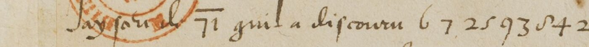
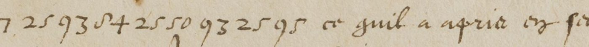
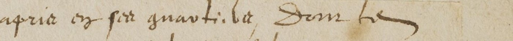

Jay sceu **[P1]** `<.71>` quil a discouru `<6>` `<7>` `<25>` `<93>` `<84>` `<25>` `<50>` `<93>` `<25>` `<95>` ce quil a apris en **[P2]** quartier **[P3]**

| slot | crop | current (L) | reader A | reader B |
|---|---|---|---|---|
| P1 | s1 | de | de | que |
| P2 | s2,s3 | sa | son quartier Dom ? | ses quartiers Dont le |
| P3 | s2,s3 | la Dont ie | son quartier Dom ? | ses quartiers Dont le |

## L02

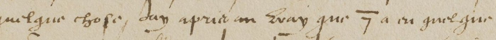
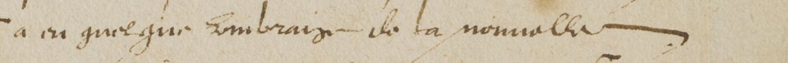

mandam vo~ en pourrez apprendre quelque chose Jay apris au vray que `<.7>` a eu quelque **[P4]** de la nouuelle

| slot | crop | current (L) | reader A | reader B |
|---|---|---|---|---|
| P4 | s2,s3 | lombraige | ombraige | ombrage |

## L03

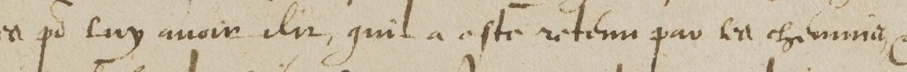
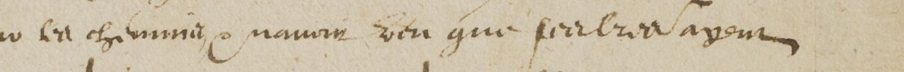

quil luy a apporte de `<14>` `<15>` mesmes po~ luy auoir dit quil a este retenu par les chemins **[P5]** que ses lettres ayent

| slot | crop | current (L) | reader A | reader B |
|---|---|---|---|---|
| P5 | s2,s3 | nauoir ueu | neantmoins veu | Ce nauroit este |

## L05

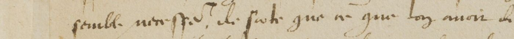
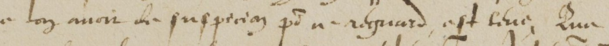
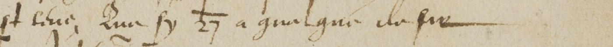

semble **[P6]** de sorte que ce que lon auoit de suspicion **[P7]** ce regard est leue Que sy `<.27>` a quelque de

| slot | crop | current (L) | reader A | reader B |
|---|---|---|---|---|
| P6 | s1 | necess~re | necess~e | necess~ |
| P7 | s2,s3 | p~ | po~ | po~ a |

## L06

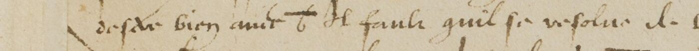
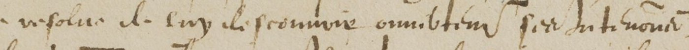
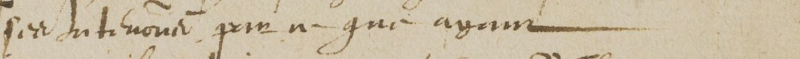

desir bien **[P8]** `<.6>` Il fault quil se resolue de luy descouurir **[P9]** inten~on **[P10]** ce que ayant

| slot | crop | current (L) | reader A | reader B |
|---|---|---|---|---|
| P8 | s1 | aua~t | aime | auec |
| P9 | s2,s3 | ouuertement son | descouurir ouuertem~ sa | descouurir son ambition ses |
| P10 | s2,s3 | p~ | pour | p~in |

## L07

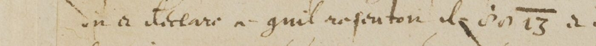
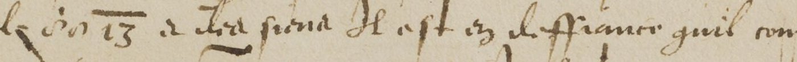
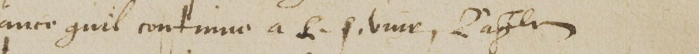

on a declare **[P11]** quil **[P12]** de `<.13>` a **[P13]** Il est en deffiance quil continue a le seruir **[P14]**

| slot | crop | current (L) | reader A | reader B |
|---|---|---|---|---|
| P11 | s1 | ce | ce | a |
| P12 | s1,s2 | resentoit | ressentoit | resoluton |
| P13 | s1,s2 | dire sena | ses siens | dit siens |
| P14 | s3 | Lassl~ | le seruir Daylleurs | le seruir Dagth~ |

## L08

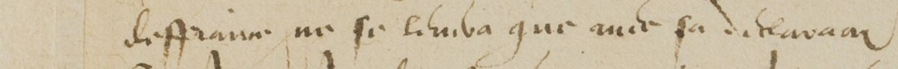
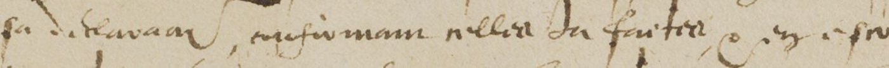
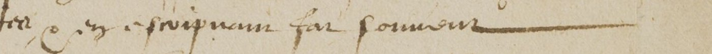

**[P15]** ne se limba que auec sa **[P16]** du **[P17]** en escripuant **[P18]** souuent

| slot | crop | current (L) | reader A | reader B |
|---|---|---|---|---|
| P15 | s1 | deffraince | deffiance | lesperance |
| P16 | s1,s2,s3 | declara~on confirmant nellre | declara~on mesmement celles | delayance confirmation nouuelle |
| P17 | s2,s3 | faicte | seruice | seruice Ce |
| P18 | s2,s3 | fai | fort | fur |

## L09

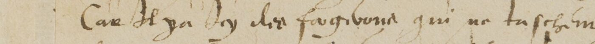
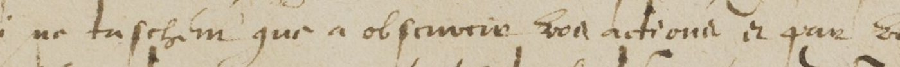
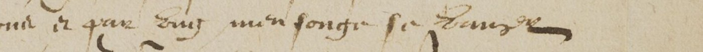

Car Il ya Jcy **[P19]** qui ne taschent que a obseruer voz actions et **[P20]** se **[P21]**

| slot | crop | current (L) | reader A | reader B |
|---|---|---|---|---|
| P19 | s1,s2 | dez factieux | des fouqibons | des fourgibons |
| P20 | s2,s3 | qua~ vous men songez | par vng mensonge | par vng mensonge |
| P21 | s3 | venger | venger | hausser |

## L10

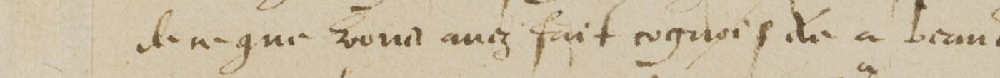
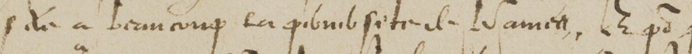
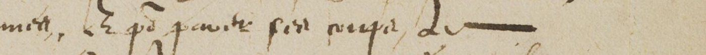

de ce que vous auez faict **[P22]** a beaucoup les **[P23]** de **[P24]** Et **[P25]** fort **[P26]** de

| slot | crop | current (L) | reader A | reader B |
|---|---|---|---|---|
| P22 | s1,s2 | cognoistre | cognois il | cognoistre |
| P23 | s1,s2,s3 | petits sistre | plus fortz | p~sonnes |
| P24 | s2,s3 | Mamett | Vaunett | Danice |
| P25 | s2,s3 | par parolle | po~ pauure | po~ pouuoir |
| P26 | s2,s3 | ouuerte | pieca | occupe |

## L11

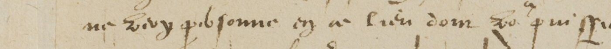
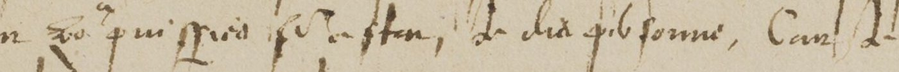

ne voy p~sonne en ce lieu dont vo~ puissiez **[P27]** de dix p~sonne Car Je suis a recognoistre de quil

| slot | crop | current (L) | reader A | reader B |
|---|---|---|---|---|
| P27 | s1,s2 | fere estat | puissiez sasseurer | puissiez vo~ asseurer |

## L12

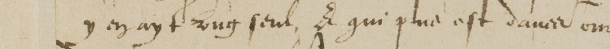
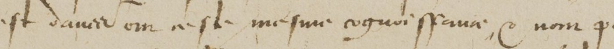
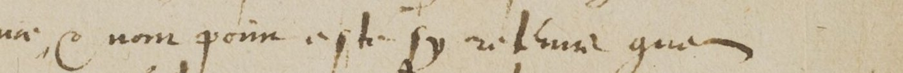

y en ayt vng seul Et qui plus est **[P28]** om **[P29]** mesme cognoissance Ce nom **[P30]** sy **[P31]** que

| slot | crop | current (L) | reader A | reader B |
|---|---|---|---|---|
| P28 | s1,s2 | dauoir | sauez | dauoir |
| P29 | s1,s2 | ne sta | en ceste | en este mesme |
| P30 | s2,s3 | poinct este | pour estre | point este |
| P31 | s2,s3 | retenue | celebre | estrange |

## L13

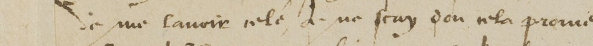
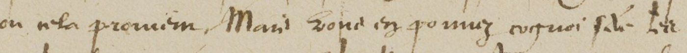
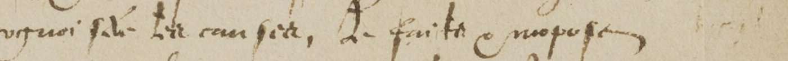

ie me lauoir nele Je ne scay dou nela **[P32]** Mais vous en pouuez cognoistre les causes de **[P33]** et **[P34]**

| slot | crop | current (L) | reader A | reader B |
|---|---|---|---|---|
| P32 | s1,s2 | promien | prouient | prouien~ |
| P33 | s2,s3 | faicts | faicts | ses faictz |
| P34 | s3 | propos | imposte | Imposteur |

## L14

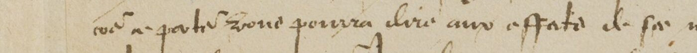
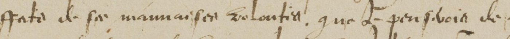
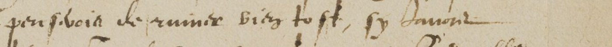

**[P35]** vous pourra dire aux **[P36]** de **[P37]** que Je **[P38]** de ruiner bien tost sy **[P39]**

| slot | crop | current (L) | reader A | reader B |
|---|---|---|---|---|
| P35 | s1 | co~ ne partie | ce porteur | ce porteur |
| P36 | s1,s2 | estats | effects | effectz |
| P37 | s1,s2,s3 | ses mauuaises volontes | sa mauuaise volonte | ses maimaisons volontes |
| P38 | s2,s3 | pensoys | pensoys | pensoie |
| P39 | s3 | dauoir | Dauant | Dauoir |

## L15

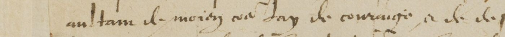
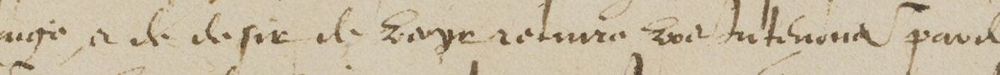
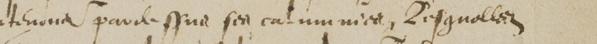

**[P40]** de **[P41]** ou Jay de couraige a ce desir de **[P42]** voz intentions **[P43]**

| slot | crop | current (L) | reader A | reader B |
|---|---|---|---|---|
| P40 | s1 | aultant | autant | autant |
| P41 | s1 | moiens | moien | moins |
| P42 | s1,s2 | voye rendre | veoir reussir | veoyr reussir |
| P43 | s2,s3 | parolle sans son calumnier Regnolles | intentions pardessus ses calumnies Lesquelles | intentions par dessus ses calamitez desquelles |

## L16

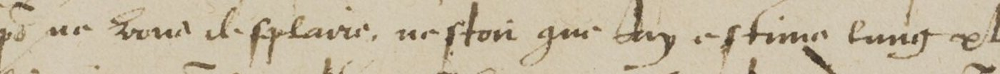
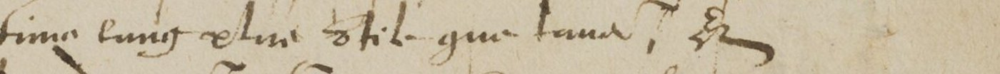

Je me fusse resolu de vous taire po~ ne vous desplaire nestoit que Jay estime lung **[P44]** vtile que **[P45]** Et

| slot | crop | current (L) | reader A | reader B |
|---|---|---|---|---|
| P44 | s2,s3 | etre | aussy vtile | et lautre vtile |
| P45 | s3 | laue | laultre | taire |

## L17

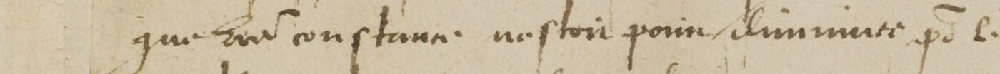
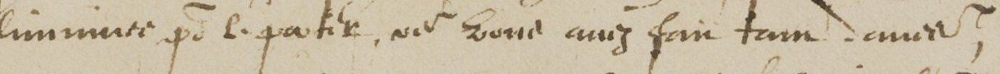
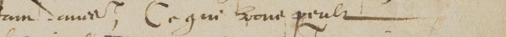

que vre~ constance nestoit point diminuee po~ le **[P46]** ou vous auez fait tant **[P47]** Ce qui vous peult

| slot | crop | current (L) | reader A | reader B |
|---|---|---|---|---|
| P46 | s1,s2 | partie | party | pate |
| P47 | s2,s3 | damitie | deuures | de preuue |

## L18

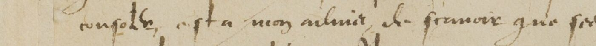
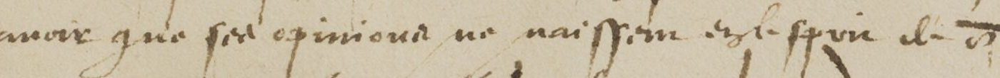
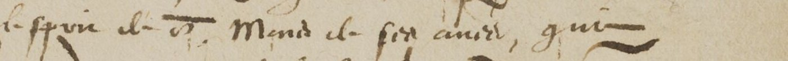

**[P48]** est a mon aduis de scauoir que ses opinions ne naissent **[P49]** de `<.03>` Mend de ses **[P50]** qui

| slot | crop | current (L) | reader A | reader B |
|---|---|---|---|---|
| P48 | s1 | consoller | consoler | consoler |
| P49 | s2,s3 | ezle sceu | naissent que du despit | naissent dailleurs que |
| P50 | s3 | amis | amys | actes |

## L19

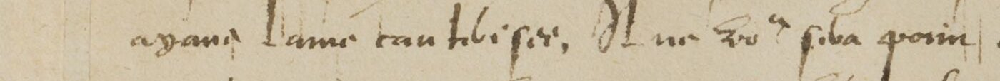
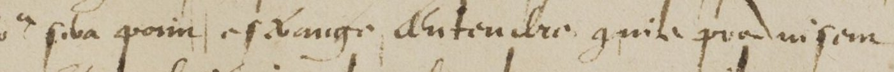
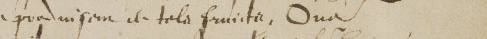

**[P51]** lame tant **[P52]** Il ne vo~ sera point estrange dentendre **[P53]** pro~duisent de **[P54]**

| slot | crop | current (L) | reader A | reader B |
|---|---|---|---|---|
| P51 | s1 | ayans | ayans | ayant |
| P52 | s1,s2 | blessee | foible | noble |
| P53 | s2,s3 | quile | estrange dentendre quilz produisent | estrange dentendre quilz produisent |
| P54 | s2,s3 | tels fruicts Ouec | telz fruictz Oue | telz fruictz Oue |

## L20

Lesperance que en vng moment la **[P55]** de **[P56]** scauroient **[P57]**

| slot | crop | current (L) | reader A | reader B |
|---|---|---|---|---|
| P55 | s1,s2 | v~ite descouuria eluit | verite descouurira celles | vertu |
| P56 | s1,s2,s3 | calumnies quilz nos | calumnies quilz ne scauroient diuertir que le Roy | sobriete et de calamitez quelle nay scauroient demourer ny estre regne |
| P57 | s2,s3 | dementir ezle Ezr~ | calumnies quilz ne scauroient diuertir que le Roy | sobriete et de calamitez quelle nay scauroient demourer ny estre regne |

## L21

de penser dy apporter vng remede par **[P58]** a `<.7>` sil mest **[P59]** de vous en dire

| slot | crop | current (L) | reader A | reader B |
|---|---|---|---|---|
| P58 | s1,s2,s3 | ceste complaisance destinee | leurs complainctes ordinaires | vostre conseil et~ conseillers |
| P59 | s2,s3 | p~mis | p~mis | permis |

## L22

**[P60]** voy que vous ne le debuez fe~ vous ressouuenant vng **[P61]** qui **[P62]** ob **[P63]**

| slot | crop | current (L) | reader A | reader B |
|---|---|---|---|---|
| P60 | s1 | ce qui dy referes Ie | ce qui Jay resceu Je | ne quil luy resceut de |
| P61 | s2,s3 | peu ont | peu ont | combat pris ou |
| P62 | s2,s3 | sera monitia | sont moins | fist mourir |
| P63 | s3 | sbuez | seruez | sebuez |

## L23

**[P64]** a que lhumeur de `<.7>` nest nullement de sy **[P65]** Car `<.03>` la **[P66]** Aussy

| slot | crop | current (L) | reader A | reader B |
|---|---|---|---|---|
| P64 | s1 | en parolles ouuertes | en pareilles occasions | ez pareilles occasions |
| P65 | s2,s3 | arrestee | courte | courte |
| P66 | s2,s3 | desplus rongneu | desfiance recognue | desloyaulte redoubte |

## L24

que le temps vous appelle **[P67]** a **[P68]** discours Mais a dire **[P69]** qui **[P70]** vne~ **[P71]** vous **[P72]**

| slot | crop | current (L) | reader A | reader B |
|---|---|---|---|---|
| P67 | s1,s2 | auoz | non | amoy |
| P68 | s1,s2 | ses | ses discours | ce discours |
| P69 | s1,s2,s3 | effaitz | des effects | vray effectz |
| P70 | s2,s3 | aussi | auec | auront |
| P71 | s2,s3 | considerant celle | conseruant et cela | conseruation eslu |
| P72 | s3 | auoissent | accroissent | auoir assistan~ |

## L25

vre~ memoire et~ **[P73]** que tous vos **[P74]** de perdre po~ leur contentement et le desplaisir de ceulx qui **[P75]**

| slot | crop | current (L) | reader A | reader B |
|---|---|---|---|---|
| P73 | s1 | renuoy | de renom | le regnay |
| P74 | s1,s2 | ssuils voque | seruiteurs viennent | subiectz le danger |
| P75 | s3 | desirent | disent | desirent |

## L26

que **[P76]** que apres la ruine **[P77]** ou restablissement de lestat qui **[P78]** cause que sy vous continuez

| slot | crop | current (L) | reader A | reader B |
|---|---|---|---|---|
| P76 | s1 | vo^s nauiez faict | vo~ naurez faict | vo~ nauez pouuoir |
| P77 | s1,s2 | entiere | entiere ou | totalle ou |
| P78 | s2,s3 | seba | sera cause | sera cause |

## L27

en la resolua~ **[P79]** `<.7>` quil ne vous en scaura poin de gre et aussy par `<.07>` quan **[P80]** y **[P81]** trouuer

| slot | crop | current (L) | reader A | reader B |
|---|---|---|---|---|
| P79 | s1 | immobl | comme le | semblable |
| P80 | s2,s3 | vo^s | quant vo~ | quand vo~ |
| P81 | s2,s3 | voulebes | voudrez | vouldrez |

## L28

Que sy `<.25>` **[P82]** aller `<.49>` Jestime que cela luy agreable de la gloire on ne se parlera plus que de luy oue~

| slot | crop | current (L) | reader A | reader B |
|---|---|---|---|---|
| P82 | s1 | peult | peult | veult |

## L29

**[P83]** Il ne sy parle que de `<.57>` qui po~ peu quil **[P84]** est beaucoup estime et prise **[P85]**

| slot | crop | current (L) | reader A | reader B |
|---|---|---|---|---|
| P83 | s1 | auiourdhuy | aucunement | au royaulme |
| P84 | s1,s2,s3 | face | face | faict |
| P85 | s2,s3 | me pendant | vre~ prudence | vne prudence |

## L30

**[P86]** ses **[P87]** qui ne naissent que de **[P88]** desir de la **[P89]** gloire aussy **[P90]**

| slot | crop | current (L) | reader A | reader B |
|---|---|---|---|---|
| P86 | s1 | fourra regibes tou~ | scaura digerer tous ses discours | comme dicelluy tous ses discours |
| P87 | s1,s2 | diferens | scaura digerer tous ses discours | comme dicelluy tous ses discours |
| P88 | s1,s2,s3 | lextresme | lextreme | lhonneste |
| P89 | s2,s3 | vra~ | vre~ | vraye |
| P90 | s2,s3 | anan lingerinas | auant Jugement | tenant augurinas |

## L31

**[P91]** que **[P92]** de **[P93]** par **[P94]** souhaite Mais **[P95]**

| slot | crop | current (L) | reader A | reader B |
|---|---|---|---|---|
| P91 | s1 | y moy ame | en may ainsi que lamour de vre~ seruice Les affaires par vill~ ne saduancent pas Je le souhaite Mais auec la calumnie | Et moy auec que ceux de vos subiectz ces assistez par vertu ne scauroient dau~ de le souhaiter Mais veu la calamite |
| P92 | s1 | mande | en may ainsi que lamour de vre~ seruice Les affaires par vill~ ne saduancent pas Je le souhaite Mais auec la calumnie | Et moy auec que ceux de vos subiectz ces assistez par vertu ne scauroient dau~ de le souhaiter Mais veu la calamite |
| P93 | s1,s2 | vos sibnict 2ii Lit affire | en may ainsi que lamour de vre~ seruice Les affaires par vill~ ne saduancent pas Je le souhaite Mais auec la calumnie | Et moy auec que ceux de vos subiectz ces assistez par vertu ne scauroient dau~ de le souhaiter Mais veu la calamite |
| P94 | s1,s2,s3 | vill un sadunautm dud de la | en may ainsi que lamour de vre~ seruice Les affaires par vill~ ne saduancent pas Je le souhaite Mais auec la calumnie | Et moy auec que ceux de vos subiectz ces assistez par vertu ne scauroient dau~ de le souhaiter Mais veu la calamite |
| P95 | s2,s3 | est la ratmuit | en may ainsi que lamour de vre~ seruice Les affaires par vill~ ne saduancent pas Je le souhaite Mais auec la calumnie | Et moy auec que ceux de vos subiectz ces assistez par vertu ne scauroient dau~ de le souhaiter Mais veu la calamite |

## L32

**[P96]** temps le **[P97]** ainsy **[P98]** paste~ vous pourra dire Ce `<15>` Apuril a Cinq heures du soir

| slot | crop | current (L) | reader A | reader B |
|---|---|---|---|---|
| P96 | s1 | du | en | Du |
| P97 | s1 | p~mier | p~mettra | p~uenir |
| P98 | s1,s2 | q~ ne | que ce | ? le |

